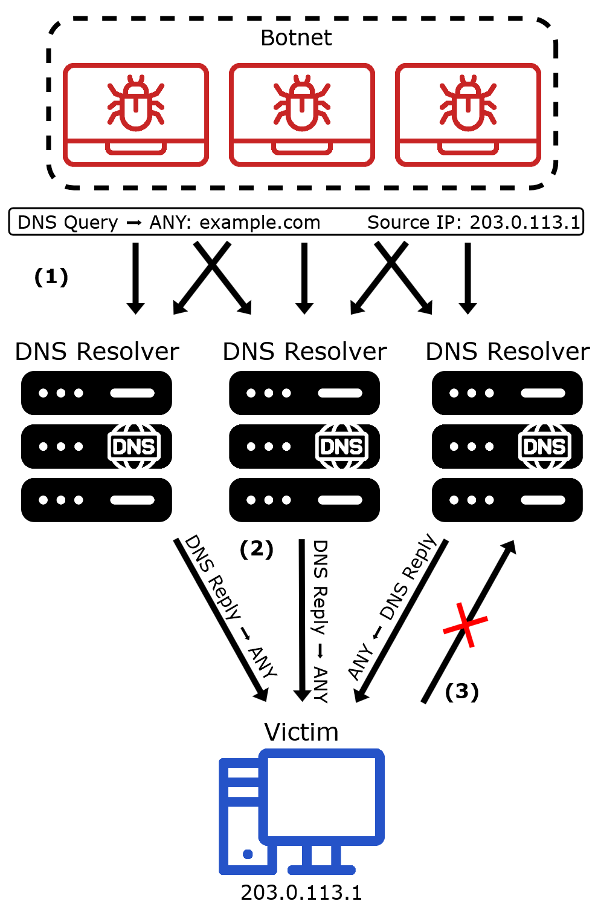
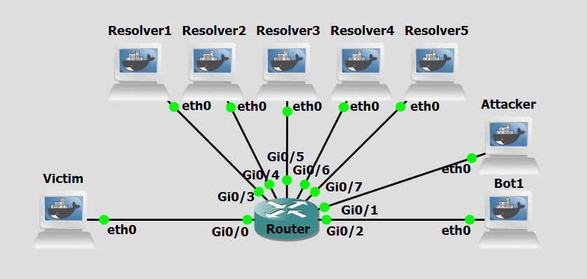

# Background

DNS amplification is a cyberattack technique that exploits the DNS protocol to overwhelm a target with an enormous volume of traffic. This method allows attackers to launch devastating Distributed Denial of Service (DDoS) attacks by leveraging the inherent asymmetry between small DNS queries and their significantly larger responses, effectively rendering the target's infrastructure unreachable without directly exhausting the attacker's own resources.

This technique exploits the open and stateless nature of the DNS protocol, combined with the ability to spoof source IP addresses over UDP. The attack involves manipulating DNS query-response mechanics to redirect and massively amplify traffic toward an unsuspecting victim.

DNS amplification can be divided into four main concepts: IP Spoofing, Query Transmission, Response Amplification, and Traffic Flooding.
Initially, the attacker forges DNS queries in which the source IP address is replaced with the IP address of the intended victim. This spoofing ensures that all DNS responses will be directed toward the target rather than back to the attacker, effectively concealing the origin of the attack. The spoofed queries are then transmitted at scale to a large number of open DNS resolvers, publicly accessible servers that will respond to queries from any source without authentication. These queries request record types, such as ANY or TXT records, that are known to produce disproportionately large responses. Each open DNS resolver receives the forged request and, acting in good faith, generates a response many times larger than the original query — an amplification factor that can range to over 7x the size of the initial request. This asymmetry is the cornerstone of the attack's destructive efficiency. The cumulative effect of multiple resolvers simultaneously directing amplified responses toward a single target results in a volumetric flood of traffic that saturates the victim's network bandwidth and overwhelms its infrastructure, causing widespread service disruption.


<figure markdown id="figure-1">
  { width="600" }
  <figcaption>Figure 1: DNS Amplification attack</figcaption>
</figure>

 [Figure 1](#figure-1) shows a DNS Amplification attack scenario. These are the steps:


- **Step 1:** The botnet sends a burst of small DNS **ANY** queries for largezone.com to multiple open resolvers, while forging the source IP address of those queries so that it matches the victim’s address, here **203.0.113.1**. 
- **Step 2:** Each open resolver processes the query as if it had been legitimately sent by the victim and returns a much larger DNS reply to the spoofed destination, namely the victim at **203.0.113.1**. Because the source IP was spoofed, the combined traffic from many resolvers accumulates into a flood of unsolicited amplified responses. As a consequence, the victim’s network link or local resources can become saturated by the incoming DNS
traffic, so legitimate communication is delayed or dropped, causing denial of service.


The open resolvers may also experience some additional processing load, but they are not the primary target of the attack. Their main role is to act as reflectors and amplifiers that multiply the traffic delivered to the victim.

<br>
<br>

# Objectives

Our goal with the following configurations is to simulate a DNS Amplification attack. This lab demonstrates how attackers can exploit multiple open DNS resolvers to flood a victim with amplified traffic. 


<br>
<br>

# Lab Prerequisites & Network Configuration
<figure markdown id="figure-2">
  
  <figcaption>Figure 2: DNS Amplification attack GNS3 Lab Topology</figcaption>
</figure>

In the GNS3 project showed in [Figure 2](#figure-2), you will need to add in the following topology that uses eight key nodes (be sure to previously check the [Lab Setup Guide](../../setup.md){:target="_blank"}):

| Node Name  | Role                          | IP Address     | Subnet           |
|------------|-------------------------------|----------------|------------------|
| **Victim**     | Target machine. DNS client  | **10.0.0.1**   | 10.0.0.0/24  |
| **Attacker**  | Attacker console         | **10.0.1.1**   | 10.0.1.0/24  |
| **Bot1**  | Receives orders from Attacker. Acts as proxy         | **10.0.2.1**   | 10.0.2.0/24  |
| **Resolver1**     | Recursive DNS Server. Also acts as authoritative nameserver for largezone.com              | **10.0.3.1**   | 10.0.3.0/24  |
| **Resolver2**     | Recursive DNS Server. Also acts as authoritative nameserver for  largezone.com| **10.0.4.1**   | 10.0.4.0/24  |
| **Resolver3**     | Recursive DNS Server. Also acts as authoritative nameserver for  largezone.com| **10.0.5.1**   | 10.0.5.0/24  |
| **Resolver4**     | Recursive DNS Server. Also acts as authoritative nameserver for largezone.com| **10.0.6.1**   | 10.0.6.0/24  |
| **Resolver5**     | Recursive DNS Server. Also acts as authoritative nameserver for largezone.com | **10.0.7.1**   | 10.0.7.0/24  |

Be sure to configure one of the Resolvers to be the designated resolver for the Victim machine by editing file `/etc/resolv.conf`.

To be able to simulate network bandwith constraints, apply the following configurations in the **Router**:

```python
conf t
policy-map LIMIT_BW
class class-default
shape average 1000000
```

and then apply to the router interface that faces the Victim machine (g0/0):

```python
int g0/0
service-policy output LIMIT_BW
```

To confirm if it is applied correctly, use:
```python
show policy-map interface g0/0
```
9
This way the connection is limmited to 1Mbps.

<br>

The following scripts were used in this lab:

- <a href="../../../scripts/amplification.py" download>amplification.py</a>
- <a href="../../../scripts/amplification_activate_bots.py" download>amplification_activate_bots.py</a>


<br>
<br>


# Phase 1: Setting up the Zone

Each **Resolver** machine will host `largezone.com` and `example.com` zones.

### Step 1.1: Basic Zone Setup

On each **Resolver**,

 1 - Create the `db.largezone` zone file:

```python
nano /etc/bind/db.largezone
```
```python
$TTL    604800
@       IN      SOA     ns1.largezone.com. hostmaster.largezone.com. (
                        2026102904 ; Serial
                        604800     ; Refresh
                        86400      ; Retry
                        2419200    ; Expire
                        604800 )   ; Negative Cache TTL
;
@       IN      NS      ns1.largezone.com.
@       IN      NS      ns2.largezone.com.

; ---------------------------
; Apex RRsets (many types)
; ---------------------------

; Multiple A records at the apex (multihomed)
@       IN      A       192.0.2.100
@       IN      A       192.0.2.101
@       IN      A       192.0.2.102
@       IN      A       192.0.2.103
@       IN      A       192.0.2.104
@       IN      A       192.0.2.105

; Multiple AAAA records at the apex
@       IN      AAAA    2001:db8::1
@       IN      AAAA    2001:db8::2
@       IN      AAAA    2001:db8::3

; Mail exchange records
@       IN      MX      10 mail.largezone.com.
@       IN      MX      20 mail2.largezone.com.
@       IN      MX      30 backupmail.largezone.com.

; Several TXT records (SPF, DMARC, misc)
@       IN      TXT     "v=spf1 ip4:192.0.2.0/24 include:_spf.largezone.com -all"
@       IN      TXT     "google-site-verification=example-token-1234567890"
@       IN      TXT     "site-annotation: created-for-lab-demo"
@       IN      TXT     "dmarc=none; pct=100; rua=mailto:dmarc@largezone.com"

; Additional plain-text records to bulk up ANY response
@       IN      TXT     "long-record-1=AAAAAAAAAAAAAAAAAAAAAAAAAAAAAAAAAAAAAAAAAAAAAAAAAA"
@       IN      TXT     "long-record-2=BBBBBBBBBBBBBBBBBBBBBBBBBBBBBBBBBBBBBBBBBBBBBBBBBB"
@       IN      TXT     "long-record-3=CCCCCCCCCCCCCCCCCCCCCCCCCCCCCCCCCCCCCCCCCCCCCCCCCC"

; Certification Authority Authorization
@       IN      CAA     0 issue "letsencrypt.org"
@       IN      CAA     0 issuewild "letsencrypt.org"
@       IN      CAA     0 iodef "mailto:security@largezone.com"

; Service records (SRV) — multiple priorities/weights/ports
@       IN      SRV     10 5 5060 sip.largezone.com.
@       IN      SRV     20 10 5060 sip2.largezone.com.

; LOC record — physical location metadata
@       IN      LOC     38 43 0.00 N 9 8 0.00 W 10m 1m 100m 10m

; HINFO — host CPU/OS info 
@       IN      HINFO   "x86_64" "Linux"

; RP — responsible person
@       IN      RP      hostmaster.largezone.com. .   ; second field is TXT RR giving contact info (dot means none)

; NAPTR records (used for URI/telephone mapping)
@       IN      NAPTR   100 10 "u" "E2U+sip" "!^.*$!sip:info@largezone.com!" .
@       IN      NAPTR   200 10 "u" "E2U+email" "!^.*$!mailto:info@largezone.com!" .

; SSHFP records for host keys (example hashes)
@       IN      SSHFP   1 1 1234567890abcdef1234567890abcdef12345678
@       IN      SSHFP   2 1 abcdef1234567890abcdef1234567890abcdef12


@       IN      SPF     "v=spf1 ip4:192.0.2.0/24 -all"

; Additional misc records 
@       IN      TXT     "misc-note=extra-apex-records-for-testing"
@       IN      TXT     "backup-info=apex-demo-v1"

; ------------- referenced hosts used above -------------
mail            IN      A       192.0.2.200
mail2           IN      A       192.0.2.201
backupmail      IN      A       192.0.2.202
sip             IN      A       192.0.2.210
sip2            IN      A       192.0.2.211
ns1             IN      A       10.0.3.1
ns2             IN      A       10.0.3.2

; keep your subhost list 
host1   IN      A       192.0.2.1
host2   IN      A       192.0.2.2
host3   IN      A       192.0.2.3
host4   IN      A       192.0.2.4
host5   IN      A       192.0.2.5
host6   IN      A       192.0.2.6
host7   IN      A       192.0.2.7
host8   IN      A       192.0.2.8
host9   IN      A       192.0.2.9
host10  IN      A       192.0.2.10
host11  IN      A       192.0.2.11
host12  IN      A       192.0.2.12
host13  IN      A       192.0.2.13
host14  IN      A       192.0.2.14
host15  IN      A       192.0.2.15
host16  IN      A       192.0.2.16
host17  IN      A       192.0.2.17
host18  IN      A       192.0.2.18
host19  IN      A       192.0.2.19
host20  IN      A       192.0.2.20
host21  IN      A       192.0.2.21
host22  IN      A       192.0.2.22
host23  IN      A       192.0.2.23
host24  IN      A       192.0.2.24


@     IN       TXT      "Cum Veteres Mechanicam uti Author est Pappus in verum Naturalium investigatione maximi fecerint recentiores missis formis substantialibus qualitatibus occultis Paenomena Naturae ad leges Mathematicas revocare aggressi sint Visum est in hoc Tractatu"

@     IN       TXT      "ACum Veteres Mechanicam uti Author est Pappus in verum Naturalium investigatione maximi fecerint recentiores missis formis substantialibus qualitatibus occultis Paenomena Naturae ad leges Mathematicas revocare aggressi sint Visum est in hoc Tractatu"

@     IN       TXT      "BCum Veteres Mechanicam uti Author est Pappus in verum Naturalium investigatione maximi fecerint recentiores missis formis substantialibus qualitatibus occultis Paenomena Naturae ad leges Mathematicas revocare aggressi sint Visum est in hoc Tractatu"

@     IN       TXT      "CCum Veteres Mechanicam uti Author est Pappus in verum Naturalium investigatione maximi fecerint recentiores missis formis substantialibus qualitatibus occultis Paenomena Naturae ad leges Mathematicas revocare aggressi sint Visum est in hoc Tractatu"
```

2 - Create the `db.example` zone file:

```python
nano /etc/bind/db.example
```
```python
example.com. IN SOA ns1.example.com. admin.example.com. (
    1 7200 3600 1209600 86400
)
    NS ns1.example.com.
ns1.example.com. A 10.0.8.3

@                IN      A       10.0.9.1
www              IN      A       10.0.9.1
secret-host IN A 10.0.10.1
mail IN A 10.0.9.100
mail IN MX 10 mail.example.com
testa            IN      A       10.0.10.1
testb            IN      A       10.0.10.1
testc            IN      A       10.0.10.1
testd            IN      A       10.0.10.1
```

 3 - Modify the `named.conf.local` file, add the `largezone.com` and `example.com` zones:

```python
nano /etc/bind/named.conf.local
```
```python
zone "largezone.com" {
    type master;
    file "/etc/bind/db.largezone";
};

zone "example.com" {
     type master;
     file "/etc/bind/db.example";
};
```

 4 - Restart the BIND service (named):

```bash
pkill named && named -c /etc/bind/named.conf
```
<br>
<br>
<br>


# Phase 2: Bot Setup

### Step 2.1: Create and Configure a Sudo User for Remote Commands

For the Attacker to be able to run commands on the bot remotely via SHH it will need new user credentials.

On **Bot1**, run:

```bash
adduser test
```
```bash
usermod -aG sudo test
```
To confirm the user was added:
```bash
groups test
```

To simplify running commands, we will a no-password needed clause to certain commands used by the C&C Server. 
```bash
visudo
```

At the end of the file add:
```bash
test ALL=(ALL) NOPASSWD: /usr/sbin/named, /usr/bin/pkill named, /usr/bin/python3, /usr/bin/tee
```

<br>


### Step 2.2: Set up the Attack Script

On **Bot1**, add this file:

```bash
nano /home/amplification.py
```
The `amplification.py` script will use the scapy python library to craft 100 ANY request (query type = 255) DNS query packets for `largezone.com` to send to each of the resolvers. Each bot sends a total of 500 such packets per iteration, with the source IP spoofed as the victim’s IP address. Since this process runs inside a `while True` loop, the 500-packet bursts are repeated indefinitely, continuously flooding the target with amplified traffic.


<br>
<br>
<br>

# Phase 3: Perform Attack

### Step 3.1: Activate the Bot to Start the Attack

The attacker machine will be responsible for activating the bots in order for the attack to start. In this case only Bot1. Do a Wireshark capture right next to the Victim interface, and another next to one of the resolvers (as a tip, use a “dns” filter to better analyze the relevant DNS packets).

On the **Attacker** machine, run:

```bash
python3 /home/amplification_activate_bots.py
```

The `amplification_activate_bots.py` script uses the paramiko python library to run, via ssh, the `amplification.py` on each of the bots. In this case, only Bot1.

<br>


### Step 3.2: Confirm DNS Service Disruption

Confirm there really was service disruption for the Victim while the attack is still ongoing, and after it stopped.

On the **Victim** machine, run:

```bash
dig www.example.com
```
or 

```bash
dig mail.example.com
```

If the request is not fulfilled, service disruption is confirmed. You might have to try multiple times with different subdomains of the `example.com` domain to see service disruption.


!!! question Question
     During the attack phase, what did you observe in the Wireshark capture next to the Victim's interface? Describe the nature of the traffic — which protocol was used, what type of DNS records were being delivered, and approximately what was the size of the responses compared to what a typical DNS reply would look like?

??? success "Answer"
     The Wireshark capture next to the Victim's interface showed a large flood of unsolicited UDP DNS response packets arriving from multiple resolver IP addresses. These responses contained ANY record replies for largezone.com, which included a wide variety of record types such as A, AAAA, MX, TXT, SRV, NAPTR, CAA, and others defined in the zone file. The responses were significantly larger than a typical DNS reply, although not in the order of several kilobytes in size like it was common in older servers, the answers are still around 400-500 bytes, compared to a standard A record response which would typically be around 70 bytes. This size disparity is the amplification factor at the heart of the attack. Although the sizes are limited, since amplification is constrained not just by RRL, but by UDP size limits and fragmentation avoidance in modern DNS servers.


!!! question Question
     Running dig testa.example.com or another subdomain on the Victim during the attack likely resulted in a timeout or failed response. Why does the attack affect the Victim's ability to resolve legitimate domains, even though the flood traffic consists entirely of DNS responses and not requests?
 

??? success "Answer"
    The attack saturates the Victim's network interface with a massive volume of inbound UDP traffic. Even though this traffic consists of DNS responses rather than requests, it consumes the Victim's available bandwidth. As a result, legitimate DNS query responses, such as replies to dig testa.example.com, are either dropped at the network level due to congestion, or the Victim's DNS resolver never receives the response in time, causing the query to time out. The attack does not need to interfere with DNS query logic directly. Overwhelming the link layer is sufficient to deny service.


<br>
<br>
<br>
<br>


# Countermeasure
After performing the attack, we now pass on to the countermeasure phase. DNS amplification abuses open DNS resolvers by spoofing the victim's IP address and exploiting the large response sizes generated by certain DNS record types, taking advantage of the fact that UDP-based DNS traffic requires no handshake or source verification. One of the core features of this attack technique is that the amplified traffic is generated by legitimate third-party open resolvers that are simply responding in good faith to what appears to be a valid request, meaning the attacker never directly floods the victim themselves. The main consequence of this is that by implementing rate limiting on DNS resolvers, restricting the number of responses sent to any single IP address within a given time window, network administrators can neutralize the amplification effect before it reaches the target. Since a spoofed attack relies on resolvers freely and repeatedly responding to high volumes of forged requests, rate limiting breaks this dynamic by capping the volume of responses any one destination can receive, rendering the amplification factor unviable for the attacker and significantly reducing the volumetric impact of the flood.

<br>

## Configure Response Rate Limiting in all Resolvers

### Step 1:  Reconfigure BIND

On each **Resolver**,: 

 1 - Modify the `named.conf.options` file:

```python
nano /etc/bind/named.conf.options
```
```python
rate-limit {
    responses-per-second 5;
    window 5;
    slip 2;
};
```
Position the `rate-limit` block inside `options{}`. This configuration limits the resolver to sending at most 5 responses per second to any single destination IP within a 5-second time window.
<br>

 2 - Restart the BIND service (named):

```bash
pkill named && named -c /etc/bind/named.conf
```

### Step 2:  Re-run the attack
Repeat Step 3.1 to re-run the attack. 

Again, do a Wireshark capture right next to the Victim interface, and another next to one of the resolvers (as a tip, use a “dns” filter to better analyze the relevant DNS packets) to see the changes to network traffic. 

<br>


!!! question Question
     After enabling Response Rate Limiting on all resolvers and re-running the attack, what differences did you observe in the Wireshark captures — both next to the Victim's interface and next to one of the resolvers? What does this tell you about where in the network the mitigation is acting?


??? success "Answer"
     After enabling RRL, the capture next to the resolver showed that after an initial burst of responses, subsequent replies to the spoofed victim IP were suppressed or replaced with truncated slip responses, as BIND began enforcing the responses-per-second 5 limit. Correspondingly, the capture next to the Victim showed a significant drop in incoming traffic volume. The flood was curtailed at its source. This confirms that RRL acts at the resolver level, throttling outbound responses before they ever reach the victim, rather than filtering traffic at the victim's end.


!!! question "Question"
     Consider the position of the Victim throughout this entire attack. Unlike other attacks, like DNS tunneling for example, where some tools can give network administrators meaningful visibility and control, a victim of DNS amplification has no equivalent lever to pull. Why is this the case, and what does it reveal about the fundamental limitations of host-level or network-local countermeasures against DDoS attacks?

??? success "Answer"
    In a DNS amplification attack, the Victim is entirely passive, it never sends a query, never interacts with the attacker, and has no prior relationship with the resolvers flooding it. By the time the amplified traffic arrives at the Victim's network interface, the damage is already being done: bandwidth is consumed, and the infrastructure is overwhelmed before any local filtering or firewall rule can even inspect the packets. A firewall can drop the offending packets after they arrive, but it cannot reclaim the bandwidth they already consumed in transit. 
    
    This is the defining characteristic of volumetric DDoS: the attack wins at the link level, not the application level. There is no host-based countermeasure the Victim can deploy to stop the flood, because the bottleneck is the network pipe itself, not the Victim's processing capacity. Meaningful defense must therefore occur upstream like at the resolvers via RRL  which are entirely outside the Victim's administrative control.


<br>
<br>

# Conclusion

As we saw, after reconfiguring BIND with Response Rate Limiting (RRL), the volume of amplified traffic directed at the victim is dramatically reduced. By capping the number of responses any single IP address can receive within a given time window, the resolvers are prevented from being weaponized at scale, effectively dismantling the amplification mechanism that makes this attack so destructive.

However, it is important to recognize that RRL is a mitigation applied at the resolver level, not at the victim's end. The victim remains fundamentally passive throughout this entire attack since it never initiates any communication, never interacts with the attacker, and has no direct means of stopping the flood once it is underway. This highlights one of the most troubling asymmetries of amplification-based DDoS attacks: the target is the least empowered party in the exchange.

DNS amplification therefore underscores a broader truth about network security: effective defense is often a collective responsibility. Resolver operators, ISPs, and network administrators must cooperate to implement mitigations such as RRL, BCP38 source address validation, and the deprecation of open resolvers, since no single party, least of all the victim, can unilaterally stop the attack alone.


<br>