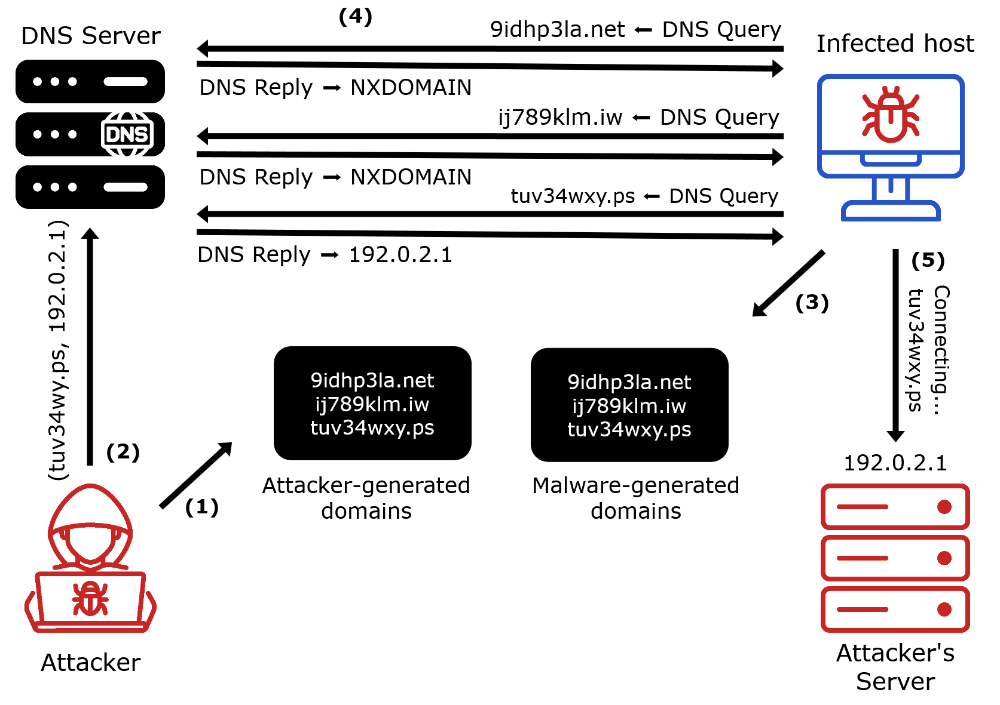
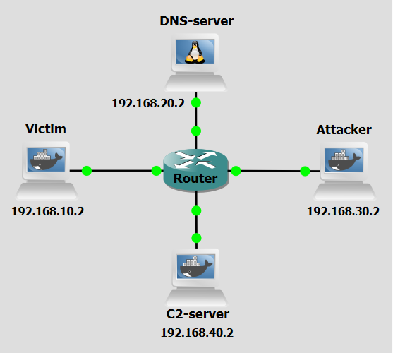
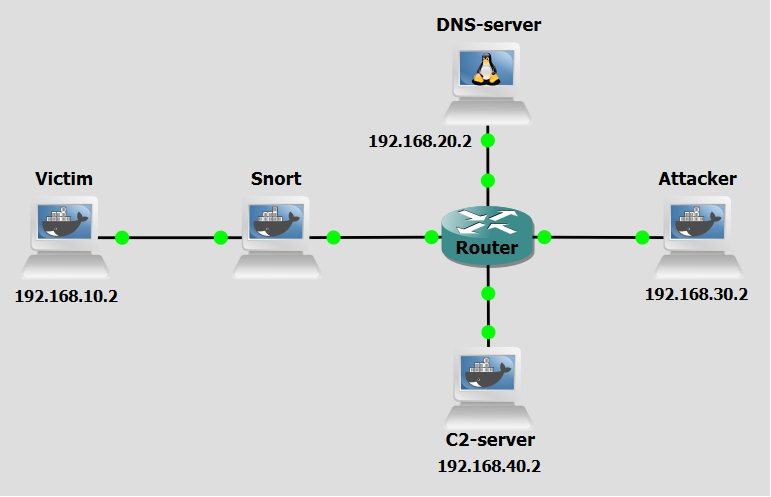

# Background
Domain Generation Algorithms (DGAs) are a key evasion technique used by modern malware families to maintain resilient communication channels with their Command-and-Control (C&C) servers through the use of botnets. Rather than relying on hardcoded domain names, DGAs generate a large number of pseudo-random domain names at runtime. This approach significantly complicates detection and blocking efforts by security mechanisms that rely on static lists of known malicious domains.

DGAs are used to algorithmically generate domain names that malware can attempt to contact in order to receive commands and/or exfiltrate data to. The attacker and the malware both implement the same deterministic algorithm, allowing synchronization without direct communication. Typically, DGAs produce domain names based on a set of input values such as the current date or timestamp, a predefined seed value, external or volatile inputs, for example, trending Twitter hashtags or news headlines. The generated domains often resemble random alphanumeric strings (like, xjo3k7d.com, akz8p1.net), which can help them evade pattern-based detection.

<figure markdown>
  
  <figcaption>Figure 1: DGA-based attack</figcaption>
</figure>

Figure 1 reveals a scenario where DGAs are used. The steps are the following:

- **Step 1:** The attacker generates a list of **AGDs** (algorithmically generated 
domains) according to a preset algorithm and seed.
- **Step 2:** The attacker configures a **Command and Control (C&C)** server and 
pairs a specific domain, generated by the DGA, to the IP address of the C&C server.
- **Step 3:** The malware-infected host, using the same seed and algorithm, 
generates an equal list of domains as the attacker.
- **Step 4:** By trial and error, the malware-infected victim eventually gets 
an IP address (192.0.2.1) result from a DNS server for one of the domains 
(tuv34wxy.ps) it had generated.
- **Step 5:** With the IP address of the C&C server known by the bot, it then 
connects to the C&C server and can now exchange information freely between the 
two parties.

After a preset time, the attacker chooses another domain from the AGDs list and the process restarts. 

DGAs provide attackers with resilience: by generating thousands of domains daily, malware only needs one active domain to maintain communication, evading blocklists; obfuscation: random, meaningless domain names bypass traditional detection and blacklisting; and scalability: infected hosts independently generate domains using embedded algorithms, enabling decentralized, large-scale attacks with minimal attacker effort.

Those same characteristics pose serious challenges for defenders. The constant generation of new domains makes static detection methods ineffective, requiring dynamic and predictive approaches instead. Reverse-engineering the malware to extract the DGA algorithm is technically demanding and time-intensive, while proactive domain registration or blocking is both operationally challenging and legally constrained. The sheer volume of domains—sometimes tens of thousands per day—can overwhelm DNS monitoring, making it difficult to separate malicious queries from legitimate traffic.


<br>
<br>

# Objectives
Our goal with the following configurations is to simulate a DGA-based C&C attack. This lab demonstrates how attackers use DGAs to generate and rotate command-and-control (C&C) domains, evading detection and maintaining persistent communication with compromised machines. You will act as both the attacker and the victim malware, executing scripts to generate domains, register them with a DNS server, establish C&C communication, and observe the data exfiltration process. Hereafter, a **malware-running victim** might be referred to as **bot** for the sake of simplicity.

<br>
<br>

# Lab Prerequisites & Network Configuration
<figure markdown>
  
  <figcaption>Figure 2: GNS3 Lab Topology</figcaption>
</figure>

In the GNS3 project showed in Figure 2, you will need to add in the following topology that uses four key nodes (be sure to previously check the [Lab Setup Guide](../../setup.md){:target="_blank"}):

| Node Name  | Role                          | IP Address     | Subnet           | Key Configuration                          |
|------------|-------------------------------|----------------|------------------|--------------------------------------------|
| **Victim**     | Infected Machine              | **192.168.10.2**   | 192.168.10.0/24  | Queries DNS at 192.168.20.2                |
| **DNS-Server** | DNS Server (DNSMasq)          | **192.168.20.2**   | 192.168.20.0/24  | Used for domain resolution                 |
| **Attacker**   | Attacker Console/Setup        | **192.168.30.2**   | 192.168.30.0/24  | Used to run DGA and DNS registration |
| **C&C-Server (C2-Server)**  | Command and Control Server (Flask)            | **192.168.40.2**   | 192.168.40.0/24  | Hosts the malicious service                |


Here the DNS server used is not based on BIND, like it is in most of these labs, but based on DNSMasq. You can install the Docker container adosztal/dns for the **DNS Server** at GNS3.
<br>

<br>

The following scripts were used in this lab:

- <a href="../../../scripts/CC_server.py" download>CC_server.py</a>
- <a href="../../../scripts/dga_banjori_attacker.py" download>dga_banjori_attacker.py</a>
- <a href="../../../scripts/dga_banjori_victim.py" download>dga_banjori_victim.py</a>
- <a href="../../../scripts/dga_register_domain_attacker.py" download>dga_register_domain_attacker.py</a>


<br>

## The Algorithm Used: Banjori DGA Variant
In this lab we will use a simple, deterministic sequence-based DGA, often associated with early malware families like **Banjori**. The domain generation relies on a simple character-shifting process:

-  A **seed** domain (tuvydgaattack.pt) is used to start the sequence.
- The next domain is generated based on simple arithmetic operations applied to the ASCII values of the characters of the previous domain.
- Only the first 4 characters of the domain are changed.

<br>
<br>

# Phase 1: Attacker Setup and DNS Registration

### Step 1.1: Generate the AGD List and Select the Domain

On the **Attacker** machine, run:

```bash
python3 /home/dga_banjori_attacker.py
```

The attacker runs the pre-configured DGA script. In this script, a list of 500 domains is generated based on the seed and following the Banjori algorithm, a random AGD is chosen at the end to be then registered. 


### Step 1.2: Register the C&C Domain with the DNS Server


On the **Attacker** machine, run:

```bash
python3 /home/dga_register_domain_attacker.py --domain DGA_DOMAIN --ip C&C_SERVER_IP
```


The Attacker maps the selected domain to the **C&C-Server** IP address. The Python script automates the process of registering a domain-IP pair in a DNSMasq server by updating a custom hosts file and reloading DNSMasq. It connects to that server (192.168.20.2) using Paramiko (SSH library) and reads/writes in a hosts file (/etc/dnsmasq.d/hosts/dynamic_hosts.txt) via SFTP. 

<br>
<br>

# Phase 2: Activation and Data Exfiltration
### Step 2.1: Activating the C&C Server

On the **C&C-Server**, run:


```bash
python3 /home/CC_server.py
```

The C&C server’s script is responsible for handling the beacon signal sent by the bots and all communication thereafter. It allows an operator to monitor connected bots, to send commands, and collect outputs and files from those bots. The server exposes four HTTP endpoints for communication with bots: `/beacon` (POST, bots send a "beacon" to signal they are alive); `/get-command` (GET, bots request commands to execute); `/report` (POST, bots send the output of executed commands); `/file-report` (POST, bots send file contents e.g., stolen data). The script can then save the information obtained for future use.
<br>
<br>

### Step 2.2: Victim Initiates the Connection
Do a Wireshark capture right next to the Victim interface (as a tip, use a “dns” filter to better analyze the relevant DNS packets).

On the **Victim** machine, run:


```bash
python3 /home/dga_banjori_victim.py
```

Observe the connection attempts and the final successful beacon confirmation on the C&C terminal. Look into the Wireshark capture to see the process in detail.

The Victim runs the malware script: it generates 500 domains, performs iterative DNS queries to the **DNS Server** until one resolves to an IP address, the **C&C’s**, and establishes a connection with that machine. It will use the previously mentioned HTTP endpoints to communicate with the C&C server.
<br>
<br>

### Step 2.3: Issuing Commands and Exfiltration
Use the C&C operator interface to control the Victim. Start by selecting Option `2. Issue Command to Victim`, entering Victim ID (`1`), and running the command `ls`. Next, issue another command using the same process, this time entering `ls /home`. To verify the output, select Option `3. View General Command Outputs` and confirm that the directory listing is received.

For data exfiltration, select Option `2. Issue Command to Victim` again, issue the command `read /home/password.txt`, and then select Option `4. View Received Files`. The content of the requested file should be displayed, confirming successful exfiltration.

!!! question Question
     Based on the current network setup, if the Victim's DNS setting was pointing to an internal resolver instead of a public one, would this attack still succeed? Why or why not?

??? success "Answer"
    It depends on the level of control network administrators could have over the inbound and outbound traffic. They could choose drastic strategies like having a whitelist of available domains to be queried, even if this would severely detrimental to a normal user experience. But only a very restrictive environment would make DGA-based attacks impossible.


<br>
<br>

# Phase 3: Domain Rotation
### Step 3.1: Rotating the C&C Domain


1 - Run on the **Attacker** to get a new selected domain.


```bash
python3 /home/dga_banjori_attacker.py
```

2 - Register the new domain: 


```python
python3 /home/dga_register_domain_attacker.py --domain NEW_DGA_DOMAIN --ip 192.168.40.2
```


To simulate the resilience expected when using a DGA technique, the Attacker now has to register a new domain for the C&C, the victims at the time of the change should still be able to contact the C&C Server, but new victims will use the new domain to establish a connection.
<br>


### Step 3.2: Re-establishing the Connection
While maintaining the C&C Server script still running, try to re-establish the connection by running the victim script. 

On the **Victim** machine, run:


```bash
python3 /home/dga_banjori_victim.py
```

Execute the command and confirm the connection is re-established using the new, rotated domain.


<br>

## Challenge: Exploring Other DGA Algorithms
The Banjori DGA variant used here is simplistic. Real-world DGAs are often far more complex, incorporating factors like the current date, time, or external data (e.g., Bitcoin exchange rates, Twitter hashtags) to generate domains. This makes prediction extremely difficult without knowing the exact algorithm and seed.
Check here for more information: [https://github.com/baderj/domain_generation_algorithms](https://github.com/baderj/domain_generation_algorithms){:target="_blank"}


Copy the contents of the `dga_banjori_attacker.py` and `dga_banjori_victim.py` scripts to new files and  implement a basic **Simple Pseudo-Random DGA** where the domains are generated using a fixed random seed. Use the previous given source to understand how to implement such algorithms in Python. You can use [Kraken](https://bin.re/blog/krakens-two-domain-generation-algorithms/){:target="_blank"} for example. 

-  **Replace the `next_domain` function** in both scripts with a different generation method using a fixed string or integer as the initial seed for repeatability.
-  **Repeat Phases 1-3** of this lab guide using your chosen algorithm.

 
!!! question Question
     Did the attack still succeed? Write down one advantage of using a Date/Time Synchronous DGA over the simple Fixed-Seed Pseudo-Random DGA you just implemented.


??? success "Answer"
    Date/Time Synchronous DGAs enable real-time synchronization between malware and C&C servers, making domain prediction and blocking harder for defenders.


<br>
<br>
<br>
<br>
<br>


# Countermeasure
After performing the attack, we now pass on to the countermeasure phase. DGAs are considered a state-of-the-art attack mechanism precisely due to its detection elusive nature and robust tolerance to termination attempts. One of the core features of this type of attack technique is the use of many algorithmically generated domains, of which only a few are indeed valid to be used. The main consequence of this is the trail of numerous NXDOMAIN response messages (responses with no answer) left behind during the connection attempt phase, which can signal the presence of this attack if monitored.

We will use an Intrusion Detection/Prevention System - IDS/IPS (like **Snort**) to monitor NXDOMAIN messages sent by the DNS Resolver to the Victim.


<figure markdown>
  
  <figcaption>Figure 3: Updated GNS3 Lab Topology</figcaption>
</figure>

<br>
<br>

## IDS/IPS Setup


In Figure 3, we introduce a Snort machine between Victim and the central Router, that will serve as a middle-man between both. By using the IDS/IPS Snort it can drop packets and even block specific origins. 

### Step 1: Snort Alert Configuration


On the **Snort** machine, edit the `/etc/snort/rules/local.rules` file to add a rule.

**Rule:** 


```bash
alert udp any 53 -> $HOME_NET any (msg:"High Volume DNS Responses with Zero Answer RRs Detected"; flow:established; byte_test:2,=,0,6,relative; threshold:type limit, track by_src, count 10, seconds 60; sid:1000002; rev:1;)
```

An IDS/IPS like Snort needs a rule to be able to alert in case of such rule applies. Edit the local.rules file to add it. The sid field is the unique ID of a rule in that file, change it accordingly. UDP 53 is used to identify DNS protocol messages. Make sure to previously check the Setup Guide to enter the necessary Snort pre-configurations.

!!! question Question
     What is this segment (```byte_test:2,=,0,6,relative;```) for?

??? success "Answer"
    This byte_test checks the 7th and 8th bytes (offset 6, relative to the UDP payload start) in a DNS response. It verifies if the Answer RR count (number of answers) is zero, indicating no answers were provided.


<br>

### Step 2: Re-run the attack


On the **Snort** machine, run:


```bash
snort -Q -A console -i eth0:eth1 -c /etc/snort/snort.conf
```

Run the attack, like before, but this time also run Snort in the **Snort** machine and observe the alert messages. Also use a Wireshark capture in between the **Victim** and **Snort** machines (use a “dns” filter to better analyze the relevant packets).

!!! question Question
    Why did the Victim receive all NXDOMAIN messages if there was already a Snort rule in place? Why did they go through the Snort machine? 

??? success "Answer"
    The snort rule in place was just an "alert" rule, without any capacity to block packets in any way. A "drop" rule however can stop packets.


<br>

### Step 3: Modify the Rule and Re-run the attack.
Now let's modify the rule to see what happens. Be sure to also capture the network traffic as before.

**Rule:**


```bash
drop udp any 53 -> $HOME_NET any (msg:"High Volume DNS Responses with Zero Answer RRs Detected"; flow:established; byte_test:2,=,0,6,relative; threshold:type limit, track by_src, count 10, seconds 60; sid:1000002; rev:2;)
```

!!! question Question
    Did this new rule make any difference in the completion of the attack?

??? success "Answer"
    Yes, this rule did make a difference in the length and difficulty of the attack, but not overall on its completion. The malware in the victim is still able to get the inforamtion it needed, even if it takes a longer time.

<br>

!!! question Question
    Should a new rule that simply blocks packets coming in from the previously detected NXDOMAIN packets' origin IP address be used? Why or why not?

??? success "Answer"
    No, a rule like that should not be used. Since this attack relies on clueless resolvers for the necessary data to get to the Victim Client, a rule that just blocks the origin IP of all the NXDOMAIN responses would just be blocking a normal resolver, and not the real source of the tampering.


<br>
<br>
<br>

# Conclusion
As we saw, after we altered the snort rule from “alert” to “drop”, the empty response NXDOMAIN packets were blocked and wouldn't reach the victim, and so the malware script had a much more substantial task of finding the correct domain to establish the connection with the C&C server.

Although we use the “drop” rule the attack isn't stopped effectively and so the Snort’s behaviour ends up being more akin to an intrusion detection than intrusion prevention system because the attack can still be completed even if is much more delayed (at least in the early stages of connection establishment).

By using the countermeasure here explored, human intervention (network administraton) is necessary to, after the attack’s initial detection, devise further measures to stop it from happening again in the future.


!!! question Question
    What do you think could be a way to automate the detection and blocking of this attack technique without harming legitimate traffic and without using human input? 

??? success "Answer"
    A good way of doing it would be to do traffic analysis using machine learning techniques, that can look into all the domain names (and also quantity of packets, etc) being queried and determine if it could be a sign of DGA-based attacks.

    
