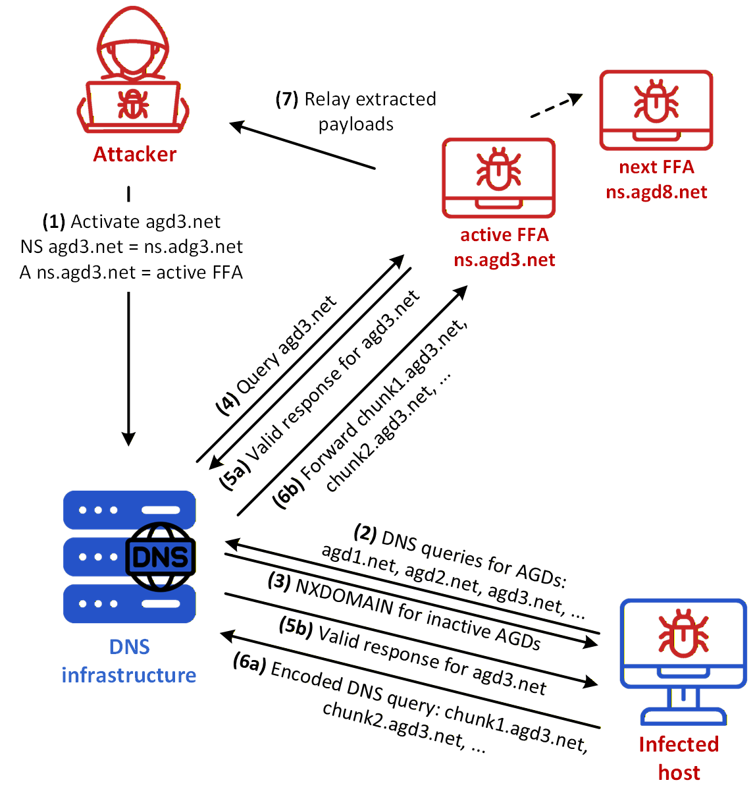
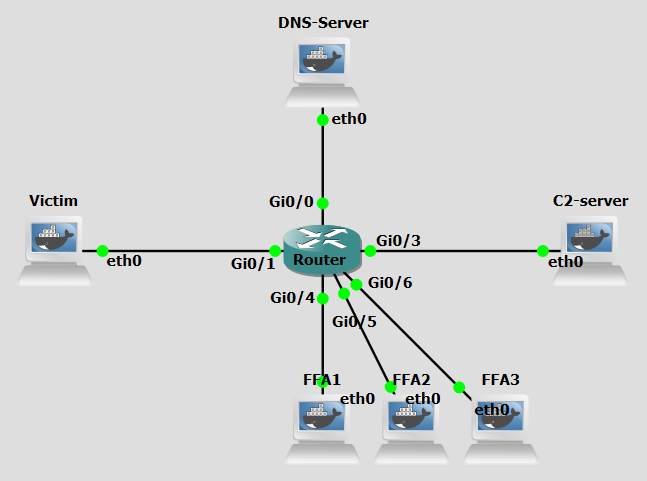

# Background
The previous lab guides covered Fast Flux and DGAs as techniques to locate and reach an attacker-controlled machine, and DNS Tunneling as a covert channel for exfiltrating data and issuing commands once that connection is established. Each technique, in isolation, addresses a different layer of the attack: DGAs solve the problem of domain takedowns, Fast Flux solves the problem of IP and nameserver blacklisting, and DNS Tunneling solves the problem of traffic inspection and filtering.

When combined, these three techniques reinforce each other to produce an infrastructure with no stable component for a defender to target. DGAs ensure the bot always knows which domain to query next even after a takedown; Fast Flux ensures that neither the resolved IP nor the authoritative nameserver remains fixed long enough to be blocked; and DNS Tunneling ensures the subsequent communication is hidden inside a protocol that firewalls rarely inspect or restrict.

This lab explores a multi-layered attack that combines three previously explored DNS techniques to create a resilient and stealthy communication channel:

 [Domain Generation Algorithms (DGAs)](dgas.md){:target="_blank"}: Used to dynamically generate pseudo-random domain names, making it difficult for defenders to block communication using static lists.

 [Fast Flux Double](ff-double.md){:target="_blank"}: An evolution of Fast Flux that rotates both the A records (IP addresses of the service) and the NS records (authoritative nameservers) using a pool of compromised machines (Fast Flux Agents or FFAs), the rotated NS records will be the most relevant in this lab guide.

 [DNS Tunneling](tunneling.md){:target="_blank"}: A technique that encodes malicious data into the subdomains of DNS queries to bypass firewalls and exfiltrate data covertly.

It is recommended to first complete the aforementioned lab guides in order to understand the concepts and techniques involved.


<figure markdown>
  { width="600" }
  <figcaption>Figure 1: Combined Fast Flux/DGA/Tunneling attack</figcaption>
</figure>

Figure 1 shows an example of a combined Fast Flux/DGA/Tunneling Architecture. These are the steps in the figure:

- **Step 1:** The attacker generates a list of **AGDs** (algorithmically generated domains) according to a preset algorithm and seed, and chooses one.
- **Step 2:** The attacker registers the NS and A records for the chosen AGD, tuv34wxy.ps, and ns.tuv34wxy.ps, respectively, on the DNS infrastructure, pointing to a fast-flux agent (**219.67.43.12**). 
- **Step 3:** The malware-infected host, using the same seed and algorithm, 
generates an equal list of domains as the attacker.
- **Step 4:** By trial and error, the infected host eventually gets 
an IP address (**59.35.174.58**) result from a DNS server for one of the domains 
(tuv34wxy.ps) it had generated.
- **Step 5:** The infected host send a query, through the DNS Server, to the FFA, acting as nameserver, for the TXT record associated with of oi9L#1..com a subdomain of the generated domain, effectively surrendering the host sensitive data.
- **Step 6:**  The FFA forwards the delivered data to the C&C server. 
- **Step 7:** The C&C server directs ns.attacker.com to send a new command order to the host (e.g. run comand2.py).
- **Step 8:** The DNS Server responds with the FFA reply to the DNS Query with the new command as a TXT record. 

<br>
<br>

# Objectives
Our goal with the following configurations is to simulate a combined Fast Flux/DGAs/Tunneling attack. This lab demonstrates how attackers can combine three distinct techniques to use DGAs to generate and rotate command-and-control (C&C) domains, evading detection and maintaining resilient communication with compromised machines; abuse the DNS protocol to rapidly rotate IP addresses associated with a malicious domain as well as with a malicious nameserver, bypassing traditional network security controls that rely on static IP-based blacklists; and abuse the DNS protocol to encode and transmit data covertly, bypassing traditional network security controls that rarely inspect or block DNS traffic.

You will act as both the attacker and the infected host malware, executing scripts to generate domains, to dynamically update DNS records, to encode data into DNS queries, set up dynamic rogue authoritative nameservers to serve rotating A records and to receive and decode those queries' data establishing a covert communication channel.


<br>
<br>

# Lab Prerequisites & Network Configuration
<figure markdown>
  
  <figcaption>Figure 2: Combined Fast Flux/DGAs/Tunneling GNS3 Lab Topology</figcaption>
</figure>

In the GNS3 project showed in Figure 2, you will need to add in the following topology that uses six key nodes (be sure to previously check the [Lab Setup Guide](../../setup.md){:target="_blank"}):

| Node Name  | Role                          | IP Address     | Subnet           |
|------------|-------------------------------|----------------|------------------|
| **DNS-Server** | DNS Server (BIND). Acts as both TLD server and Resolver              | **10.0.0.1**   | 10.0.0.0/24  |
| **Victim**  | Infected Machine            | **10.0.1.1**   | 10.0.1.0/24  |
| **C&C-Server (C2-Server)**     | Command and Control Server | **10.0.3.1**   | 10.0.3.0/24  |
| **FFA1**   | Receives orders from Attacker. Acts as proxy  | **10.0.4.1**   | 10.0.4.0/24  |
| **FFA2**  | Receives orders from Attacker. Acts as proxy          | **10.0.5.1**   | 10.0.5.0/24  |
| **FFA3**     | Receives orders from Attacker. Acts as proxy             | **10.0.6.1**   | 10.0.6.0/24  |

<br>

The following scripts were used in this lab:

- <a href="../../../scripts/tunneling_nameserver.py" download>tunneling_nameserver.py</a>
- <a href="../../../scripts/dga_banjori_attacker.py" download>dga_banjori_attacker.py</a>
- <a href="../../../scripts/combined_choose_FFAs.py" download>combined_choose_FFAs.py</a>
- <a href="../../../scripts/tunneling_attacker.py" download>tunneling_attacker.py</a>
- <a href="../../../scripts/combined_victim.py" download>combined_victim.py</a>


<br>
<br>

# Phase 1: FFA Setup, Domain Generation and Registration

### Step 1.1: Create and Configure a Sudo User for Remote Commands

For the C&C Server to be able to run commands on the FFAs remotely via SHH it will need new user credentials.

On each **FFA**, run:

```bash
adduser test
```
```bash
usermod -aG sudo test
```
To confirm the user was added:
```bash
groups test
```

To simplify running commands, we will a no-password needed clause to certain commands used by the C&C Server. 
```bash
visudo
```

At the end of the file add:
```bash
test ALL=(ALL) NOPASSWD: /usr/sbin/named, /usr/bin/pkill named, /usr/bin/python3, /usr/bin/tee
```

<br>

### Step 1.2: Configure BIND on every FFA

Since any FFA in the botnet can become the authoritative nameserver for generated domain if the C&C Server commands it to, we have to configure the appropriate BIND files to make every FFA work as a nameserver.

On each **FFA**, edit these files:

```bash
nano /etc/bind/named.conf.options
```
```bash
options {
    directory "/var/cache/bind";
    recursion no;
    listen-on port 53 { any; };
};
```

<br>
<br>

### Step 1.3: Set up the DNS Exfiltrator

An FFA working as an authoritative nameserver for the generated domain also has to have an exfiltrator script so that it can exfiltrate the data to the C&C Server when acting as nameserver.

On each **FFA**, add the script:

```bash
nano /home/tunneling_nameserver.py
```
The `tunneling_nameserver.py` script on the FFA acting as nameserver will capture DNS packets, extract the subdomain, and forward it to the data receiver.

 This script has two concurrent responsibilities, handled via a main thread and a background worker thread: Packet sniffing (main thread), using Scapy, it listens on UDP port 53 for all incoming DNS queries. For every packet, it checks whether it's a `TXT`-record query (query type 16, qr == 0 meaning it's a question not a response) destined for the attacker.com domain. When it finds one, it strips the generated domain suffix and extracts just the subdomain prefix (which is the actual encoded data the victim machine sent); and data forwarding (background thread), in which, for each subdomain it pulls out, it opens a fresh TCP connection to 10.0.3.1:9999 and sends the subdomain string there. 

<br>
<br>

### Step 1.4: Add Zone Change Key to C&C Server

To be able to remotely update a nameserver's DNS records (in the `combined_choose_FFAs.py` script of Step 1.6), the C&C Server needs the key that was configured with the zone.

On the **C&C-Server**:

```bash
nano /home/ns-attacker-key.txt
```
and add the previous used key:

```bash
key "ns-attacker" {
        algorithm hmac-sha256;
        secret "nvhsmRBHfjI0rKLsTY098adHHtbjRjh+3s8CH0S/k5o=";
};
```

and also:


```bash
nano /home/TLD-key.txt
```

```bash
key "TLD" {
        algorithm hmac-sha256;
        secret "nvhsmRBHfjI0rKLsTY098adHHtbjRjh+3s8CH0S/k5o=";
};
```

<br>

### Step 1.5: Generate the AGD List and Select the Domain

On the **C&C-Server**, add and modify the script:

```bash
nano /home/dga_banjori_attacker.py
```

Remove the seed `'tuvydgaattack.pt'` and add instead `'tuvydgaattack.com'`, ending with `.com` TLD.

Now, run:

```bash
python3 /home/dga_banjori_attacker.py
```

In this script, a list of 500 domains is generated based on the seed and following the Banjori algorithm, a random AGD is chosen at the end.

### Step 1.6: Select the FFAs

Now you will have to select two Fast Flux Agents. One for being the proxy (not applicable in this case since we will be using tunneling) and the other to be the nameserver for generated domain. There are three available machines. We selected FFA1 to be the authoritative nameserver.

On the **C&C-Server**, run:

```bash
python3 /home/combined_choose_FFAs.py --domain DGA_DOMAIN --ip FFA1_IP

```

The `combined_choose_FFAs.py` script , using ssh: starts the BIND service on the selected FFA to be the authoritative nameserver (FFA1 in this case); does a nsupdate request to the DNS Server, which includes deleting any previous NS record of the generated domain (e.g. tuvydgaattack.com), and adding a new A record of the corresponding nameserver domain (e.g. ns1.tuvydgaattack.com) with IP address of FFA1, with a TTL of 60 seconds; modifies the necessary BIND configuration files of FFA1, such as named.conf.local and the adds a new zone file for the generated domain; does a nsupdate request to FFA1, which includes deleting any previous A record of domain cc.attacker.com, and adding a new A record with IP address of FFA1, also with a TTL of 60 seconds. Finally, it background-runs the `tunneling_nameserver.py` script in FFA1 in order for it to send the extracted data to the C&C Server.

You can see which FFA currently has the role of authoritative nameserver by runnning `netstat -tulnp | grep 53` in each FFA. Only one will return the listenning ports associated with a DNS server.

<br>
<br>

# Phase 2: Activation and Data Exfiltration
### Step 2.1: Activating the C&C Server

On the **C&C-Server**, run:

```bash
python3 /home/tunneling_attacker.py
```

The `tunneling_attacker.py` script on the C&C Server machine will listen on a TCP port to collect the final exfiltrated data forwarded by `tunneling_nameserver.py` on the nameserver-acting FFA.

To listen for connections, it binds a TCP socket to port 9999 on all available network interfaces (0.0.0.0), until an incoming connection arrives. In the full attack chain, this script is the passive endpoint, it just prints whatever subdomains the exfiltrator forwards, which would be the base64-encoded (or otherwise encoded) data chunks originally sent via DNS queries from the Victim machine.
<br>
<br>


### Step 2.2: Prepare the Data

On the **Victim** machine, create the file(s) and populate them with a few lines of text:

```bash
nano /home/passwords.txt
```
This is the where the extracted data will come from. You can populate it with something like this:

```bash
[CONFIDENTIAL - INTERNAL USE ONLY]

--- CONTRACT DETAILS ---
Contract #12345
Agreement between XYZ Corporation and ABC Limited
Effective Date: 2025-10-15
Term: 24 months

Payment Terms:
- Monthly: $15,000
- Bank Account: 1234-5678-9012-3456 (Fake Bank of Portugal)

--- PERSONAL INFORMATION ---
Employee ID: EMP-7890
Name: João Silva
Address: Rua da Liberdade 123, 1200-001 Lisboa, Portugal
National ID: 123456789 (Placeholder)

2025-11-01: Contract renewal pending. Financial review required
2025-11-02: Security audit flagged potential vulnerability in data storage
```


### Step 2.3: Victim Initiates the Connection
Do a Wireshark capture right next to the Victim interface, another next to the C&C Server and yet another next to the DNS Server (as a tip, use a “dns” filter to better analyze the relevant DNS packets).

On the **Victim** machine, run:


```bash
python3 /home/combined_victim.py
```

The script `combined_victim.py` generates a list of 500 domains, performs iterative DNS queries to the **DNS Server** until one resolves to an IP address (the selected FFA's), reads a few files like `passwords.txt` and uses each line as a subdomain for a DNS query, it performs the DNS queries that initiate the tunneling process.

Observe the quantity and diversity of DNS messages the Victim machine is communicating with. Look into the Wireshark captures to see the process in detail.
You can check the extracted data in the C&C Server console.

<br>


!!! question Question
      Compare the Wireshark captures next to the Victim and next to the C&C Server, what does each capture reveal?

??? success "Answer"
     The capture next to the Victim shows DNS queries going to the DNS Server (the resolver), not to any FFA or attacker-controlled machine directly. The subdomains carry the encoded sensitive data, but from the Victim's perspective all traffic looks like ordinary recursive DNS resolution — the Victim never establishes a direct connection to any attacker infrastructure. The capture next to the C&C Server shows the exfiltrated data arriving via TCP from the FFA acting as nameserver, forwarded after the FFA extracted it from the tunneled subdomain.

<br>

In the standalone DNS Tunneling lab, the Victim sent its tunneling queries (after passing through a resolver) to the Attacker Nameserver, a fixed and known machine. In this combined attack, the Victim's tunneling queries are instead routed through the DNS resolution chain to whichever FFA is currently acting as authoritative nameserver.

!!! question Question
      What does a defender monitoring only the Victim's traffic conclude about the destination of the exfiltrated data?


??? success "Answer"
     A defender monitoring only the Victim's traffic sees DNS queries directed at the DNS Server, a legitimate recursive resolver, and nothing else. The Victim never contacts any attacker-controlled machine directly, so the exfiltrated data appears to be ordinary DNS traffic to a trusted local node, and the true destination remains completely invisible from this position.


!!! question Question
      What is a defender monitoring the DNS Server's traffic able to conclude? How does the combination of techniques affect what it can detect, and is there any indicator that remains useful?

??? success "Answer"
     A defender monitoring the DNS Server's traffic has a wider view: they can observe the DNS Server querying the TLD Server and then forwarding queries to whichever FFA is currently acting as authoritative nameserver. However, in this combined attack, the IP rotation and domain rotation are paired — every new DGA domain comes with a freshly assigned FFA as nameserver. This means that from the DNS Server's perspective, each domain is only ever seen resolving to one IP and being served by one nameserver before it is abandoned. There is no accumulation of distinct IPs or nameservers per domain, which is exactly what traditional Fast Flux and DGA detectors at the resolver level rely on. In a standalone Fast Flux attack the domain stays fixed so IP rotation becomes visible over time; in a standalone DGA attack the nameserver stays fixed so the NXDOMAIN flood is attributable to a single infrastructure. Here, both anchors are gone simultaneously. 
     
     What does remain detectable at the DNS Server level, and equally so as in the classic standalone tunneling lab, is the tunneling signal itself: the subdomains being queried are unusually long and high-entropy regardless of which domain or FFA they are directed at. This characteristic is intrinsic to the encoding of data into subdomains and is not affected by domain or IP rotation. Subdomain length and entropy analysis at the resolver therefore remains a valuable countermeasure even against this combined attack, and is the one indicator that the combination of techniques does not degrade.

<br>
<br>

# Phase 3: FFA and Domain Rotation


While maintaining the C&C Server data receiver script running, we will use an auxiliary console of C&C Server to remotely update the IP addresses and the domain (select `Auxiliary Console` option).

### Step 3.1: Generating a new Domain

Run on the **C&C Server** to select a new generated domain.


```bash
python3 /home/dga_banjori_attacker.py
```


### Step 3.2: Rotating the Domain and the IP Address

Now you will have to choose a different Fast Flux Agent to be authoritative nameserver. There are two available machines. We selected FFA2.

On the **C&C-Server** auxiliary console, run:

```bash
python3 /home/combined_choose_FFAs.py --domain NEW_DGA_DOMAIN --ip FFA2_IP
```

To simulate the resilience expected when using a Fast Flux and a DGA techniques, the attacker (using C&C Server machine) now has to register a new domain and a new IP address for the authoritative nameserver of the new domain. 
<br>


### Step 3.3: New Victim Connection

Now let's simulate a new victim connecting.

On the **Victim** machine, run the script again:

```bash
python3 /home/combined_victim.py
```

<br>

!!! question Question
      After re-running `combined_victim.py` on the Victim, which FFA does the Victim ultimately send its DNS tunneling queries to, and how does the resolution path differ from the first session?

??? success "Answer"
     On restart, the Victim queries the DNS Server, this then queries FFA2 which is now acting as the authoritative nameserver for the newly generated DGA domain (instead of FFA1 as before) and receives the tunneled DNS TXT queries from the Victim. So both layers have shifted: the NS role has moved from FFA1 to FFA2, and the domain itself has changed to a newly generated AGD. The Victim is now communicating with an entirely different machine and domain compared to the first session, despite following the exact same DGA algorithm to locate the C&C infrastructure.

<br>
<br>
<br>

# Conclusion

This lab demonstrated that the combination of Fast Flux, Domain Generation Algorithms, and DNS Tunneling produces an attack that is qualitatively more resilient than the sum of its parts. Each technique, taken individually, leaves a detectable residue that a well-positioned monitoring system can exploit. DGAs leave a trail of NXDOMAIN failures. Fast Flux leaves a trail of rotating IPs that accumulate against a stable domain name. DNS Tunneling leaves a trail of anomalously long subdomains at high query rates against a stable nameserver.

When the three techniques are combined, each of those residual signals is degraded or erased by one of the other layers: the DGA removes the stable domain name that the Fast Flux detector relies on; the Fast Flux removes the stable nameserver IP that a tunneling blocker could target; and the domain rotation can distribute the tunneling query load thinly enough to evade rate-based detection.

The result is an infrastructure in which there is no component — no IP address, no domain name, no nameserver — that remains stable long enough for a defender to anchor a reactive countermeasure against. Every element that a defender might attempt to block has already been replaced by the time the block takes effect.
Effective detection of this class of attack cannot rely on reactive, threshold-based rules applied to individual protocol layers in isolation. It requires correlating signals across layers — DNS resolution behaviour, query content, and infrastructure topology — and applying approaches capable of identifying coordinated anomalies that individually fall below detection thresholds.


!!! question Question
      Considering the three-layer combined attack explored in this lab, propose a detection strategy that could identify this attack without relying on any single stable observable (fixed domain name, fixed IP, or fixed nameserver). What data sources would you correlate, and at what point in the DNS resolution chain would you position your monitoring?

??? success "Answer"
An effective strategy must abandon the assumption that any single observable will remain stable. Instead, detection should be based on behavioural fingerprinting across multiple signals simultaneously. The monitoring point should be the Resolver, since it is the only node in the resolution chain that observes all three layers: it sees the DGA-generated domain names (and their failure rate), the authoritative nameserver IPs serving those domains, and the content of the queries themselves (including subdomain length and structure). At that position, a detector could correlate: a cluster of pseudo-random domain names being queried by the same source host (DGA signal); unusually long or high-entropy subdomains appearing within queries to those ephemeral domains (tunneling signal); and short TTLs on both A and NS records across the observed domains (Fast Flux signal). Note that NS IP rotation, the defining observable of Fast Flux in isolation, is not reliably detectable here because the domain rotates with every DGA cycle, the Resolver never accumulates enough NS IP observations per domain to flag rotation as suspicious.   No single one of the remaining signals needs to cross a standalone threshold — instead, the simultaneous co-occurrence of all of them, even at sub-threshold levels, should itself constitute a high-confidence alert. This is fundamentally a multivariate anomaly detection problem, and it is best addressed with machine learning models trained on labelled DNS traffic that include combined attack scenarios, rather than hand-crafted rules designed for isolated techniques.