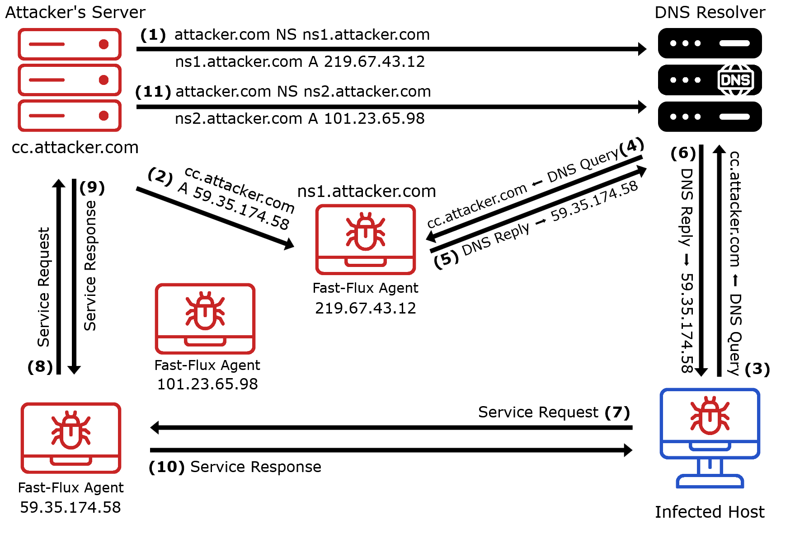
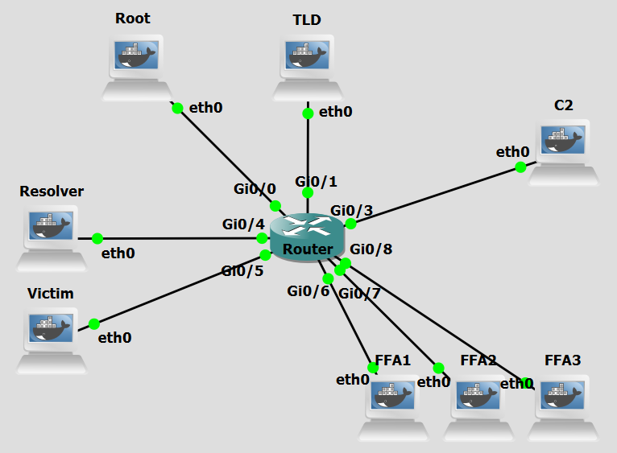
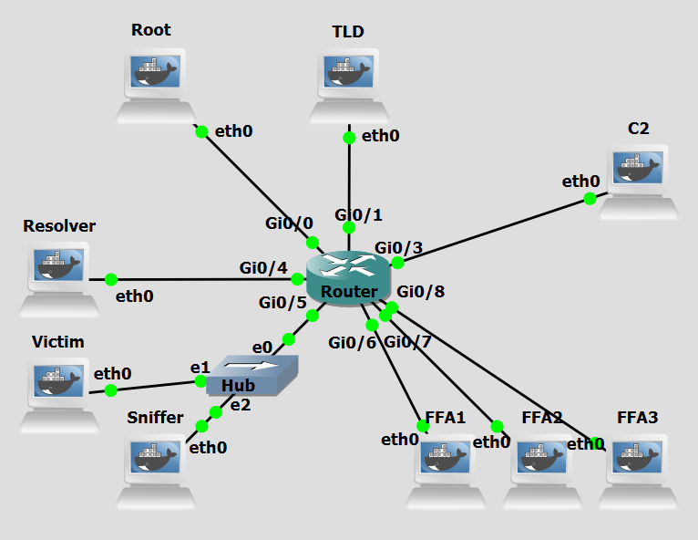

# Background
DNS Fast Flux is an evasion technique commonly used by attackers to hide the location of malicious
infrastructure and prolong the availability of malicious services, such as phishing sites, malware distribution, or botnet command-and-control (C&C) servers. The primary goal of this technique is to make
takedown efforts significantly more difficult by frequently changing the IP addresses associated with a
malicious domain.

Double-Flux is an evolution of the Single-Flux technique, designed to provide
even greater resilience and redundancy for malicious networks. The attacker’s goal remains the same—keeping
services like phishing or C&C servers highly available and difficult to track or block, but the technique now
involves rotating both A records and NS records. As with Single-Flux, the attacker begins by registering a
domain and associating it with a large pool of compromised machines that serve as forward proxies. However,
in Double-Flux, the attacker also rotates the domain’s authoritative name servers (NS records), pointing them
to other compromised machines that are part of the botnet. Each NS record also uses very short TTLs, forcing
resolvers to frequently re-query the domain hierarchy. This setup creates a multi-level, shifting DNS infrastructure, with both the name servers and the resolved IPs changing regularly. This additional layer of flux makes
it even harder for defenders to track the true backend or shut down the malicious network. Even if an IP or a
name server is taken down, new ones quickly replace it, and the domain remains active.


<figure markdown>
  { width="600" }
  <figcaption>Figure 1: Fast Flux Double - based attack</figcaption>
</figure>

Figure 1 shows an example of a Double Flux Architecture. These are the steps in the figure:

- **Step 1:** The attacker rotates the DNS authority for attacker.com, so that the domain is currently served by one authoritative server, shown in the figure as **ns1.attacker.com**. 
- **Step 2:** The victim sends a DNS query for **service.attacker.com** to a DNS resolver.
- **Step 3:** The resolver queries the current authoritative server for the A record of service.attacker.com
- **Step 4:** The authoritative server replies with the IP address **101.23.65.98**, corresponding to one fast-flux agent, and sets a short TTL for that answer. 
- **Step 5:** The resolver returns that IP address to the victim.
- **Step 6:** The victim connects to **101.23.65.98**.
- **Step 7:** The fast-flux agent relays the traffic to the hidden backend server. Because the service-record TTL is short, and because previously learned authority-related information eventually expires from resolver caches,
later lookups may return not only a different fast-flux agent IP address, such as **59.35.174.58** or **219.67.43.12**, but also different authoritative-server information for **attacker.com**, for example moving authority from **ns1.attacker.com** to **ns2.attacker.com**. In this way, Double-Flux removes stability from both the service layer and the DNS-control layer, further increasing the resilience of the malicious infrastructure.


<br>
<br>

# Objectives
Our goal with the following configurations is to simulate a DNS Fast Flux (Double)-based C&C attack. This lab demonstrates how attackers abuse the DNS protocol to rapidly rotate IP addresses associated with a malicious domain as well as with a malicious nameserver, bypassing traditional network security controls that rely on static IP-based blacklists. You will act as both the attacker and the victim, executing scripts to dynamically update DNS records, set up dynamic rogue authoritative nameservers to serve rotating A records, establish a command-and-control communication channel through compromised proxy machines, and observe how sensitive data can be exfiltrated.

<br>
<br>

# Lab Prerequisites & Network Configuration
<figure markdown>
  
  <figcaption>Figure 2: Double Flux GNS3 Lab Topology</figcaption>
</figure>

In the GNS3 project showed in Figure 2, you will need to add in the following topology that uses eight key nodes, very similar to [Fast Flux Single-based](ff-single.md){:target="_blank"} just remove the **NS-Attacker** machine (be sure to previously check the [Lab Setup Guide](../../setup.md){:target="_blank"}):

| Node Name  | Role                          | IP Address     | Subnet           |
|------------|-------------------------------|----------------|------------------|
| **Root Server**     | Root Zone ( .)                            | **10.0.0.1**   | 10.0.0.0/24  | 
| **TLD (Top Level Domain) Server** | Top-Level Domain (.com)     | **10.0.1.1**   | 10.0.1.0/24    |
| **C&C-Server (C2-Server)**     | Command and Control Server | **10.0.3.1**   | 10.0.3.0/24  |
| **Resolver**     | Recursive DNS Server              | **10.0.4.1**   | 10.0.4.0/24  |
| **Victim**  | Infected Machine            | **10.0.5.1**   | 10.0.5.0/24  |
| **FFA1**   | Receives orders from C&C-Server. Acts as proxy  | **10.0.6.1**   | 10.0.6.0/24  |
| **FFA2**  | Receives orders from C&C-Server. Acts as proxy          | **10.0.7.1**   | 10.0.7.0/24  |
| **FFA3**     | Receives orders from C&C-Server. Acts as proxy             | **10.0.8.1**   | 10.0.8.0/24  |


<br>


The following scripts were used in this lab:

- <a href="../../../scripts/fast_flux_proxy_FFA.py" download>fast_flux_proxy_FFA.py</a>
- <a href="../../../scripts/CC_server.py" download>CC_server.py</a>
- <a href="../../../scripts/fast_flux_victim.py" download>fast_flux_victim.py</a>
- <a href="../../../scripts/double_flux_choose_FFAs.py" download>double_flux_choose_FFAs.py</a>
- <a href="../../../scripts/double_flux_detector.py" download>double_flux_detector.py</a>


<br>
<br>

# Phase 1: FFA Setup and DNS Registration


### Step 1.1: Configure a Sudo User for Remote Commands

For the C&C Server to be able to run commands on the FFAs remotely via SHH it will need new user credentials.

On each **FFA**, run:

```bash
adduser test
```
```bash
usermod -aG sudo test
```
To confirm the user was added:
```bash
groups test
```

To simplify running commands, we will a no-password needed clause to certain commands used by the C&C Server. 
```bash
visudo
```

At the end of the file add:
```bash
test ALL=(ALL) NOPASSWD: /usr/sbin/named, /usr/bin/pkill named, /usr/bin/python3
```

<br>

### Step 1.2: Configure BIND on every FFA

Since any FFA in the botnet can become the authoritative nameserver for attacker.com if the C&C Server commands it to, we have to configure the appropriate BIND files to make every FFA work as a nameserver.

On each **FFA**, edit these files:

```bash
nano /etc/bind/named.conf.options
```
```bash
options {
    directory "/var/cache/bind";
    recursion no;
    listen-on port 53 { any; };
};
```

```bash
nano /etc/bind/named.conf.local
```
```bash
key "ns-attacker" {
        algorithm hmac-sha256;
        secret "nvhsmRBHfjI0rKLsTY098adHHtbjRjh+3s8CH0S/k5o=";
};


zone "attacker.com" {
    type master;
    file "/etc/bind/db.attacker";
    allow-update { key "ns-attacker"; };
};

```

If you want to generate another key use this command: 
```bash
tsig-keygen ns-attacker
```

<br>

On **FFA1**:

```bash
nano /etc/bind/db.attacker
```
```python
$TTL 60
attacker.com.   IN SOA  ns1.attacker.com. admin.attacker.com. (
                        2026010605 ; serial
                        7200
                        3600
                        1209600
                        60
                        )
attacker.com.   IN NS   ns1.attacker.com.
attacker.com.   IN A    10.0.3.1
ns1.attacker.com.  IN A    10.0.6.1
cc.attacker.com.   IN A    10.0.11.1
test.attacker.com. IN A    10.0.31.1
*.attacker.com.    IN A    10.0.3.1
```

On **FFA2**:

```bash
nano /etc/bind/db.attacker
```
```python
$TTL 60
attacker.com.   IN SOA  ns1.attacker.com. admin.attacker.com. (
                        2026010605 ; serial
                        7200
                        3600
                        1209600
                        60
                        )
attacker.com.   IN NS   ns1.attacker.com.
attacker.com.   IN A    10.0.3.1
ns1.attacker.com.  IN A    10.0.7.1
cc.attacker.com.   IN A    10.0.11.1
test.attacker.com. IN A    10.0.32.1
*.attacker.com.    IN A    10.0.3.1
```


On **FFA3**:
```bash
nano /etc/bind/db.attacker
```
```python
$TTL 60
attacker.com.   IN SOA  ns1.attacker.com. admin.attacker.com. (
                        2026010605 ; serial
                        7200
                        3600
                        1209600
                        60
                        )
attacker.com.   IN NS   ns1.attacker.com.
attacker.com.   IN A    10.0.3.1
ns1.attacker.com.  IN A    10.0.8.1
cc.attacker.com.   IN A    10.0.11.1
test.attacker.com. IN A    10.0.33.1
*.attacker.com.    IN A    10.0.3.1
```
<br>

### Step 1.3: Register FFAs as Nameservers for attacker.com

The TLD server has to know which machines are authoritative nameservers for attacker.com. Here we are simplifying the process by registering all FFAs as possible authoritative nameservers. 

On the **TLD Server**, run:

```bash
nano /etc/bind/db.com
```
at the end of the file add in:

```bash
attacker.com.    IN  NS  ns1.attacker.com.
attacker.com.    IN  NS  ns2.attacker.com.
attacker.com.    IN  NS  ns3.attacker.com.
ns1.attacker.com. IN  A   10.0.7.1
ns2.attacker.com. IN  A   10.0.8.1
ns3.attacker.com. IN  A   10.0.6.1
```

In a more realistic scenario, the attacker would likely dynamically register the nameserver. An attacker would have to register an (IP address, domain) pair through a normal registrar's API which would then propagate the change to the real TLD server. 

<br>

### Step 1.4: Add Zone Change Key to C&C Server

To be able to remotely update a nameserver's DNS records, the C&C Server needs the key that was configured with the zone.

On the **C&C-Server**:

```bash
nano /home/ns-attacker-key.txt
```
and add the previous used key:

```bash
key "ns-attacker" {
        algorithm hmac-sha256;
        secret "nvhsmRBHfjI0rKLsTY098adHHtbjRjh+3s8CH0S/k5o=";
};
```

<br>

### Step 1.5: Select the FFAs

Now you will have to select two Fast Flux Agents. One for being the proxy and the other to be the nameserver for attacker.com. There are three available machines. We selected FFA1 to be the authoritative nameserver.

On the **C&C-Server**, run:

```bash
python3 /home/double_flux_choose_FFAs.py FFA1_IP
```

The `double_flux_choose_FFAs.py` script , using ssh, starts the BIND service on the selected FFA to be the authoritative nameserver (FFA1 in this case), then automatically selects the next FFA in the list to act as proxy (FFA2), does a nsupdate request to FFA1, which includes deleting any previous A record of domain cc.attacker.com, and adding a new A record with IP address of FFA2, with a TTL of 60 seconds. Finally, it background-runs the `fast_flux_proxy_FFA.py` script in FFA2 in order for it to able to act as proxy of C&C Server.

You can see which FFA currently has the role of authoritative nameserver by runnning `netstat -tulnp | grep 53` in each FFA. Only one will return the listenning ports associated with a DNS server.

<br>
<br>

# Phase 2: Activation and Data Exfiltration
### Step 2.1: Activating the C&C Server

On the **C&C-Server**, run:

```bash
python3 /home/CC_server.py
```

The `CC_server.py` script is responsabile for handling the beacon signal sent by the bots and all communication thereafter. It allows an operator to monitor connected bots, to send commands, and collect outputs and files from those bots. The server exposes four HTTP endpoints for communication with bots: `/beacon` (POST, bots send a "beacon" to signal they are alive); `/get-command` (GET, bots request commands to execute); `/report` (POST, bots send the output of executed commands); `/file-report` (POST, bots send file contents e.g., stolen data). The script can then save the information obtained for future use.
<br>
<br>

### Step 2.2: Victim Initiates the Connection
Do a Wireshark capture right next to the Victim interface (as a tip, use a “dns || http ” filter to better analyze the relevant DNS and HTTP packets).

On the **Victim** machine, run:


```bash
python3 /home/fast_flux_victim.py
```

Observe the DNS lookup process and the IP address the Victim machine is communicating with. Look into the Wireshark capture to see the process in detail.

The Victim runs the script: queries the Resolver for the IP address of cc.attacker.com, gets one response, receives one response pointing to **FFA2**, and establishes a connection with that machine. The infected host will use those HTTP endpoints to communicate with the FFA.
<br>
<br>

### Step 2.3: Issuing Commands and Exfiltration
Use the C&C operator interface to control the Victim. Start by selecting Option `2. Issue Command to Victim`, entering Victim ID (`1`), and running the command `ls`. Next, issue another command using the same process, this time entering `ls /home`. To verify the output, select Option `3. View General Command Outputs` and confirm that the directory listing is received.

For data exfiltration, select Option `2. Issue Command to Victim` again, issue the command `read /home/password.txt`, and then select Option `4. View Received Files`. The content of the requested file should be displayed, confirming successful exfiltration.

!!! question Question
      Looking at the Wireshark capture, how does the DNS resolution process for cc.attacker.com differ from what you would expect in a standard DNS lookup? Which machines are involved at each stage, and what is notable about the authoritative nameserver that responds?

??? success "Answer"
     In a standard DNS lookup, the authoritative nameserver for a domain is a fixed, well-known server. Here, the resolution process goes through the Root Server (10.0.0.1) and TLD Server (10.0.1.1) as expected, but instead of a static NS server, the TLD delegates to an IP address belonging to FFA1 — a compromised machine acting as the authoritative nameserver for attacker.com. FFA1 then responds with an A record for cc.attacker.com pointing to FFA2 (the current proxy). This double layer of compromise is what distinguishes Double Flux from Single Flux: not only is the resolved IP (the proxy) dynamic, but so is the nameserver itself.


<br>
<br>

# Phase 3: FFA Rotation and Connection Resilience


While maintaining both the C&C Server script, as well as the fast_flux_victim.py in the Victim machine running, we will use an auxiliary console of C&C Server to remotely update the IP address associated with cc.attacker.com (select `Auxiliary Console` option).

### Step 3.1: Rotating the Domain's IP Address

Now you will have to choose a different Fast Flux Agent to be authoritative nameserver. There are two available machines. We selected FFA2 (and so automatically FFA3 will be the new proxy).

On the **C&C-Server** auxiliary console, run:

```bash
python3 /home/double_flux_choose_FFAs.py FFA2_IP
```

To simulate the resilience expected when using a Fast Flux Double technique, the attacker now has to register a new IP address for ns.attacker.com and a new IP address for cc.attacker.com domain, the victims at the time of the change should still be able to contact the C&C Server, and new victims will use the new domain to establish a connection.
<br>


### Step 3.2: Checking Connection Resilience

On the **C&C Server** machine, continue to send commands to the victim using the appropriate ID. Be sure to check Wireshark to see which packets are being exchanged.


!!! question Question
     After running double_flux_choose_FFAs.py FFA2_IP, two things change in the DNS infrastructure simultaneously. Why is this more disruptive to a defender trying to block the attack compared to Single Flux?

??? success "Answer"
     Both the authoritative nameserver for attacker.com (the NS record, now pointing to FFA2) and the A record for cc.attacker.com (now pointing to FFA3) are updated at the same time. In Single Flux, a defender could potentially identify and block the fixed nameserver even if the proxy IPs kept rotating. In Double Flux, that option is removed — the nameserver itself is now a moving target on the same botnet. A defender who blacklists FFA1's IP as a malicious nameserver will find that the domain has already migrated to FFA2 as its new NS. There is no stable infrastructure component left to anchor a takedown on.


<br>

### Step 3.3: New Victim Connection

Now let's simulate a new victim connecting.

On the **Victim** machine, stop the running python script and run it again:

```bash
python3 /home/fast_flux_victim.py
```

<br>

!!! question Question
     When the Victim script is restarted, trace the full DNS resolution path it follows to reach the C&C Server. Which machines serve the NS and A record responses this time, and how do they differ from the first connection in Step 2.2?

??? success "Answer"
    On restart, the Victim queries the Resolver, which contacts the TLD Server. The TLD Server now returns FFA2's IP as the authoritative nameserver for attacker.com (instead of FFA1 as before). The Resolver then queries FFA2, which returns an A record for cc.attacker.com pointing to FFA3 (instead of FFA2 as before). So both layers have shifted: the NS role has moved from FFA1 to FFA2, and the proxy role has moved from FFA2 to FFA3. The Victim is now communicating with an entirely different set of machines compared to the first session, despite querying the exact same domain name.

<br>

!!! question Question
     In Single Flux, the NS record always pointed to the fixed NS-Attacker machine, which was the only machine capable of issuing nsupdate commands. In Double Flux, that machine no longer exists. What are the security implications of this architectural change for the attacker, and what new risks does it introduce for the botnet's own stability?

??? success "Answer"
     From the attacker's perspective, removing the fixed nameserver eliminates a single point of failure that defenders could target. In Single Flux, taking down or blocking NS-Attacker would sever the attacker's ability to rotate DNS records, effectively crippling the infrastructure. In Double Flux, since any FFA can become the authoritative nameserver, there is no such bottleneck. However, this introduces operational risk for the attacker as well: the C&C Server must carefully coordinate which FFA holds the NS role at any given moment, and a mistimed rotation or a failure in the coordination tool could result in the domain briefly resolving to a decommissioned or unreachable nameserver, making the entire botnet temporarily unreachable — including to its own infected victims. 

<br>
<br>
<br>


# Countermeasure
After performing the attack, we now move on to the countermeasure phase. Fast Flux networks are considered a state-of-the-art attack mechanism due to their elusive nature and robust resistance to termination attempts. One of the core features of this technique is the use of many IP addresses (belonging to FFAs in a botnet), of which only one at a time will be accessible via DNS lookup. The main consequence of this is the rapid IP rotation that occurs at short intervals, which can signal the presence of a Fast Flux network if monitored.


Similarly to what was done for in the Single Flux lab, instead of using an internal resolver, which would be realistic in an enterprise environment but not in a personal or home environment, we will use a packet sniffer connected to the victim network. This **Sniffer** will monitor DNS messages and identify patterns associated with Fast Flux networks to then send out an alert.


<figure markdown>
  
  <figcaption>Figure 3: Updated Double Flux GNS3 Lab Topology</figcaption>
</figure>

<br>


In the GNS3 project showed in Figure 3, you will need to modify the previous topology and add in a Hub connecting the Victim machine to a new machine with some network configurations:

| Node Name  | Role                          | IP Address     | Subnet           |
|------------|-------------------------------|----------------|------------------|
| **Victim** | Malware-infected victim. Contains sensitive data          | **10.0.5.1**   | 10.0.5.0/24  |
| **Sniffer**     | Alert Packet Sniffer             | **10.0.5.2**| 10.0.5.0/24 |


<br>
<br>

## Sniffer Machine Setup

In Figure 3, we added a hub positioned between the Victim machine and the central router to which we will add the **Sniffer** machine. This way this machine can actually observe all traffic that reaches and is sent from the Victim machine.

The script `double_flux_detector.py.py` uses the Python library Scapy to sniff network packets, capturing DNS response packets returned to the Victim machine. It listens for UDP packets on port 53 and filters specifically for DNS responses (QR flag = 1) that contain at least one answer record.
For every DNS response it sees, it runs detection logic across two independent layers, each targeting a different tier of the Double Flux infrastructure.

The first layer targets the proxy tier and mirrors the Single Flux detector: a **unique A record IP count check** tracks how many distinct IP addresses a domain has resolved to over time. If that count reaches 3 or more unique IPs within the 24-hour observation window, the domain is flagged with a SINGLE FLUX ALERT. Combined with a **TTL analysis check** — which inspects the Time-To-Live value on each A record and upgrades the alert from MEDIUM to HIGH confidence if any TTL falls below 300 seconds — this layer detects the rapid proxy rotation characteristic of both Single and Double Flux.
The second layer targets the nameserver tier, which is unique to Double Flux. A **unique NS glue IP count check** tracks the IP addresses found in the additional section of DNS responses (the glue A records that resolve the nameserver's own hostname to an IP address). In a legitimate domain, the authoritative nameserver IP is essentially static. In a Double Flux network, these IPs rotate across botnet members just like the proxy IPs do. If two or more distinct nameserver IPs are observed for the same domain within the history window, the domain is flagged with a DOUBLE FLUX ALERT, again upgraded to HIGH confidence if a low TTL is detected on the NS records. The NS threshold is intentionally set lower than the A record threshold — any rotation of nameserver IPs is inherently suspicious and warrants an earlier alert.
Both layers alert independently, meaning a Double Flux attack will typically trigger both a SINGLE FLUX ALERT and a DOUBLE FLUX ALERT for the same domain. Receiving both alerts simultaneously is itself a strong indicator that the infrastructure being observed is more sophisticated than a standard Single Flux setup.

The script maintains a 24-hour rolling history window for both A record and NS record observations, ensuring stale entries do not accumulate and cause false positives. State for both layers is persisted to disk at /home/fast_flux_state.json every 60 seconds and is reloaded with expiry filtering on startup, so detection context survives process restarts.
<br>

### Step 1:  Execute the Scapy Detector Script
Do a new Wireshark capture right next to the Victim machine interface.

On the **Sniffer** machine, run: 

```bash
python3 /home/double_flux_detector.py.py
```
<br>

### Step 2:  Re-run the attack
Delete the `/home/fast_flux_state.json` file in the Sniffer machine. Repeat Steps 1.3 to 2.3 to re-run the attack.

<br>


!!! question Question
      After re-running the attack, did the sniffer detector fire a `DOUBLE FLUX ALERT` at any point? Explain why or why not.


??? success "Answer"
     No. The sniffer only fires a `SINGLE FLUX ALERT`, exactly as it did in the Single Flux lab. The `DOUBLE FLUX ALERT` never triggers because the Sniffer sits next to the Victim and only sees the final DNS response forwarded by the Resolver. By the time that packet reaches the Victim, the Resolver has already completed the full iterative resolution internally — querying the TLD, receiving the NS delegation pointing to whichever FFA is currently the authoritative nameserver, and querying that FFA for the A record. None of that NS-layer traffic is visible from the Victim's network segment. The Resolver always rewrites the source IP to its own before forwarding the answer, so the Sniffer has no way of knowing which machine actually served the authoritative response.


<br>

!!! question Question
     The `SINGLE FLUX ALERT` does fire correctly. Does this mean the Double Flux attack was successfully detected? What does the alert actually tell a defender, and what critical information about the attack's infrastructure remains hidden?

??? success "Answer"
    No, detecting Single Flux activity is not the same as detecting Double Flux. The `SINGLE FLUX ALERT` tells the defender that the proxy layer is rotating: cc.attacker.com is resolving to different IPs across multiple queries, which is anomalous. However, the alert reveals nothing about the nameserver layer. A defender acting only on this alert might attempt to identify and block the authoritative nameserver for attacker.com, not realising that it too is a rotating botnet member. In Single Flux that strategy would work since there is a fixed NS-Attacker machine to target. In Double Flux it would fail immediately, because by the time the defender identifies and blocks FFA1 as the nameserver, it has already been rotated out and replaced by FFA2. The most dangerous aspect of Double Flux, the absence of any stable infrastructure component, is completely invisible to the Sniffer from this position.

<br>


!!! question Question
    Where would the Sniffer need to be repositioned in the GNS3 topology to detect the NS-layer rotation and trigger the `DOUBLE FLUX ALERT`? What traffic would it need to observe, and what would the responder IP tracking logic see from that new position?

??? success "Answer"
    The Sniffer would need to be repositioned on the link between the Resolver and the rest of the network, specifically so it can observe the Resolver's outgoing queries and the responses it receives from the FFA nameservers. From that vantage point, the Sniffer would see DNS responses where the source IP is the FFA currently acting as authoritative nameserver for attacker.com. As the NS role rotates from FFA1 to FFA2 to FFA3, those responses would arrive from different source IPs for the same queried domain, and the responder IP tracking logic would accumulate distinct IPs until the `NS_THRESHOLD` of 2 is reached, correctly firing a `DOUBLE FLUX ALERT`. This is fundamentally different from the Victim-adjacent position, where the Resolver's IP always masks the true origin of the authoritative answer.


<br>

### Step 3:  Re-execute the Scapy Detector Script
Do a new Wireshark capture right next to the Resolver machine interface.

On the **Resolver** machine, run: 

```bash
python3 /home/double_flux_detector.py.py
```
<br>

### Step 4:  Re-run the attack
Delete the `/home/fast_flux_state.json` file in the Sniffer machine. Repeat Steps 1.3 to 2.3 to re-run the attack.

<br>

!!! question Question
      And now, did the sniffer in the Resolver machine fire a `DOUBLE FLUX ALERT` at any point? Explain why or why not.


??? success "Answer"
     Yes. The sniffer now fires a `DOUBLE FLUX ALERT` followed by a `SINGLE FLUX ALERT`. The `DOUBLE FLUX ALERT` now triggers because the script, by being in the Resolver machine. could see all DNS responses sent from the hierarchy including the ones in relation to the nameservers for attacker.com. The Resolver completed the full iterative resolution — querying the TLD, receiving the NS delegation pointing to whichever FFA is currently the authoritative nameserver, and querying that FFA for the A record. So it has access to the information needed to trugger the new alert.

<br>

# Conclusion

As we saw, the Scapy-based sniffer demonstrated that passive DNS monitoring is a viable detection strategy even in a non-enterprise environment. By tracking the number of unique IP addresses a domain resolves to over time, combined with TTL analysis, the detector was able to reliably identify the anomalous pattern introduced by Fast Flux after just a small number of rotations.

However, this countermeasure has limitations. It was not able to identify the Nameserver rotation which distinguishes Fast Flux Double from Fast Flux Single, when it relied only on packets reaching the victim itself and not the wider DNS infrasctructure, such as Resolvers.

Ultimately, Fast Flux Double remains a more powerful technique than Single Flux strictly because it goes beyond the range of what a local inspection on a particular private network can reveal. It exploits the recursive nature of DNS. Allowing this variant to be only detetable at the infrastructure part of Domain Name System.