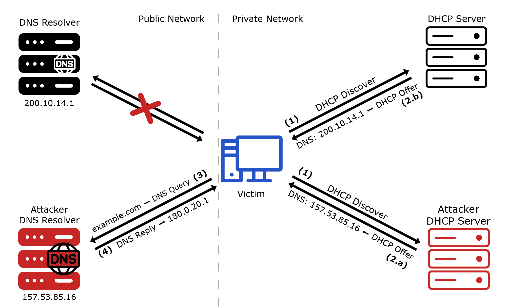
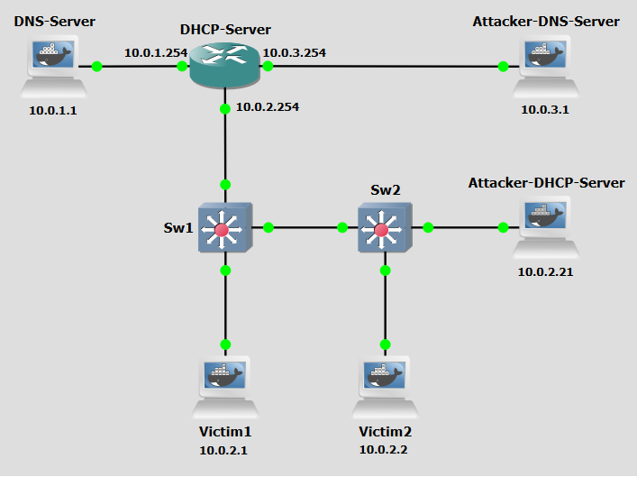

# Background

DHCP DNS Spoofing is a cyberattack technique that manipulates the Dynamic Host Configuration Protocol (DHCP) and Domain Name System (DNS) to redirect or intercept network traffic. This attack exploits the trust-based nature of DHCP and DNS to deceive clients into using malicious or unauthorized DNS servers. which allows attackers to redirect victims to fraudulent websites, intercept sensitive data, or launch further attacks, all while evading direct detection.


This technique leverages the lack of authentication in DHCP and DNS responses, combined with the ability to inject false information into network communications. The attack involves intercepting or forging DHCP responses to assign a rogue DNS server to clients, thereby controlling their DNS resolution process. DHCP DNS spoofing can be broken down into four main concepts: **DHCP Request Interception** and **DNS Resolution Manipulation**.


Initially, the attacker monitors a network for DHCP requests from clients seeking IP configuration. When a legitimate DHCP Discover request is detected, the attacker races to respond with a forged DHCP offer before the legitimate DHCP server can. This spoofed offer contains the IP address of a malicious DNS server controlled by the attacker. If the client accepts the attacker's offer, it will use the rogue DNS server for all subsequent DNS queries. The attacker's DNS server then manipulates responses to redirect the victim's traffic, such as directing requests for legitimate websites to phishing pages or intercepting unencrypted communications. This redirection can lead to malware distribution, or man-in-the-middle attacks. The victim remains unaware of the manipulation, as the attack exploits the inherent trust in DHCP and DNS protocols, making it difficult to detect without proper network monitoring or security measures.


<figure markdown id="figure-1">
  
  <figcaption>Figure 1: DHCP DNS Spoofing attack</figcaption>
</figure>

 [Figure 1](#figure-1) shows a DHCP DNS spoofing scenario. These are the steps:


- **Step 1:** A victim device joins the network or attempts to renew its lease and broadcasts a DHCPDISCOVER message to the entire local network in order to find an available DHCP server.
- **Step 2:**  The Attacker DHCP Server intercepts the broadcast and immediately sends a DHCPOFFER. To ensure the Victim chooses it has its DHCP server. This message includes standard networking info, like an IP address and gateway, but also the IP address of a DNS Resolver, 157.53.85.16, which belongs to the Attacker DNS Resolver. 
- **Step 3:** The Victim accepts the malicious offer and configures its network settings based on the attacker's provided info. It then performs a query for a domain, like example.com. From this point on, every time the victim tries to resolve a domain it will be sent to the Attacker DNS Resolver.
- **Step 4:** The Attacker DNS Resolver can now reply with an IP address belonging to an attacker machine, effectively redirecting the Victim away from the legitimate destination.

In Step 2, the attacker may first perform a DHCP Starvation attack to exhaust the legitimate DHCP Server's IP pool, making the rogue Attacker DHCP Server the only one capable of responding.


<br>
<br>

# Objectives

Our goal with the following configurations is to simulate a DHCP DNS Spoofing attack. This lab demonstrates how attackers can exploit the lack of authentication in DHCP to inject a rogue DNS server into victim network configurations, effectively hijacking all DNS resolution for those clients.

<br>
<br>

# Lab Prerequisites & Network Configuration
<figure markdown id="figure-2">
  
  <figcaption>Figure 2: DHCP DNS Spoofing attack GNS3 Lab Topology</figcaption>
</figure>

In the GNS3 project showed in [Figure 2](#figure-2), you will need to add in the following topology that uses five key nodes (be sure to previously check the [Lab Setup Guide](../../setup.md){:target="_blank"}):

| Node Name  | Role                          | IP Address     | Subnet           |
|------------|-------------------------------|----------------|------------------|
| **DNS Server**     | DNS Server authoritative for example.com.             | **10.0.1.1**   | 10.0.1.0/24  |
| **DHCP Server**  | Router, also acting as DHCP server for network 10.0.2.0         | **f0/1: 10.0.1.254** **f0/0: 10.0.2.254**  **f1/0: 10.0.3.254** | |
| **Attacker DNS Server**     | Attacker-controlled DNS Server              | **10.0.3.1**   | 10.0.3.0/24  |
| **Attacker DHCP Server**  | Attacker-controlled DHCP Server          | **10.0.2.21**   | 10.0.2.0/24  |
| **Victim1**     | DHCP and DNS client machine | **10.0.2.1**   | 10.0.2.0/24  |
| **Victim2**     | DHCP and DNS client machine | **10.0.2.2**   | 10.0.2.0/24  |

Configure the **Attacker DNS Server** machine identically to **DNS Server**. It should be configured to be authoritative for example.com as well.

Use Cisco IOSvL2 switches for Sw1 and Sw2.


Use this simple configuration for the `Edit config` option of the **Victim1** and **Victim2** machines options menu:


```python
auto eth0
iface eth0 inet dhcp
```


<br>

The following script was used in this lab:

- <a href="../../../scripts/dhcpspoof.py" download>dhcpspoof.py</a>


<br>
<br>


# Phase 1: Setting up DHCP and DNS Servers

In this phase we configure the legitimate network infrastructure.

### Step 1.1: Basic DHCP Pool Setup

On the **DHCP Server** router,

 1 - Run the following configuration commands:

```python
conf t
ip dhcp pool 0
network 10.0.2.0 /24
default-router 10.0.2.254
dns-server 10.0.1.1
```

To confirm:

```python
show ip dhcp pool
show ip dhcp binding
```

On the **Switches**, run:
```python
enable
conf t
no cdp advertise-v2
```

### Step 1.2: Modify `example.com` Zone


On the **DNS Server**,

 1 - Modify the `db.example` zone file:

```python
nano /etc/bind/db.example
```

At the end, add:

```python
testa            IN      A       10.0.10.1
testb            IN      A       10.0.10.1
testc            IN      A       10.0.10.1
```
 3 - Restart the BIND service (named):

```bash
pkill named && named -c /etc/bind/named.conf
```
<br>
<br>


# Phase 2: Setting up the Attacker DHCP and DNS Servers

The attacker's servers need to be configured to mirror and subvert the legitimate
infrastructure.

### Step 2.1: Basic DHCP Pool Setup

On the **Attacker DHCP Server**, add the `dhcpspoof.py` script:


```bash
nano /home/dhcpspoof.py
```

The script `dhcpspoof.py` uses the python library scapy to implement a rogue DHCP server. Its primary goal is to intercept requests from local devices and provide them with malicious controlled network settings such as a DNS server controlled by the attacker. The script operates by leveraging Scapy's `AnsweringMachine` class, which is a high-level framework designed to listen for specific packets and automatically generate replies. When the script starts, it takes several command-line arguments (`interface`, `IP pool`, `subnet mask`, `gateway`, and `DNS`). The script initializes by defining a "pool" of IP addresses and identifying itself as the server. It constantly sniffs the local network for `DHCP Discover` or `DHCP Request` packets (broadcasted on `UDP ports` 67 and 68). When a victim device asks for an IP address this script will respond immediately with a `DHCP Offer`. Rather than just giving the victim an IP address, it forces the victim to update its internal routing table with a Rogue DNS Server, which points the victim to a specific DNS server (`Option 6`). The script maintains a local database (`self.leases`) mapping the hardware MAC addresses of victims to the IP addresses it has handed out. This ensures that if a victim reconnects, they receive the same "poisoned" configuration, maintaining persistence.

<br>

### Step 2.2: Modify `example.com` Zone


On the **Attacker DNS Server**,

 1 - Modify the `db.example` zone file:

```python
nano /etc/bind/db.example
```

At the end, add:

```python
testa            IN      A       10.0.20.1
testb            IN      A       10.0.20.1
testc            IN      A       10.0.20.1
```
 3 - Restart the BIND service (named):

```bash
pkill named && named -c /etc/bind/named.conf
```
<br>
<br>


# Phase 3: Perform Attack

The attacker is now fully set up and ready to intercept victim DHCP requests.

### Step 3.1: Turn off the Victim machines

Turn off both Victim machines. You might need to also manually enable the Switches by running `enable` in each console.

### Step 3.2: Execute the Spoofing script

On the **Attacker DHCP Server**, run:

```bash
python3 /home/dhcpspoof.py eth0 10.0.2.1 10.0.2.20 255.255.255.0 10.0.2.254 10.0.3.1
```

By running `dhcpspoof.py` with the above parameters, we are setting the script to listen on interface **eth0**, hand out IP addresses from the pool **10.0.2.1–10.0.2.20** (since 10.0.2.21 is reserved for itself), use a subnet mask of **255.255.255.0**, set the default gateway to **10.0.2.254** (same as before), and push **10.0.3.1** (the Attacker DNS Server) as the DNS server to every victim that accepts its `DHCP offer`. Any client that receives this configuration will resolve all domain names through the attacker-controlled DNS server instead of the legitimate one at 10.0.1.1.
<br>

### Step 3.3: Turn on the Victim machines

Now turn on the **Victim** machines to force `DHCPDiscover` broadcasts. Do two Wireshark captures, directly next to each Victim's interface.

<br>

!!! question Question
     After turning on the Victim machines, inspect the Wireshark captures on both victims' interfaces. What NS server address was assigned to each Victim via DHCP? Does the DNS server differ from what the legitimate DHCP Server would have assigned? Run `dig testa.example.com` on each Victim and compare the resolved IP address against the legitimate DNS Server's records. What do you observe?

??? success "Answer"
    Both Victim machines received **10.0.3.1** (the Attacker DNS Server) as their DNS
    server, instead of the legitimate **10.0.1.1**. This is visible in the Wireshark capture
    as DHCP Option 6 (DNS Server) inside the DHCP Offer sent by the Attacker DHCP Server. When running `dig testa.example.com`, victims receive **10.0.20.1**, the forged address configured in the Attacker DNS Server's zone file, instead of the legitimate **10.0.10.1** served by the real DNS Server. This confirms the attack was successful: the victims are transparently redirected to attacker-controlled infrastructure while believing they are accessing the legitimate service.


<br>
<br>
<br>
<br>


# Countermeasure
We now pass on to the countermeasure phase. DHCP spoofing abuses the DNS protocol's lack of built-in authentication by poisoning the source of DNS configuration before resolution even begins. Because standard DHCP has no mechanism to verify the identity or legitimacy of a responding DHCP server, any host on the same broadcast domain can race to answer a DHCPDISCOVER and win. The countermeasure must therefore be enforced at Layer 2, before rogue DHCP responses can reach clients.

DHCP Snooping is a Layer 2 security feature implemented on managed switches that acts as a firewall between untrusted hosts and trusted DHCP servers. It works by classifying switch ports as either trusted or untrusted. DHCP Snooping also builds and maintains a DHCP Snooping Binding Table, a database that records the mapping between a client's IP address, its MAC address, the switch port it is connected to, and the VLAN. Every time a client successfully obtains an IP address via DHCP, an entry is created in this table. 

The countermeasure will be implemented in the Switches nodes. 


<br>

## DHCP Snooping


### Step 1: Configure DHCP Snooping on Sw1 and Sw2

In these configurations below, g0/0 of Sw1 is connected to the DHCP Server, and g0/2 of Sw2 is connected to Sw1. Adjust to suit your network topology.

On the **Sw1**, run the following configurations:

```python
enable
configure terminal
ip dhcp snooping
ip dhcp snooping vlan 1
no ip dhcp snooping information option
interface GigabitEthernet0/0
 ip dhcp snooping trust
interface range GigabitEthernet0/1-3, GigabitEthernet1/0-3, GigabitEthernet2/0-3, GigabitEthernet3/0-3
 ip dhcp snooping limit rate 10
exit
end
```


On the **Sw2**, run the following configurations:

```python
enable
configure terminal
ip dhcp snooping
ip dhcp snooping vlan 1
no ip dhcp snooping information option
interface GigabitEthernet0/2
 ip dhcp snooping trust
interface range GigabitEthernet0/1, GigabitEthernet0/3, GigabitEthernet1/0-3, GigabitEthernet2/0-3, GigabitEthernet3/0-3
 ip dhcp snooping limit rate 10
exit
end
```

### Step 2:  Re-run the attack
Repeat Step 2.2 to re-run the attack. 

Perform two Wireshark captures right next to the Sw2 interfaces that link to Victim2 and to the Attacker DHCP Server. 

<br>


!!! question Question
     After re-running the attack with DHCP Snooping enabled, inspect the Wireshark capture on the Sw2  interface facing the **Attacker DHCP Server**. Can you still see DHCP Offer packets originating from 10.0.2.21 being forwarded toward the victims? What does Sw2 do with those packets?

??? success "Answer"
    Yes, the Attacker DHCP Server still sends DHCP Offer packets, which are visible arriving on Sw2's Gi0/1 interface. However, because that interface is configured as an **untrusted** port, Sw2 silently drops all DHCP server-originated messages (DHCP Offer, DHCP ACK) received on it. These packets never reach the victim-side ports. In the Wireshark capture on the Victim2-facing interface of Sw2, only DHCP Offers from the legitimate DHCP Server (arriving via the trusted uplink) are forwarded through.


!!! question Question
     After DHCP Snooping is in place, what DNS server address do the Victim machines receive? Re-run `dig testa.example.com` on both victims. How do the results compare to the pre-countermeasure results, and what does this confirm about the effectiveness of DHCP Snooping against this attack?

??? success "Answer"
    With DHCP Snooping active, both victims now receive **10.0.1.1** (the legitimate DNS Server) as their DNS server, assigned by the real DHCP Server. Running `dig testa.example.com` now returns **10.0.10.1**, which matches the authoritative record on the legitimate DNS Server.

    This confirms that DHCP Snooping successfully neutralises the DHCP DNS Spoofing attack. By classifying the attacker's port as untrusted and blocking DHCP server-type messages from it, the switch ensures that clients can only receive IP configuration from the trusted, legitimate DHCP Server — eliminating the attacker's ability to inject a rogue DNS server into victim configurations.


<br>
<br>

# Conclusion

As we saw, DHCP DNS Spoofing is a potent attack that requires no prior foothold on victim machines. An attacker merely needs to be present on the same broadcast domain and respond to DHCP broadcasts faster than the legitimate server. By injecting a rogue DNS server address into DHCP offers, the attacker silently hijacks all DNS resolution for the victim, enabling traffic redirection, phishing, and man-in-the-middle attacks that are invisible to the victim at the application level.

The countermeasure used, DHCP Snooping, addresses the root cause by enforcing trust boundaries at Layer 2. By designating only the uplink toward the legitimate DHCP Server as trusted, and rate-limiting or dropping DHCP server messages on all other ports, managed switches prevent rogue DHCP servers from ever reaching clients. The DHCP Snooping Binding Table that is built as a side effect also forms the foundation for additional protections such as Dynamic ARP Inspection (DAI), which can prevent ARP spoofing attacks using the
same IP-to-MAC mappings validated during DHCP.

Properly deploying DHCP Snooping across all access-layer switches in a network is therefore a critical baseline defence in any environment where Layer 2 trust cannot be assumed.

<br>