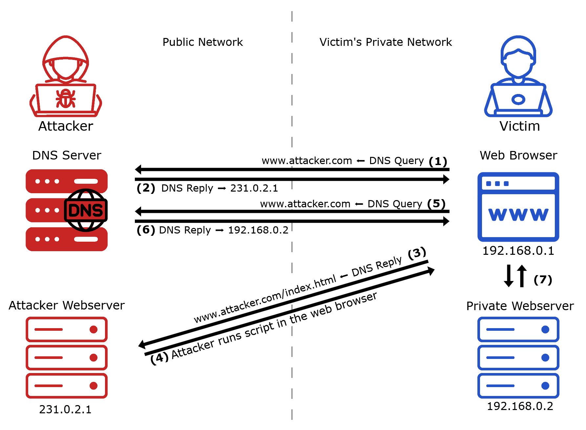
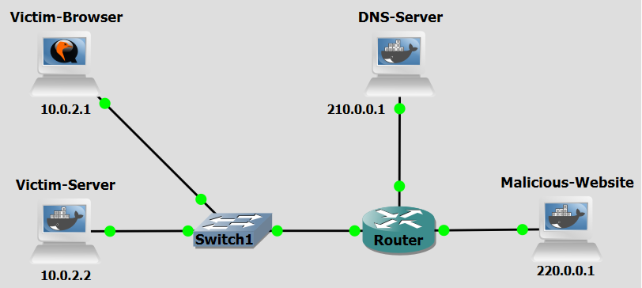

# Background

DNS Rebinding is a technique that allows an attacker to bypass the same-origin policy in web browsers, enabling malicious scripts to interact with private network services as if they originated from within the trusted network. There are two primary ways to carry out the attack:

Client-side rebinding via a malicious website: In the most common form of the attack, the attacker tricks the victim into visiting a malicious website such as attacker.com, which the attacker controls. When the victim's browser loads the page, it performs a DNS lookup for attacker.com, and the attacker’s DNS server responds with an IP address pointing to an attacker-controlled web server on the internet. The browser loads malicious JavaScript from this server. Later, when the JavaScript makes another request to attacker.com, the attacker responds with a different IP address, for example, a private IP such as 192.168.0.2. Because the domain name remains the same, the browser still considers the request to be the same origin. This allows the malicious script to access internal network resources as if they were part of \textbf{attacker.com}, breaching the network’s perimeter defenses.
    
Rebinding via a compromised local DNS resolver: A more difficult but potentially more powerful variation of the attack involves the attacker gaining control of the DNS resolver used by the victim’s network — for example, through malware or misconfiguration. If the attacker controls the resolver, they can manipulate DNS responses without needing the victim to visit a malicious website. This allows for DNS rebinding attacks to be launched passively or on-demand, targeting devices inside the local network without user interaction.

<figure markdown>
  { width="600" }
  <figcaption>Figure 1: DNS Rebinding attack</figcaption>
</figure>

Figure 1 illustrates a scenario based on "Client-side rebinding via a malicious website", in which the victim visits a malicious website controlled by the attacker (**www.attacker.com**). The victim also has a private web server on their local network that is normally inaccessible from the internet. The attacker, who has access to a compromised DNS Server, can control the DNS records for their domain and knows the private IP of the victim’s internal service, launches the attack as follows:

- **Step 1:** The Attacker tricks the Victim into accessing its malicious web page on www.attacker.com (such as, via phishing) and a DNS request is sent to the malicious domain's DNS server.
- **Step 2:** The DNS server returns (231.0.2.1) that corresponds to the correct IP address of the Attacker’s Web server.
- **Step 3:** The Victim’s web browser gets the web page from the Attacker Web Server.
- **Step 4:** After the page is loaded, the browser runs the malicious script.
- **Step 5:** The Web Browser sends a new request to www.attacker.com through a DNS Query sent to the DNS Server.
- **Step 6:** The DNS Server returns the Victim’s Private Web Server IP address (192.168.0.2).
- **Step 7:** The malicious script sends an HTTP request to the private server. Because the browser treats the request as same-origin, it allows the malicious page to fully interact with the private server’s resources.

The attack is now concluded. The attacker can now send HTTP requests to the Private Web Server, and the Web Browser will not identify it as a cross-origin request. The attacker is free to fully access the Private Web Server.

<br>
<br>

# Objectives
Our goal with the following configurations is to simulate a DNS Rebinding attack. This lab demonstrates how attackers use low-TTL DNS records and browser same-origin policy assumptions to pivot from a public-facing malicious website into a victim's private local network. 

<br>
<br>

# Lab Prerequisites & Network Configuration
<figure markdown>
  
  <figcaption>Figure 2: DNS Rebinding GNS3 Lab Topology</figcaption>
</figure>

In the GNS3 project showed in Figure 2, you will need to add in the following topology that uses four key nodes (be sure to previously check the [Lab Setup Guide](../../setup.md){:target="_blank"}):

| Node Name  | Role                          | IP Address     | Subnet           |
|------------|-------------------------------|----------------|------------------|
| **Victim Browser**     | Target Browser                       | **10.0.2.1**   | 10.0.2.0/24  |
| **Victim Server** | Target Webserver                    | **10.0.2.2**   | 10.0.2.0/24  |
| **DNS Server**  | DNS Server (BIND)                      | **210.0.0.1**   | 210.0.0.0/24  |
| **Malicious Website**   | Attacker Webserver             | **220.0.0.1**   | 220.0.0.0/24  |


The **Victim Server**, the **Malicious Website**, and **DNS Server** machines are implemented with Docker containers available at the Docker Hub. For the **Victim Server** install at GNS3 the container 0xdrogon/dns-
rebinding-victim, for the **Malicious Website** install 0xdrogon/dns-rebinding-malware and for the **DNS Server** install 0xdrogon/dns-rebinding-bind9.

For the **Victim Browser** use the **Ubuntu Desktop Guest** appliance of GNS3 (22.04 version was the one used in this lab, includes Firefox). To log in, use credentials: `Username: osboxes.org`, `Password: osboxes.org`.


<br>
<br>

# Phase 1: Setup

The **DNS Server**, **Victim Server** and **Malicious Website** machines are ready. Only the **Victim Browser** needs setup.

The **DNS Server** runs a Python script `sniffer.py` in the background that uses Scapy to listen for DNS requests to `www.dnsrebindingmalware.com`. When the victim makes the first request, it calls a bash script to change the name-to-IP mapping to the Victim Server (10.0.2.2) in the BIND 9 configuration files and, afterwards, it calls a second bash script to change the mapping back to the Malicious Website (220.0.0.1).

The **Victim Server** is a Python web server, `victim.py`, that changes the state of the lights at the
victim’s house. In the attack, the attacker gains access to the Victim Server and turns on all lights.
The Victim Server uses a simple form of authentication based on one-time passwords. The user must
first send a `GET` request to the `/password` endpoint, to obtain the password that must be included in
the POST request that turns on a specific light. This mechanism aims at defeating **Cross-site request forgery (CSRF) attacks**.

The **Malicious Website** runs a Python web server, `malware.py`,  with a simple Web page that includes malicious JavaScript code. The JavaScript code uses the `XMLHttpRequest` object to make requests to the Victim Server that turn on all the lights in the victim’s house. The Web page also has a ten second countdown timer; the attack is only launched when the timer reaches zero. This countdown works as a waiting period to allow the change of name-to-IP mapping at the DNS Server. The malicious JavaScript code that is executed by the Victim Browser turns on all the lights in the victim’s house. To achieve that, it makes five requests to the `/password` endpoint, each followed by a request to the `/lights` endpoint.

### Step 1.1: Victim Browser Configuration

On the **Victim Browser** machine:

- Go to `Settings>Network>Wired>IPv4`. There, fill in the IP address (10.0.2.1), netmask (255.255.255.0) and gateway (10.0.2.254), and DNS (210.0.0.1) fields.

- Check if you can change the lights by visiting:
    ```console
    http://10.0.2.2
    ```
    You can check the state at `http://10.0.2.2/lights`. Leave them all turned off.

- Open Firefox browser, type `about:config` on the URL field, and search for `dnsCache` and change the value of the following entries:

    ```console
    network. dnsCacheExpiration: 2
    network. dnsCacheExpirationGracePeriod: 0
    ```

- Disable the Firefox prefetching. Set to false the `network.prefetch-next` and `network.dns.disablePrefetch` options. These settings are not required for the success of the attack but ease the interpretation of the DNS messages.

<br>
<br>
<br>

# Phase 2: Attack Execution

### Step 2.1: Start the Attack

Do a Wireshark capture at the connection between the Victim Browser and the switch, use the filter `dns.qry.name contains "dnsrebindingmalware" or http`.


On the **Victim Browser**, on the URL field, type:

```bash
www.dnsrebindingmalware.com
```

A window with title “DNS Rebinding Attack” must appear together with a countdown timer. The attack is performed when the countdown timer finishes, at that instant open a different tab on the same domain.

You should be able to access 10.0.2.2 through `www.dnsrebindingmalware.com` now. The switches should be all turned on, nut if not you can do it manually. 

Go to `http://10.0.2.2/lights` to confirm if the attack really was sucessful.

<br>

### Step 2.2: Repeat the attack

If the attack was not sucessful, which can happen, you can repeat the attack. Go to firefox's settings and remove all history, cache and site data. Note that the **DNS Server** must be restarted every time the experiment is repeated. As an alternative, access the auxiliary console of the **DNS Server**, and run:

```bash
python3 /var/dns-rebinding/sniffer.py 10.0.2.1
```

This way you can see if the sniffer script is working properly or not.

<br>

!!! question Question
     Examine the Wireshark capture. How many DNS queries for www.dnsrebindingmalware.com do you observe, and what are the IP addresses returned in each response? What does the change in resolved IP address tell you about the rebinding mechanism?

??? success "Answer"
    You should observe at least two DNS queries for `www.dnsrebindingmalware.com`: **First query:** The DNS server responds with `220.0.0.1` — the IP of the Malicious Website. This is the initial resolution that allows the browser to load the attacker's web page and execute the malicious JavaScript; **Second query (after ~10 seconds):** The DNS server responds with `10.0.2.2` — the IP of the Victim Server on the private network. This is the rebind step: after the browser's short DNS cache (set to 2 seconds) expires and the countdown timer on the malicious page fires a new request to the same domain, the sniffer script on the DNS Server has already switched the DNS record to point to the internal host. The change in resolved IP is the core of the attack: the **domain name stays the same** (`www.dnsrebindingmalware.com`), so the browser considers both responses as belonging to the same origin. This tricks the browser into allowing the malicious JavaScript — loaded from the attacker's server — to make XMLHttpRequests directly to the private Victim Server, completely bypassing the Same-Origin Policy.


<br>
<br>
<br>


# Countermeasure
After performing the attack, we now pass on to the countermeasure phase. To combat DNS Rebinding attacks, one of the most commonly used countermeasures in web browsers is DNS Pinning. This method ensures that the browser caches DNS resolutions for a predetermined period, regardless of the Time To Live (TTL) value specified by the DNS server. This is particularly effective against attackers who set extremely low TTL values for their malicious hostnames, as browsers will override these values with a default setting.


<br>

## DNS Pinning

### Step 1: Configuration

On the **Victim Browser** machine, inside Firefox type `about:config` on the URL field, and search for `dnsCache` and change the value of the following entries:

```console
network. dnsCacheExpiration: 600
network. dnsCacheExpirationGracePeriod: 10
```

These values configure Firefox to cache DNS entries for 600 seconds (10 minutes) and to apply a 10-second grace period after expiration before discarding the entry entirely. Since modern browsers already apply DNS pinning techniques by default, this step restores Firefox to behavior closer to its production defaults — which were deliberately weakened at the start of Phase 1 to enable the attack to succeed.

!!! question Question
     Why did we need to set `dnsCacheExpiration` to just 2 seconds at the beginning of the lab (Phase 1, Step 1.1)? What would have happened if we had left Firefox at its default caching duration of 600 seconds throughout the entire experiment?

??? success "Answer"
    The DNS Rebinding attack depends entirely on the victim's browser performing a second DNS lookup for `www.dnsrebindingmalware.com` after the DNS Server has switched the record to point to the Victim Server (10.0.2.2). This second lookup can only happen once the browser's DNS cache entry for the domain expires. With the default 600-second cache lifetime, the browser would have continued resolving `www.dnsrebindingmalware.com` to `220.0.0.1` (the attacker's server) for up to 10 minutes, even though the DNS Server had already changed the record. The malicious JavaScript's `XMLHttpRequests` would therefore continue going to the attacker's own server, not the private Victim Server, and the rebind would never occur.


<br>


### Step 2: Re-run the attack.

Clear all browser history, cache, and site data in Firefox. Restart the DNS Server sniffer script as in Step 2.2. Then repeat the steps from Phase 2, Step 2.1 — navigate to `www.dnsrebindingmalware.com` and wait for the countdown to finish.

Be sure to also capture the network traffic as before.


!!! question Question
    After applying the DNS Pinning countermeasure, was the attack successful? Examine the Wireshark capture. How does the DNS traffic differ from what you observed in Phase 2? What do you observe about the IP address returned for the second DNS query (if one occurs at all)? 

??? success "Answer"
    With DNS Pinning enabled (600-second cache), the attack fails. The lights on the Victim Server should remain off after the countdown, and `http://10.0.2.2/lights` should confirm no state change occurred. In the Wireshark capture, you should observe a key difference in DNS behavior: **First DNS query:** As before, `www.dnsrebindingmalware.com` resolves to `220.0.0.1`. The malicious page loads and the countdown timer begins; **Second DNS query (after ~10 seconds):** A second query may **not appear at all**, or if it does, Firefox ignores the new DNS response and continues using the originally cached IP (`220.0.0.1`). Because the DNS cache entry is pinned for 600 seconds, the browser does not accept the updated record pointing to `10.0.2.2`. As a result, when the malicious JavaScript fires its XMLHttpRequests to `www.dnsrebindingmalware.com`, they are sent to the **attacker's own server** (`220.0.0.1`), not the Victim Server. The Same-Origin Policy is never bypassed with respect to the private network, so the `/password` and `/lights` endpoints of the Victim Server are never reached.


<br>
<br>
<br>

# Conclusion

As we saw, after we configured DNS Pinning in the browser, the DNS Rebinding attack was effectively neutralized. By caching the initial DNS resolution for a longer period (600 seconds), Firefox prevented the browser from accepting the attacker's forged second DNS response that redirected the domain to the Victim Server's private IP address. This meant the malicious JavaScript could never establish a same-origin context with the internal service, and the `/password` and `/lights` endpoints of the Victim Server remained inaccessible from the attack page. 

The Same-Origin Policy is designed to protect users, but it relies on the assumption that a domain name consistently maps to a single origin. DNS Rebinding exploits the moment when this assumption breaks down, when a domain's DNS record changes between requests. The attack is particularly dangerous because it requires no vulnerability in the target application itself since it abuses a legitimate browser mechanism.
    
<br>