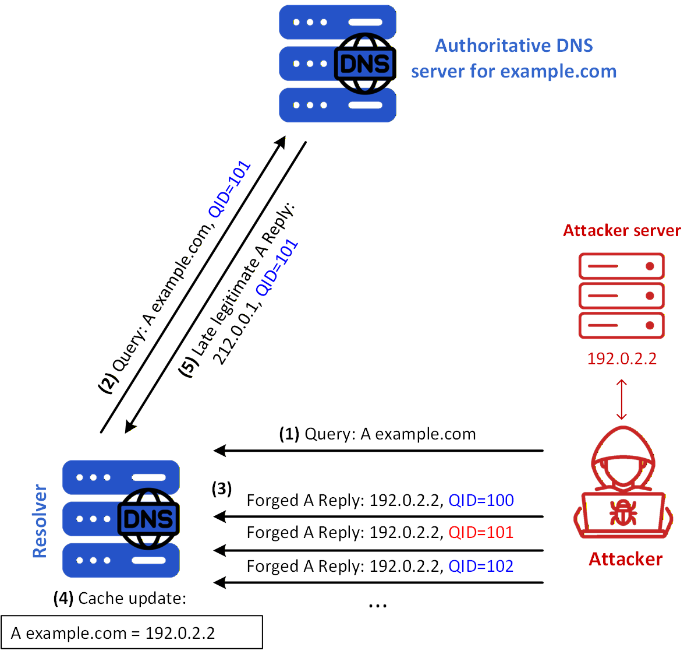
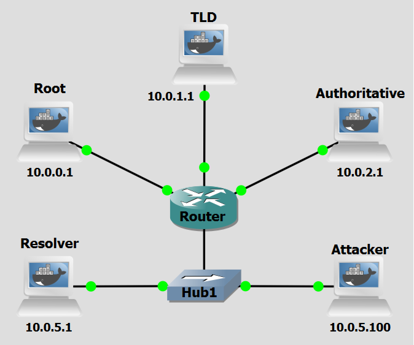

# Background
A DNS Cache Poisoning attack aims to insert false DNS information into the cache of a DNS resolver, such that users are redirected to malicious websites even when requesting legitimate domains. It is sometimes also referred to as DNS Spoofing, but this term doesn't emphasize the role of poisoning the cache in the outcome of the attack.

In a basic DNS cache poisoning attack, the attacker waits for a DNS resolver to send a query for a domain (in this case, www.example.com). The attacker cannot directly control when such a query is made, but if they are on the same LAN as the resolver, they can observe the query in real time. This gives the attacker a critical advantage: visibility into the transaction ID used in the query packet.

DNS responses must contain the same transaction ID as the query, and because this ID is typically randomly generated and 16 bits in length, guessing it blindly is difficult. However, once the attacker sees the query, they can forge a response with the correct transaction ID and malicious DNS data, and send it back to the DNS resolver before the legitimate response arrives.

If the attacker's forged response arrives first and is accepted by the resolver, the false information is cached and served to other clients for the duration of the Time-To-Live (TTL). During this cache period, the resolver will not issue another query for the same domain, and the attacker cannot attempt the same trick until the cache expires. This delay can significantly hinder the attack's success rate.

DNS poisoning attacks become much harder when the attacker is not on the same LAN as the resolver, since they cannot see the original query and must blindly guess the transaction ID. Still, due to the small size of the Transaction/Query ID (QID) space of 16 bits, if the attacker can forge K responses within the attack window, namely, before the legitimate response arrives, the probability of success is K over \(2^{16}\). Attackers can send hundreds or thousands of forged responses to increase their chances of success. But if they fail to guess correctly before the real response is received, the correct data is cached, and the attacker must wait for the cache to time out before trying again.


<figure markdown id="figure-1">
  
  <figcaption>Figure 1: DNS Cache Poisoning attack</figcaption>
</figure>


 [Figure 1](#figure-1) shows a DNS Cache Poisoning scenario where the Victim DNS Server has no record of the domain **example.com**, and the attacker has a fast connection to the DNS Server. The attack's steps are the following:  


- **Step 1:** The Attacker sends DNS Query request to Victim DNS Server about domain example.com.
- **Step 2:** Victim DNS Server sends DNS Query to Root/gTLD servers inquiring about example.com.
- **Step 2.1:** Simultaneously, the Attacker floods the Victim DNS Server with DNS Replies containing the IP address (192.0.2.2) belonging to their fake web server for example.com, and using different QIDs.
- **Step 3:** Root/gTLD servers respond to the previous DNS Query with information about the domain’s nameserver.
- **Step 4:** The Victim DNS Server queries the domain’s nameserver (ns1.example.com) to get the domain’s corresponding IP address.
- **Step 5:** The domain’s nameserver (ns1.example.com) responds with IP address of example.com (212.0.0.1).
- **Step 6:** The Victim DNS Server finally responds to the Attacker with the IP address it assumes to be of example.com. If Step 2.1 happened successfully before Step 5, the returned IP address in step 6 will be 192.0.2.2.

Do note that the attack is only successful if Step 2.1 happens before Step 5, and if that wasn't the case, steps 4 and 5 would simply not occur. This all means that the attacker has to flood the Victim DNS server with replies right after sending the DNS Query in Step 1.

<br>
<br>

# Objectives
This lab demonstrates how attackers can exploit the lack of authentication in the DNS protocol to poison the cache of a recursive resolver and silently redirect users to a malicious destination. You will act as the attacker executing a script to capture outgoing DNS queries and injecting a forged response before the legitimate authoritative nameserver can reply.


<br>
<br>

# Lab Prerequisites & Network Configuration
<figure markdown id="figure-2">
  
  <figcaption>Figure 2: Cache Poisoning GNS3 Lab Topology</figcaption>
</figure>

In the GNS3 project showed in [Figure 2](#figure-2), you will need to add in the following topology that uses five key nodes (be sure to previously check the [Lab Setup Guide](../../setup.md){:target="_blank"}):


| Node Name  | Role                          | IP Address     | Subnet           |
|------------|-------------------------------|----------------|------------------|
| **Root Server**     | Root Zone ( .)                            | **10.0.0.1**   | 10.0.0.0/24  | 
| **TLD (Top Level Domain) Server** | Top-Level Domain (.com)     | **10.0.1.1**   | 10.0.1.0/24    |
| **Authoritative Server**   | Authoritative nameserver for example.com  | **10.0.2.1**   | 10.0.2.0/24  |
| **Resolver**     | Recursive DNS Server. Attack victim            | **10.0.5.1**   | 10.0.5.0/24  |
| **Attacker**  | Implements attack            | **10.0.5.100**   | 10.0.5.0/24  |


Note that the Resolver and the Attacker share the same subnet (10.0.5.0/24). This is intentional and is the key topological assumption of this lab. Transaction ID randomisation, present in all current DNS software by default, makes blind off-path forgery statistically impractical: an attacker who cannot observe the resolver's outgoing packets must simultaneously guess a 16-bit transaction ID (or QID) and an ephemeral source port within a narrow time window. By placing the attacker on the same LAN, both values become directly observable in plaintext from a single packet capture, reducing the attack to a race condition rather than a guessing game. Any attacker position that does not afford visibility into the resolver's outgoing DNS traffic, such as a different subnet with no routing path through the LAN segment, would make this attack infeasible against a resolver using standard QID and port randomisation.

We will add a delay in the connection between the router and the Authoritative Server to be able to simulate the latency observed between the resolver´s network and DNS infrastructure outside of it. 
Right-Click on the connection and select `Packet Filters`, and in `Delay` add 600ms of latency.

<br>

The following script was used in this lab:

- <a href="../../../scripts/cache_poisoning.py" download>cache_poisoning.py</a>


<br>
<br>


# Phase 1: Setting up the Attacker's Infrastructure

The attacker machine runs a packet-sniffing script that passively monitors the LAN for outgoing DNS queries from the victim resolver and immediately races to inject a forged response.

### Step 1.1: Prepare the Script

On the **Attacker** machine, add the script `cache_poisoning.py`:

```bash
nano /home/cache_poisoning.py
```

The `cache_poisoning.py` script on the Attacker machine captures outgoing DNS queries from the victim resolver, whose IP address is specified as a command-line argument when executing the script, and races to inject a forged response before the legitimate authoritative nameserver can reply.

This script has two concurrent responsibilities, handled via a packet filter and a response callback: **Packet sniffing** (main thread), using `Scapy`, it listens on `UDP port 53` for all outgoing DNS queries originating from the victim resolver. For every packet, it checks whether it's an A-record query (query type 1, qr == 0 meaning it's a question not a response) directed toward the legitimate authoritative nameserver for the target domain `www.example.com`. When it finds one, it extracts the **transaction ID**, the resolver's ephemeral source port, and the original question section, all of which are required to craft a convincing forgery; and **Response injection** (callback spoof_dns_response), in which, for each matching query it intercepts, it immediately constructs and sends a spoofed UDP packet whose source IP is spoofed as being the legitimate authoritative nameserver's and whose destination is the resolver's ephemeral port. The forged DNS layer mirrors the original transaction ID and plants a poisoned A record pointing www.example.com to the attacker's own IP (10.0.5.100) with a 604800-second TTL (1 week) causing the resolver to cache and serve the attacker's address to any downstream client that queries it.

<br>


!!! question Question
      Why does the script need to extract the resolver's ephemeral source port as well as the transaction ID from the intercepted query? Would matching just the transaction ID be sufficient for the forged response to be accepted?

??? success "Answer"
     No, matching only the transaction ID is not sufficient. A DNS resolver accepts a response only if both the transaction ID and the destination UDP port match the values used in the original query. The resolver opens an ephemeral (randomly chosen, high-numbered) source port when sending the query; the legitimate response is expected to arrive back on that exact port. The script must therefore extract the source port from the sniffed query packet and use it as the destination port of the forged response. This is also why source port randomisation (RFC 5452) was introduced as a defence: even if an off-path attacker can guess the 16-bit transaction ID, they also need to guess the correct port from a pool of up to ~64,000 possibilities, which reduces the probability of a successful blind forgery dramatically. In this lab the attacker is on-path (same LAN), so both values are directly observable and the defence provided by port randomisation is bypassed entirely.

<br>
<br>

# Phase 2: Validation and Analysis

You can now execute the attack and observe the results. Do a Wireshark capture right next to the Resolver interface (as a tip, use a `dns` filter to better analyze the relevant DNS packets).

### Step 2.1: Test DNS Resolution

On the **Attacker** machine, run:

```bash
dig testa.example.com
```

Make sure it receives a correct response. If not, restart BIND on the **Resolver** machine.


### Step 2.2: Run the attack

On the **Attacker** machine, run:

```bash
python3 /home/cache_poisoning.py 10.0.5.1
```

The script will begin silently sniffing the LAN. Now, trigger a DNS lookup from the Resolver to cause the resolver to send a fresh query for `www.example.com`.

On the **Resolver**, run:

```bash
dig www.example.com
```


!!! question Question
     Looking at the Wireshark capture taken at the Resolver interface, you will see both the forged response from the attacker and the legitimate response from the Authoritative Server. What determines which response the resolver accepts, and what happens to the other one? What does the relative timing of the two responses tell you about the role the 600ms artificial delay plays in this lab?

??? success "Answer"
     The resolver applies a first-come, first-served rule meaning it accepts the very first response that arrives with a matching transaction ID and destination port, and discards any subsequent response for the same query, including the legitimate one. In the Wireshark capture you should observe the attacker's forged response arriving measurably earlier than the legitimate response from the Authoritative Server. The 600ms artificial delay on the link to the Authoritative Server is what makes this timing gap reliable in the lab: it models the real-world latency that would exist between the resolver's LAN and an external authoritative nameserver, giving the attacker (who is local to the resolver) a consistent and comfortable time window in which to inject the forged packet. Without the delay, the legitimate response might arrive first depending on the machine's processing speed, and the poisoning attempt would fail.


<br>
<br>
<br>
<br>
<br>


# Countermeasure
DNSSEC defends against DNS cache poisoning by cryptographically signing DNS records, forcing resolvers to verify the authenticity of every response before caching it. This countermeasure leverages the fact that a poisoning attack depends entirely on the resolver blindly trusting whichever response arrives first, as it has no native way to distinguish a forged packet from a legitimate one. The defender's goal is to make every DNS response verifiably traceable back to the zone's legitimate owner, so that even a perfectly timed spoofed packet is rejected outright.

A defining characteristic of this defense is that it addresses the root vulnerability of the DNS protocol: the absence of authentication. Since every record in a DNSSEC-signed zone is accompanied by a digital signature (RRSIG record), a resolver can use the zone's published public key (DNSKEY record) to verify that the answer was produced by the legitimate authoritative nameserver and has not been tampered with in transit. A forged response like the one injected by `cache_poisoning.py` script (which impersonates the authoritative nameserver and plants a poisoned A record) would carry no valid RRSIG, causing a validating resolver to discard it immediately, regardless of whether the transaction ID and source port matched perfectly.

<br>

### Step 1: Configure DNSSEC

To configure DNSSEC in the DNS hierarchy follow the [DNNSEC lab guide](../../enhancements/dnssec.md){:target="_blank"}.

Once DNSSEC is fully configured, the resolver will have dnssec-validation auto; enabled in its BIND options and a valid root trust anchor installed in /etc/bind/bind.keys file.

<br>


### Step 2:  Re-run the attack

Do a Wireshark capture like before, right next to the Resolver to be able to see the influence of the countermeasure.


On the **Resolver**, restart the BIND service (named):

```console
pkill named && named -c /etc/bind/named.conf
```

On the **Attacker** machine, run:

```bash
python3 /home/cache_poisoning.py 10.0.5.1
```

Then, on the **Resolver**, trigger a fresh lookup:

```bash
dig www.example.com
```

To inspect the cache of the BIND **Resolver** to view cached DNS records, including DNSSEC-signed responses, run:

```bash
rndc dumpdb -cache
nano /var/cache/bind/named_dump.db
```


<br>


!!! question Question
      After enabling DNSSEC, the attacker's forged response still arrives at the resolver before the legitimate one. Despite this, the poisoning attempt fails. What exactly does the resolver check in the forged response that causes it to reject it, and at what point in the DNSSEC validation chain does the verification fail?? 


??? success "Answer"
    When DNSSEC validation is enabled, the resolver does not simply accept the first response that matches the transaction ID and port. Before caching any answer, it verifies the `RRSIG` record attached to the returned `RRset` by checking the digital signature against the zone's `public ZSK` (obtained from the `DNSKEY` record, which is itself verified via the chain of trust from the root). The forged response crafted by `cache_poisoning.py` contains a plain `A record` with no accompanying RRSIG, because the attacker does not possess the private ZSK for `example.com` and therefore cannot produce a valid signature. The resolver detects the absence of a valid RRSIG for the A record RRset, determines that the response fails DNSSEC validation, and discards it returning `SERVFAIL` to the client. The validation failure occurs at the lowest link in the chain, the verification of the A record's RRSIG against the example.com ZSK.


!!! question Question
    Could an attacker defeat DNSSEC by also forging the RRSIG record in the spoofed response? What would the attacker need in order to produce a valid RRSIG?
 

??? success "Answer"
    No. To forge a valid `RRSIG`, the attacker would need access to the `private ZSK` of the `example.com` zone, which is kept secret by the legitimate zone operator and never published in DNS. RRSIG records are produced by signing the RRset with the private ZSK. The resolver verifies the signature using only the public ZSK, which is published in the DNSKEY record and anchored to the chain of trust via the parent DS record. Without the private key, producing a signature that verifies correctly against the published public key is computationally infeasible. 


<br>

### Step 3: DNSSEC as a denial-of-service vector

Although DNSSEC prevents cache poisoning, since the attacker can no longer redirect users to a malicious IP, they can still cause DNS resolution for the targeted domain to become unavailable for a period of time.

In a scenario where the attacker sends a forged response that arrives first and carries a poisoned record which the resolver attempts to validate, the resolver returns SERVFAIL to the client immediately, it also typically caches the negative result (a validation failure for that query) during which it will not re-query the authoritative server for the same name. During this window, the domain is effectively unreachable from the resolver's clients even though the DNS infrastructure itself is functioning correctly. The attack does not pollute the cache with a false IP, but it temporarily denies service to legitimate users, an outcome the attacker can sustain by re-triggering the attack each time the negative TTL expires.

With DNSSEC still enabled and the 600ms delay still in place, restart the BIND service and run the attack again:

On the **Resolver**:
```bash
pkill named && named -c /etc/bind/named.conf
```
On the **Attacker** machine:
```bash
python3 /home/cache_poisoning.py 10.0.5.1
```

Then on the **Resolver** trigger a lookup immediately:

```bash
dig www.example.com 
```
Observe that the response received in previous step is SERVFAIL. 

Inspect the cache of the BIND **Resolver** to view cached DNS records of `www.example.com`, run:

```bash
rndc dumpdb -cache
nano /var/cache/bind/named_dump.db
```

<br>

!!! question Question
     In this scenario, DNSSEC successfully prevents the attacker from poisoning the resolver's cache with a false IP address. However, the attacker is still able to cause harm. What is the nature of that harm, and how does it differ from a successful cache poisoning attack in terms of impact on the end user?

??? success "Answer"
    The harm is a temporary denial of service for the targeted domain. Rather than being silently redirected to a malicious server, end users receive a `SERVFAIL` error and are unable to reach the domain at all until the resolver's `negative TTL` expires and it is willing to retry the query. The two outcomes differ in a key way: cache poisoning is stealthy and dangerous precisely because the user has no indication that anything is wrong, while the denial-of-service effect caused by DNSSEC's rejection of the forged response is immediately visible as a resolution failure. The `SERVFAIL` is disruptive but transparent; the poisoned cache is subtle and potentially far more damaging because it enables credential theft, phishing, or traffic interception without the user's knowledge.

<br>
!!! question Question
     An attacker who understands that DNSSEC will block cache poisoning might deliberately use the denial-of-service effect as their primary goal. What could they do to maximise the duration of the service disruption, and what would limit their ability to do so indefinitely?
     
??? success "Answer"
     To maximise disruption, the attacker could monitor the resolver and re-trigger the attack each time the `negative TTL` expires, continuously racing a new forged response ahead of each fresh legitimate lookup to cause a new validation failure and reset the negative cache timer. The main limits on this strategy are: (1) the attacker must remain on the same LAN as the resolver and keep the sniffing script running continuously — losing network access ends the attack; (2) the 600ms artificial delay is what makes the race winnable in our lab scenario; in a real network, link latency to the authoritative server may be low enough that the legitimate response sometimes arrives first, causing the attack to fail intermittently; and (3) a network administrator who notices persistent `SERVFAIL` responses for a specific domain could investigate and detect the anomalous forged packets in a traffic capture, potentially leading to the attacker being identified and removed from the network.
<br>
<br>

###  Step 4: Remove the latency delay

So far, the 600ms artificial delay on the link to the Authoritative Server has been what makes the race condition consistently winnable for the attacker. In a real-world scenario, the authoritative server for a domain may be geographically close to the resolver, or the network path may be fast enough that the legitimate response arrives before the attacker can inject a forged one. This step simulates that scenario by removing the delay and observing the result.

In GNS3, right-click on the connection between the router and the Authoritative Server, select Packet Filters, and remove the 600ms delay (set it back to 0).

Do a Wireshark capture like before, right next to the Resolve.
Flush the resolver cache by restarting the BIND service and run the attack again:

On the **Resolver**:
```bash
pkill named && named -c /etc/bind/named.conf
```
On the **Attacker** machine:
```bash
python3 /home/cache_poisoning.py 10.0.5.1
```

Then on the **Resolver** trigger a lookup immediately:

```bash
dig www.example.com 
```

You can also use `+dnssec` in the dig command to see the associated RRSIG to the A record answer.

This time, the legitimate response from the Authoritative Server arrives at the resolver before the attacker's forged packet. The resolver processes the legitimate response first, validates it successfully against the DNSSEC chain of trust (the `ad` flag will be set in the response), and caches the correct `A record`. The attacker's forged response arrives afterwards and is discarded, both because its transaction ID no longer matches an open query (the query has already been answered) and because it carries no valid `RRSIG`. The dig response should show the correct IP address (10.0.3.1) and the ad flag confirming authenticated resolution.


<br>
<br>

# Conclusion

As we saw, after enabling DNSSEC on the DNS Hierarchy, the cache poisoning attack was neutralised even though the underlying race condition, and the attacker's ability to inject a forged response before the legitimate one arrives, remained entirely unchanged. The forged packet still reached the resolver first, but the resolver's DNSSEC validation logic detected the absence of a valid RRSIG and discarded the response outright, preventing the poisoned record from ever entering the cache.

This demonstrates that DNSSEC does not prevent the attacker from sending forged packets, but it makes those packets cryptographically unacceptable, removing the resolver's blind trust in whichever response arrives first. The countermeasure therefore addresses the root cause of the vulnerability, the lack of origin authentication in the DNS protocol, rather than merely making the attack harder to time correctly.
<br>