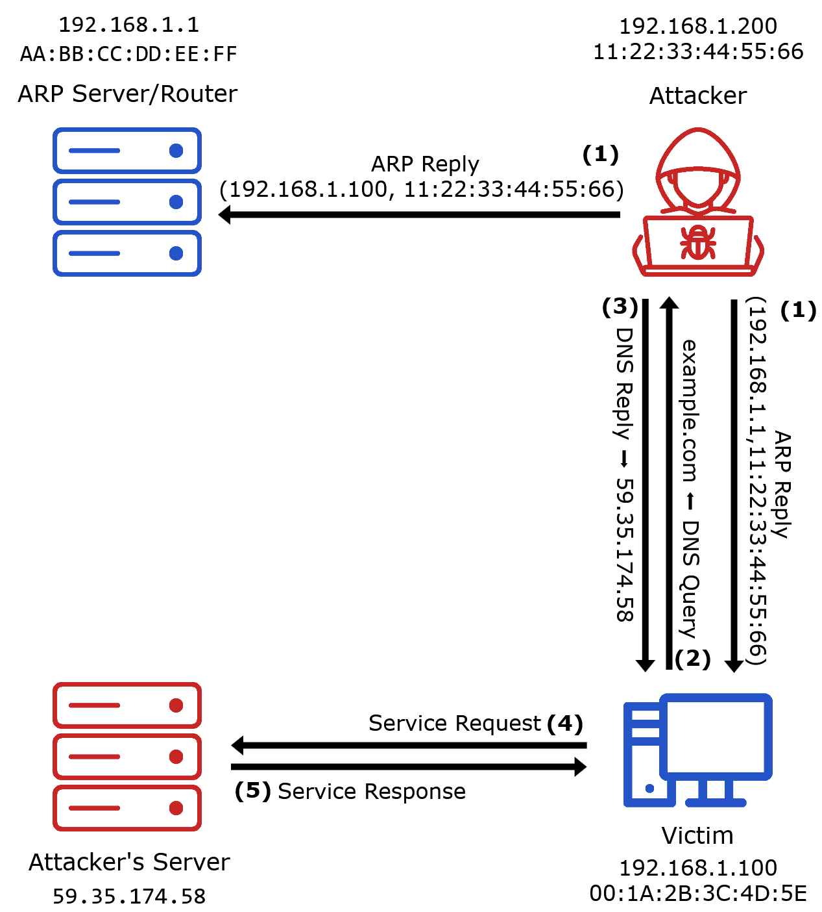
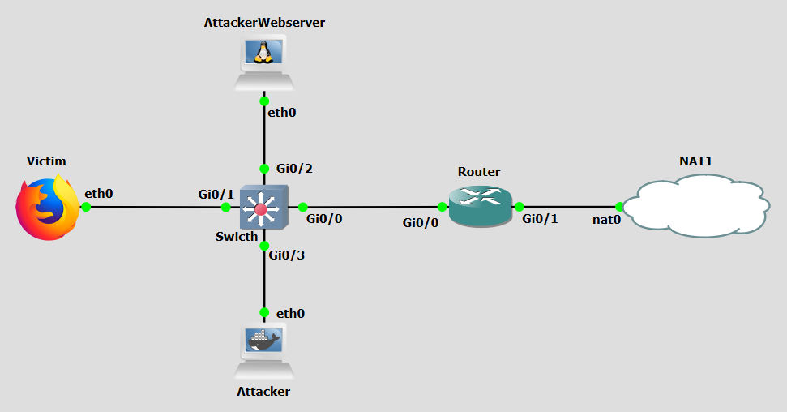

# Background
Address Resolution Protocol (ARP) poisoning, also known as ARP spoofing, is a malicious technique used to intercept, modify, or redirect network traffic within a local area network (LAN).  This capability can then used to reroute victims to a rogue DNS server.

ARP operates on the principle of broadcasting requests and receiving responses. When a device needs to communicate with another device on the same network, it sends an ARP request to discover the MAC address associated with the target IP address. The device with the matching IP address responds with its MAC address, and the requesting device caches this mapping for future use. These ARP requests happen each time an entry in the ARP cache of a particular device expires, which tipically happens every few minutes.

In an ARP poisoning attack, the attacker sends falsified ARP messages to the target device(s), associating their own MAC address with the IP address of a legitimate network resource, such as the default gateway or a DNS server. Once the target device updates its ARP cache with the attacker's MAC address, all traffic intended for the legitimate resource is instead sent to the attacker's machine, "man-in-the-middle" (MITM). This redirection allows the attacker to intercept, inspect, or alter the traffic before forwarding it to the intended destination, or to drop it entirely.

DNS spoofing based on ARP Poisoning, or just simply DNS ARP Poisoning is an application of ARP poisoning in the redirection of victims to a rogue DNS server. By poisoning the ARP cache of a victim's device, an attacker can redirect DNS queries to a malicious DNS server under their control. This rogue server can then return incorrect IP addresses for legitimate domains, directing victims to attacker-controlled servers or phishing sites.


<figure markdown>
  { width="600" }
  <figcaption>Figure 1: DNS ARP Poisoning attack</figcaption>
</figure>

Figure 1 reveals a DNS spoofing based on ARP Poisoning attack scenario. The steps are the following:

- **Step 1:** The attacker scans the network to identify active devices and their IP/MAC mappings. It then sends ARP replies to a recurrent ARP Request of both the Victim and the ARP Server with each other's MAC addresses paired with the attacker's own IP address. 
- **Step 2:** Eventually, the Victim sends a DNS Query for example.com which the attacker intercepts since he now acts as "man-in-the-middle".
- **Step 3:** The attacker replies with the IP address of his pre-configured malicious webserver.
- **Step 4:** The Victim establishes a connection with the Attacker Webserver, oblivious to it not being the legitimate webserver for example.com.
- **Step 5:** The Attacker Webserver is now free to respond with whatever it sees fit.


<br>
<br>

# Objectives
Our goal with the following configurations is to simulate a DNS ARP Poisoning attack. This lab demonstrates how attackers use ARP Poisoning to reroute victims to a malicious DNS server. You will act as both he attacker and the victim, executing a script that automates ARP cache poisoning and DNS reply injection to redirect victims to attacker-controlled infrastructure, without the victim's knowledge, deploy a countermeasure by configuring DHCP Snooping and Dynamic ARP Inspection on a managed switch.


<br>
<br>

# Lab Prerequisites & Network Configuration
<figure markdown>
  
  <figcaption>Figure 2: DNS ARP Poisoning GNS3 Lab Topology</figcaption>
</figure>

In the GNS3 project showed in Figure 2, you will need to add in the following topology that uses four key nodes (be sure to previously check the [Lab Setup Guide](../../setup.md){:target="_blank"}):

| Node Name  | Role                          | IP Address     | Subnet           |
|------------|-------------------------------|----------------|------------------|
| **Victim**     | Target Machine (Browser)              | **10.0.0.1**   | 10.0.0.0/24  |
| **Attacker Webserver**  | Attacker Controlled Webserver            | **10.0.0.2**   | 10.0.0.0/24  |
| **Attacker**   | Attacker Console/Setup        | **10.0.0.3**   | 10.0.0.0/24  |
| **Router** | Acts as gateway for the Victim. Accesses NAT          | **g0/0: 10.0.0.254 ‎ ‎ ‎ ‎ g0/1:DHCP‎‎‎**   | g0/0:10.0.0.0/24  |

For the **Victim** use the **webterm** appliance of GNS3 (which includes Firefox), and for the **Attacker Webserver** use the **Toolbox** appliance of GNS3 (which includes NGINX). Use a Cisco IOSvL2 switch router between the four key nodes.

<br>

The following script was used in this lab:

- <a href="../../../scripts/dns_arp_poisoning.py" download>dns_arp_poisoning.py</a>


<br>
<br>
<br>

# Phase 1: Setup

### Step 1.1: Router Configuration

You might need to implement NAT overload at the Router ro be able to communicate with external networks.

On the **Router**, apply this configuration:

```bash
conf t
```

```bash
access-list 1 permit any
ip nat inside source list 1 interface g0/1 overload
int g0/0
ip add 10.0.0.254 255.255.255.0
ip nat inside
no shut
int g0/1
ip add dhcp
ip nat outside
no shut
```

To confirm all interface addresses were correctly configured:

```bash
show ip interface brief 
```

### Step 1.2: Victim Configuration

To easily configure which DNS server the Victim should resort, use the following configuration for the `Edit config` option of the **Victim** machine options menu: 

```bash
auto eth0
iface eth0 inet static
    address 10.0.0.1
    netmask 255.255.255.0
    gateway 10.0.0.254
    up echo nameserver 8.8.8.8 > /etc/resolv.conf
```

### Step 1.3: Switch Router Configuration


On the **Switch**, run:

```bash
enable
conf t
no cdp advertise-v2
```


<br>
<br>
<br>

# Phase 2: Attack Preparations
### Step 2.1: Activating the Webserver

On the **Attacker Webserver**, edit the homepage:

```bash
nano /var/www/html/index.html
```

then start NGINX:

```bash
service nginx start
```

Check wether the Victim browser can connect to the Attacker Webserver by using the it's IP address.


<br>
<br>

### Step 2.2: Configure IP Bindings


On the **Attacker** machine, create the file:


```bash
nano /home/atk.txt
```

and write something like this:

```bash
10.0.0.2 linkedin.com
10.0.0.2 www.linkedin.com
10.0.0.2 google.com
10.0.0.2 www.google.com
10.0.0.2 example.com
10.0.0.2 www.example.com
```

<br>
<br>

### Step 2.3: Prepare Victim's Browser

Before lauching the attack in the Attacker machine, be sure to prepare the Victim browser. On Firefox, select `Clear Recent History` including both `History` and `Data`, if there is any option to remove all `Cookies` be sure to do that as well. Modern browsers have a tendency to use HTTPS by default, using port 443. 


<br>
<br>

### Step 2.4: Attack Implementation

Now we launch the attack in the Attacker machine. Perform a Wireshark capture right next to the Victim's interface connected to the Switch.

On the **Attacker** machine, run:

```bash
python3 /home/dns_arp_poisoning.py eth0 /home/atk.txt 10.0.0.0/24
```

On the **Victim** browser we want to use HTTP (port 80) so make sure you enter:

```bash
http://www.linkedin.com:80
```

You can also try the same for other domains listed on `atk.txt`.


The `dns_arp_poisoning.py` script uses the python library scapy to perform a combined ARP poisoning and DNS spoofing attack. Its execution can be broken down into four stages: **IP Forwarding Setup**, the script begins by enabling IP forwarding on the attacker's machine which is essential for the MITM position. It also disables ICMP redirects and drops ICMP "destination unreachable" messages via iptables to prevent the network from correcting itself; **Network Scan**, the script iterates over every address in the provided subnet (`10.0.0.0/24`) and sends ARP requests (broadcast ff:ff:ff:ff:ff:ff) to discover which IP addresses are live and to collect their MAC addresses. The result is a `mac_list` dictionary mapping each active IP to its real MAC address; **ARP Poisoning**, using the collected MAC addresses, the script sends unsolicited ARP Reply packets. Each reply tells host A that the MAC address for host B's IP is actually the attacker's MAC, and vice versa. This poisons the ARP caches of all devices on the subnet simultaneously, placing the attacker as a MITM between all of them. The poisoning loop repeats every 5 seconds to keep the caches stale (since ARP cache entries expire periodically and devices will re-broadcast ARP Requests); **DNS Interception**, an `AsyncSniffer` listens on the network interface for DNS packets. When a DNS query arrives, checks the queried hostname against the `host_map` loaded from `atk.txt`. If a match is found, the script crafts a spoofed DNS Reply packet (using the victim's own source IP/MAC as the destination, the attacker's interface MAC as the Ethernet source, and crucially the legitimate DNS server's IP address (`8.8.8.8`) as the IP source) and sends it back with the Attacker Webserver IP address as the answer. The real DNS query never reaches the legitimate DNS server.


<br>
<br>

### Step 2.5: Understand the Attack

To understand the attacks, analyze the ARP, DNS and TCP packets observed in the Wireshark capture. Moreover, analyze the ARP caches of the browser and Attacker Webserver using the command `arp -a`, and analyze the DNS cache of the Web browser by typing `about: networking#dns` in its address bar.

If the attack didn't work you might need to repeat it a few times, since the Attacker script might not have been to poison the ARP caches yet. If even after several times the attack was not successful stop the Attacker Webserver and start again, also restart nginx by running `service nginx start`.


<br>
<br>

!!! question Question
     Why is it not enough for the attacker to only poison the Victim's ARP cache? Why must the Gateway's cache be poisoned as well?

??? success "Answer"
    Poisoning only the Victim's cache redirects the Victim's outbound traffic to the attacker, but return traffic from the internet still flows through the Gateway directly back to the Victim therefore bypassing the attacker entirely. For a true man-in-the-middle position, the attacker must intercept traffic in both directions. By also poisoning the Gateway's ARP cache, making the Gateway believe the Victim's IP maps to the attacker's MAC, return traffic destined for the Victim is also sent to the attacker first. With IP forwarding enabled, the attacker can then relay packets in both directions, remaining invisible while sitting in the middle of the full communication flow.
<br>

!!! question Question
     Why does the script re-send ARP poison packets every 5 seconds instead of just once at the start?

??? success "Answer"
    ARP cache entries are not permanent, operating systems expire them after a short period (typically a few minutes) and re-issue ARP Requests to refresh the mapping. If the attacker only poisoned the caches once, the victim's and gateway's caches would eventually expire and be repopulated with the correct, legitimate IP-to-MAC mappings, ending the attack. By continuously re-sending spoofed ARP Replies every 5 seconds, the script ensures that any time a legitimate ARP refresh occurs, the poisoned entry is immediately re-injected before normal traffic can restore the correct mapping.

<br>
<br>
<br>
<br>
<br>


# Countermeasure
After performing the attack, we now pass on to the countermeasure phase. To combat ARP poisoning attacks, one of the most commonly used countermeasures is Dynamic ARP Inspection (DAI), which relies on DHCP Snooping. Both will be implemented in the Switch node. 

DHCP Snooping is a Layer 2 security feature implemented on managed switches that acts as a firewall between untrusted hosts and trusted DHCP servers. It works by classifying switch ports as either trusted or untrusted. DHCP Snooping also builds and maintains a DHCP Snooping Binding Table — a database that records the mapping between a client's IP address, its MAC address, the switch port it is connected to, and the VLAN. This binding table is the foundation upon which Dynamic ARP Inspection operates. Every time a client successfully obtains an IP address via DHCP, an entry is created in this table. 

Dynamic ARP Inspection is a security feature that uses the DHCP Snooping Binding Table to validate ARP packets on the network. Without DAI, any device on the LAN can send an ARP Reply claiming any IP-to-MAC mapping — which is precisely what ARP poisoning exploits. With DAI enabled, the switch intercepts all ARP packets on untrusted ports and checks them against the DHCP Snooping Binding Table. If the ARP packet's source IP and source MAC match a valid entry in the binding table, the packet is forwarded normally. If the ARP packet's source IP and MAC do not match any binding table entry (as is the case when an attacker sends a spoofed ARP Reply claiming someone else's IP) the packet is dropped.


<br>
<br>

## Dynamic ARP Inspection (DAI) via DHCP Snooping


### Step 1: DHCP Configuration
For DHCP Snooping and therefore DAI to work, we must have a functional DHCP service. Without DHCP, no binding table is populated, and DAI has no reference to validate ARP packets against.


On the **Router**, perform the followoing configurations:

```bash
conf t
ip dhcp pool 0
network 10.0.0.0 /24
default-router 10.0.0.254
dns-server 8.8.8.8
ip dhcp excluded-address 10.0.0.1 10.0.0.3
ip dhcp excluded-address 10.0.0.254
show ip dhcp pool
show ip dhcp binding
```


!!! question Question
     Notice how we excluded `10.0.0.1` and `10.0.0.3` from the DHCP pool of addresses. Obviously in a real-world scenario this wouldn't happen. How would the actual process work then?

??? success "Answer"
    In a real-world scenario, the DHCP server (the Router in this case) would configure a regular DHCP pool without any manual exclusions for the attacker. The attacker would not have a pre-known static IP address assigned to them. Instead, the attacker would first need to passively monitor the network, for example, by capturing DHCP traffic or sending ARP probes, to identify which IP addresses are currently in use by legitimate machines. Only after identifying the active address space would the attacker configure their own machines (either by requesting a DHCP lease like any other host, or by setting a static IP outside the pool) and subsequently launch the attack. In this lab, we pre-assign static IPs to simplify the setup and focus on the attack mechanics rather than the reconnaissance phase.


<br>


### Step 2: DHCP Victim Configuration

To make the Victim use DHCP it is easier to just use the following configuration for the `Edit config` option of the **Victim** machine options menu: 

```bash
auto eth0
iface eth0 inet dhcp
```


### Step 3: Configure the Switch


On the **Swicth**, perform the following configurations:


```bash
enable
configure terminal
ip dhcp snooping
ip dhcp snooping vlan 1
ip arp inspection vlan 1
interface GigabitEthernet0/0
 ip dhcp snooping trust
 ip arp inspection trust
interface range GigabitEthernet0/1-3, GigabitEthernet1/0-3,
 GigabitEthernet2/0-3, GigabitEthernet3/0-3
 ip dhcp snooping limit rate 10
exit
end
conf t
no ip dhcp snooping information option
exit
```

<br>

### Step 4: Re-run the attack.
Repeat Steps 2.3 and to 2.4 to re-run the attack. Be sure to also capture the network traffic as before.


!!! question Question
    Why did the attack now fail? 

??? success "Answer"
    The attack failed because Dynamic ARP Inspection, enabled on the Switch, is now intercepting and validating every ARP packet received on untrusted ports. When the `dns_arp_poisoning.py` script attempts to send its spoofed ARP Reply packets — falsely claiming that the Attacker's MAC address corresponds to the Gateway's IP (`10.0.0.254`) or the Victim's IP — the Switch checks these packets against its DHCP Snooping Binding Table. Since the Attacker's port has no binding table entry that associates the Attacker's MAC with those IP addresses (those IPs belong to other hosts), the Switch identifies the ARP packets as invalid and drops them. As a result, the ARP caches of the Victim and other hosts are never poisoned, the Attacker is never inserted as a MITM, and DNS queries from the Victim continue to flow normally to the legitimate DNS server.

<br>

!!! question Question
    Why is using DHCP versus static IPs the key for this countermeasure to work? 

??? success "Answer"
    The entire effectiveness of Dynamic ARP Inspection hinges on the existence of the DHCP Snooping Binding Table, and that table is only populated when hosts obtain their IP addresses dynamically via DHCP. When a host uses DHCP, the switch observes the full DHCP exchange (Discover → Offer → Request → Ack) on its ports and records a trusted binding: this MAC address on this port legitimately owns this IP address. DAI then uses this ground-truth database to validate all subsequent ARP traffic. When hosts use static IP addresses, no DHCP exchange ever occurs, so no binding entry is ever created for those hosts. With an empty or incomplete binding table, the switch has no reference against which to validate ARP packets — meaning DAI would drop **all** ARP traffic from statically configured hosts (since none of them have a binding), effectively breaking connectivity for legitimate devices. While it is possible to manually configure static ARP inspection entries (called "ARP ACLs") on the switch to compensate, this approach is operationally complex and error-prone in any environment larger than a small lab. DHCP therefore provides an automated and scalable mechanism for building and maintaining the binding table, making DAI practical to deploy in real networks.


<br>
<br>
<br>

# Conclusion

As we saw, after we configured Dynamic ARP Inspection with DHCP Snooping on the Switch, the ARP poisoning attack was completely neutralised. The Switch's enforcement of IP-to-MAC bindings — derived automatically from observed DHCP leases — prevented the Attacker from inserting itself as a man-in-the-middle, blocking the DNS spoofing that depends on it. This demonstrates how a relatively simple Layer 2 control, when properly configured, can defeat a class of attacks that would otherwise be trivially easy to execute on an unprotected switched network.
    
