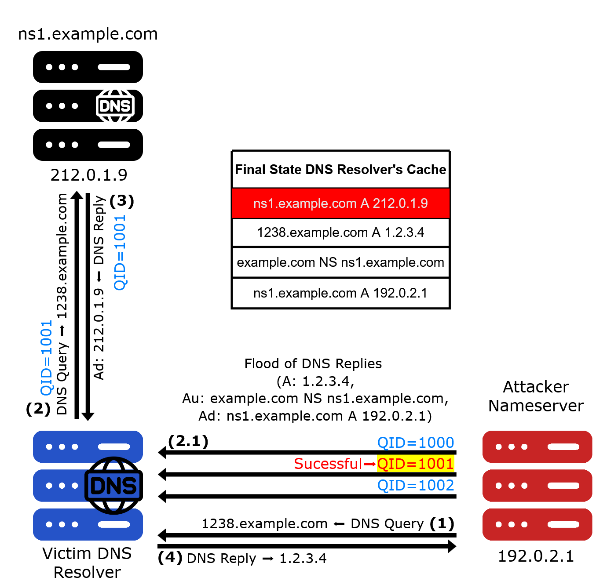
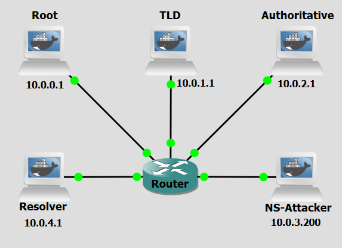

# Background
The  [DNS Cache Poisoning](cache-poisoning.md){:target="_blank"} attack has overlooked the cache effect. In reality, if the attacker is not fortunate enough to make a correct guess before the real response packet arrives, correct information will be cached by the DNS server for a while. This caching effect makes it impossible for the attacker to forge another response regarding the same name because the DNS server will not send out another DNS query for this name before the cache times out. To forge another response on the same name, the attacker has to wait for another DNS query on this name, which means they have to wait for the cache to time out. The waiting period can be hours or days.

Dan Kaminsky devised an elegant technique to defeat this: by always querying a different random subdomain (e.g. abc123.example.com, def456.example.com), the attacker forces the resolver to issue a fresh upstream query every time, bypassing the cache entirely. This gives the attacker a continuous stream of race windows, allowing sustained poisoning attempts without waiting.

Once successful, the resolver's cache for the domain's nameserver delegation is poisoned. All subsequent queries for the domain and its subdomains get redirected to servers under the attacker's control — until the poisoned cache entries expire.

A feature of DNS not previously explained, relevant for this attack, is the glue record. It is an A (IPv4) or AAAA (IPv6) record that is included in the DNS response when a nameserver for a domain is within the same domain. It provides the IP addresses of the authoritative nameservers for a domain, allowing DNS resolvers to query those nameservers directly, preventing a circular dependency that would occur when a nameserver is a subdomain of the domain it is serving. Without glue records, a DNS resolver would need to know the IP address of the nameserver to query it, but it would also need to query that same nameserver to find out its IP address, creating an unsolvable circular reference.


<figure markdown id="figure-1">
  { width="600" }
  <figcaption>Figure 1: Kaminsky Cache Poisoning attack</figcaption>
</figure>


 [Figure 1](#figure-1) shows a scenario where the victim DNS server has a record of the domain (**example.com**) in cache. Evidently, the victim DNS server has no record of the subdomain (**1238.example.com**). The attacker has a pre-configured authoritative nameserver for the domain (**example.com**) and has a fast connection to the victim DNS server. The attack's steps are the following:
 

- **Step 1:** The attacker sends the Resolver an A-record query for a fresh randomized name, here **s1.example.com**.
- **Step 2:** Because the requested name is not cached, the Resolver sends an upstream query for s1.example.com to a legitimate authoritative DNS server for example.com, using transaction **ID 101**.
- **Step 3:** While this query remains outstanding, the attacker floods the Resolver with forged responses that reproduce the question but contain different transaction-ID guesses, illustrated by QID=100, QID=101, and QID=102. Each response pretends to originate from the queried authoritative server and contains a direct answer mapping s1.example.com to **192.0.2.2**, an Authority-section NS record delegating example.com to **ns1.example.com**, and an Addtional-section A record mapping that nameserver to the attacker-controlled address **192.0.2.1**.
- **Step 4:** If the forged response containing QID=101 arrives first, the Resolver associates it with the outstanding query and processes the RRsets it contains. The direct Answer-section record for s1.example.com is eligible to be cached. If the Authority and Additional-section records also satisfy the Resolver’s bailiwick, relevance, and trust requirements, the malicious delegation and corresponding nameserver address are cached as well.
- **Step 5:** The legitimate authoritative server returns an NXDOMAIN response for the non-existent randomized name, also using QID=101; however, this response arrives too late and is ignored because the query has already been completed. The figure then distinguishes two possible outcomes.
- **Step 6a:** If the attacker loses the race or the desired delegation data is not accepted, another attempt is triggered with a fresh name, such as **s2.example.com**.
- **Step 6b:** If the malicious delegation is accepted, the Resolver uses it during a later resolution and sends an A-record query for **www.example.com** to the attacker-controlled nameserver ns1.example.com at 192.0.2.1.

<br>

The following script was used in this lab:

- <a href="../../../scripts/kaminsky.py" download>kaminsky.py</a>


<br>
<br>

# Objectives
This lab demonstrates how an attacker can exploit DNS transaction ID predictability to poison a resolver's cache and redirect DNS resolution for an entire domain to a rogue nameserver. It also demonstrates the effectiveness of source port randomization as a countermeasure.


<br>
<br>

# Lab Prerequisites & Network Configuration
<figure markdown id="figure-2">
  { width="500" }
  <figcaption>Figure 2: Kaminsky Cache Poisoning GNS3 Lab Topology</figcaption>
</figure>

In the GNS3 project showed in [Figure 2](#figure-2), you will need to add in the following topology that uses five key nodes (be sure to previously check the [Lab Setup Guide](../../setup.md){:target="_blank"}):


| Node Name  | Role                          | IP Address     | Subnet           |
|------------|-------------------------------|----------------|------------------|
| **Root Server**     | Root Zone ( .)                            | **10.0.0.1**   | 10.0.0.0/24  | 
| **TLD (Top Level Domain) Server** | Top-Level Domain (.com)     | **10.0.1.1**   | 10.0.1.0/24    |
| **Authoritative Server**   | Authoritative nameserver for example.com  | **10.0.2.1**   | 10.0.2.0/24  |
| **NS Attacker**  | Attacker controlled nameserver for example.com. Implements attack.           | **10.0.3.200**   | 10.0.3.0/24  |
| **Resolver**     | Recursive DNS server (victim)            | **10.0.4.1**   | 10.0.4.0/24  |


We will add a delay in the connection between the router and the Authoritative Server to be able to simulate the latency observed between the resolver´s network and DNS infrastructure outside of it. Right-Click on the connection and select `Packet Filters`, and in `Delay` add 600ms of latency.

On the **Resolver** machine:

```bash
nano /etc/bind/named.conf.options
```
Add the following line, and restart BIND:

```bash
use-v4-udp-ports { range 53 53; };
send-cookie no;
```

```bash
pkill named && named -c /etc/bind/named.conf
```


<br>
<br>


# Phase 1: Setting up the Infrastructure

The attacker machine runs a packet-sniffing script that passively monitors the LAN for outgoing DNS queries from the victim resolver and immediately races to inject a forged response.

### Step 1.1: Configure the TLD Server

Make sure the TLD BIND files have the correct information on the zones:

```bash
nano /etc/bind/db.com
```

```console
$TTL 86400
@   IN  SOA ns.com. admin.example.com. (
        2        ; Serial
        7200    ; Refresh
        3600    ; Retry
        1209600 ; Expire
        86400 ) ; Minimum TTL

    IN  NS  ns.com.
ns.com. IN  A   10.0.1.1

example.com.    IN  NS  ns.example.com.
ns.example.com. IN A   10.0.2.1

attacker.com IN NS ns1.attacker.com
ns1.attacker.com. IN A 10.0.3.200
```


### Step 1.2: Configure the Attacker Nameserver

On the **NS Attacker** machine, configure zone `example.com`:

```bash
nano /etc/bind/named.conf.options
```

```console
answer-cookie no;
```

Configure the rogue zone for example.com — this is what the resolver will query once the cache is poisoned. Every subdomain returns 10.0.3.100 so it is easy to confirm which answers came from the rogue NS:

```bash
nano /etc/bind/db.fake.example
```

```console
$TTL 86400
@   IN  SOA ns.example.com. admin.example.com. (
        2025090301
        7200
        3600
        1209600
        86400 )
    IN  NS  ns.example.com.

ns1.example.com.    IN  A   10.0.3.200
ns.example.com.    IN  A   10.0.3.200
ns2.example.com.    IN  A   10.0.3.200
www.example.com.    IN  A   10.0.3.100
mail.example.com.   IN  A   10.0.3.100
*.example.com.      IN  A   10.0.3.100
```

```bash
nano /etc/bind/db.attacker
```

```console
$TTL 86400
@   IN  SOA ns1.attacker.com. admin.attacker.com. (
        2025090301
        7200
        3600
        1209600
        86400 )
    IN  NS  ns1.attacker.com.

ns1.attacker.com    IN  A   10.0.3.200
*.attacker.com.      IN  A   10.0.3.100
```

```bash
nano /etc/bind/named.conf.local
```

```console
zone "example.com" {
    type master;
    file "/etc/bind/db.fake.example";
    allow-transfer { none; };
};


zone "attacker.com" {
    type master;
    file "/etc/bind/db.attacker";
    allow-transfer { none; };
};
```
<br>


### Step 1.3: Prepare the Script

On the **NS Attacker** machine, add the script `kaminsky.py`:

```bash
nano /home/kaminsky.py
```

The `kaminsky.py` script builds raw IP/UDP packets entirely in Python, spoofing the source IP as the legitimate authoritative NS (10.0.2.1). Each spoofed response contains: **Answer section**: <random>.example.com A 1.2.3.4 — a plausible answer to the triggered query; **Authority section**: example.com NS <rogue-ns> — the zone delegation to poison; **Additional section**: <rogue-ns> A <rogue-ip> — glue record for the rogue NS.
It floods all 65,536 possible Transaction IDs for each subdomain in a single burst, guaranteeing a TID hit within the resolver's query timeout window. Due to timing its beast to leave it running for a bit more time to confirm if the cache was really poisoned...

<br>


!!! question Question
      The script floods all 65,536 Transaction IDs for each random subdomain rather than trying to extract the correct TID from an intercepted query. Why?

??? success "Answer"
    The script cannot extract the TID because the resolver's query is sent directly to the authoritative NS (10.0.2.1), not to the attacker. The attacker is not on-path for that exchange and never sees the outgoing query or its TID. Instead, the script floods all 65,536 possible values — guaranteeing one will match within the resolver's timeout window..

<br>
<br>

# Phase 2: Validation and Analysis

You can now execute the attack and observe the results. Do a Wireshark capture right next to the Resolver interface (as a tip, use a `dns` filter to better analyze the relevant DNS packets).

### Step 2.1: Test DNS Resolution

On the **NS Attacker** machine, run:

```bash
dig @10.0.4.1 testa.example.com
```

```bash
dig @10.0.4.1 www.example.com
```

Make sure it receives a correct response, 10.0.2.100. If not, temporarly remove the delay in the Authoritative server link, and restart BIND on the **Resolver** machine.


See the state of the BIND **Resolver**'s cache before the attack:

```bash
rndc dumpdb -cache
nano /var/cache/bind/named_dump.db
```

<br>

### Step 2.2: Attack — Poisoning with an In-Bailiwick NS (ns1.example.com)

On the **NS Attacker** machine, run:

```bash
pkill named && named -c /etc/bind/named.conf
```

```bash
python3 kaminsky.py --rogue-ns ns1.example.com
```

Inspect the cache of the **Resolver**:

```bash
rndc dumpdb -cache
nano /var/cache/bind/named_dump.db
```


You will likely see:

`; additional`

`ns1.example.com.   86400   A   10.0.3.200` 


But the NS delegation for `example.com` still points to `ns.example.com` — not `ns1.example.com`.

Running `dig @10.0.4.1 www.example.com` will return 10.0.2.100 from the legitimate server, not from the rogue NS. The glue injection worked because ns1.example.com is in-bailiwick — it falls under example.com, so BIND's bailiwick check accepts the Additional section record. However, the NS delegation itself was not poisoned because the TLD had already cached `example.com NS ns.example.com` as authoritative glue with a high trust ranking. BIND will not overwrite an existing high-trust cached NS delegation with one from a spoofed response.


<br>


### Step 2.3: Attack — NS Delegation Poisoning with an Out-of-Bailiwick NS (ns1.attacker.com)

On the **NS Attacker** machine, run:

```bash
pkill named && named -c /etc/bind/named.conf
```

```bash
python3 kaminsky.py --rogue-ns ns1.attacker.com
```

Inspect the cache of the **Resolver**:

```bash
rndc dumpdb -cache
nano /var/cache/bind/named_dump.db
```

You should observe:

`; authauthority`

`example.com.   86400   NS   ns1.attacker.com.   ← NS delegation poisoned`

The cache result can vary between runs. In some cases the NS delegation itself gets poisoned to `ns1.attacker.com`; in others the delegation remains legitimate but the rogue NS still gets used. Either way, what confirms the attack worked is the presence of random subdomains returning 10.0.3.100:

`; authanswer`

`0widiya1.example.com.   86386   A   10.0.3.100   ← served by rogue NS`

That IP (10.0.3.100) can only come from the rogue NS at 10.0.3.200 — the legitimate authoritative server returns 10.0.2.100 and the flood packets inject 1.2.3.4. The resolver forwarded real subdomain queries to the rogue NS and cached its answers as authoritative.
Also notice that `ns1.attacker.com` does not appear as a `glue A record` in the cache — it was resolved separately and its IP obtained through the legitimate .com TLD. This is bailiwick checking at work: the spoofed response claims to come from the authoritative NS for `example.com`, so BIND only accepts `Additional` section records whose names fall within example.com. Since ns1.attacker.com is outside that zone, its glue is silently discarded. The resolver then had to look up ns1.attacker.com through the TLD — where it is registered — obtaining 10.0.3.200 legitimately and making the rogue NS reachable.

Run:

```bash
dig @10.0.4.1 www.example.com
```

The result may be inconsistent — sometimes returning 10.0.3.100 from the rogue NS, sometimes timing out. This is because the poisoning is transient: any subsequent query that traverses the `.com` TLD delegation chain causes the resolver to re-learn the legitimate example.com NS ns.example.com, overwriting the poisoned entry. The rogue NS gets used for a brief window before the legitimate delegation is restored.


!!! question Question
     Bailiwick checking prevented the glue A record for ns1.attacker.com from being cached, yet the NS delegation to ns1.attacker.com in the Authority section is accepted in sometimes. Why does bailiwick checking apply to the Additional section but not the Authority section?

??? success "Answer"
     DNS has three sections in a response beyond the header: Answer, Authority, and Additional. Bailiwick checking was designed specifically to protect the Additional section — which carries supplementary glue records that the responding server volunteers without being directly asked. Without this check, any server could inject arbitrary A records for names it has no authority over simply by including them as extra data. The **Authority section** is treated differently because it carries NS records that are directly relevant to the query being answered. When a resolver asks about `example.com` and the responding server (even a spoofed one) says "the authoritative NS for `example.com` is `ns1.attacker.com`", that is a direct answer to the delegation question — not volunteered side data. BIND accepts it. This asymmetry is intentional by design: blocking Authority section NS records would break normal DNS delegation entirely. 


<br>
<br>
<br>
<br>
<br>


# Countermeasure
Source port randomization (RFC 5452) is the primary practical defence against the Kaminsky attack. When a resolver randomizes the UDP source port for every outgoing DNS query, an attacker must now correctly guess both the Transaction ID (16 bits) and the source port (typically ~14 bits of entropy across ~49,000 ephemeral ports) to have a forged reply accepted. This expands the search space from ~65,000 to over 3 billion combinations, making a brute-force flooding attack impractical within the time window of a single query's round-trip.

<br>

### Step 1: Enable Source Port Randomization

On the **Resolver** machine:

```bash
nano /etc/bind/named.conf.options
```
Remove the previously added line, and restart BIND:

```bash
use-v4-udp-ports { range 53 53; };
```

```bash
pkill named && named -c /etc/bind/named.conf
```

<br>


### Step 2:  Re-run the attack

Do a Wireshark capture like before, right next to the Resolver to be able to see the influence of the countermeasure.


On the **Resolver**, restart the BIND service (named):

```console
pkill named && named -c /etc/bind/named.conf
```

On the **NS Attacker** machine, run:

```bash
python3 /home/kaminsky.py --rogue-ns ns1.attacker.com
```

Inspect the cache of the BIND **Resolver** to view any new cached DNS records:

```bash
rndc dumpdb -cache
nano /var/cache/bind/named_dump.db
```


<br>
!!! question Question
    In the Wireshark capture, compare the outgoing DNS queries from the resolver with port randomization enabled versus disabled. What changes, and how does this affect the attacker's probability of success?
 

??? success "Answer"
    With port randomization disabled, all outgoing queries from the resolver use source port 53 — visible in Wireshark as a constant 53 → 53 flow. The script targets port 53, so every spoofed response has a 1-in-65,536 chance of matching the correct TID. With --batch-size 65535, the attacker sends the entire TID space in one burst and is guaranteed to hit the correct TID before the legitimate response arrives. With port randomization **enabled**, Wireshark shows a different random ephemeral source port on every outgoing query (e.g. `47382`, `54231`, `33901`). The script still targets port 53, so all 65,535 spoofed responses are sent to the wrong port and are discarded by BIND before even checking the TID. The probability of a hit per sweep drops to approximately 1-in-49,152 (the size of the ephemeral port range), and the combined TID+port space of ~3 billion makes brute-force flooding infeasible within any realistic query timeout.. 


!!! question Question
    Source port randomization significantly raises the bar against Kaminsky-style attacks. Is it a complete solution? What are its limitations, and what is the long-term cryptographic defence against DNS cache poisoning?


??? success "Answer"
    Source port randomization is not a complete solution. Its effectiveness depends on the randomness being truly unpredictable — which can be undermined by NAT devices that rewrite source ports to a smaller pool, firewalls that restrict outbound port ranges, or on-path adversaries who can observe the outgoing query and read the source port before the response window closes. The definitive long-term answer is **DNSSEC** (DNS Security Extensions). Rather than relying on transport-layer randomness, DNSSEC has zone operators cryptographically sign their DNS records with a private key. A resolver with DNSSEC validation enabled will reject any forged response — even one with a perfectly guessed TID and source port — if it cannot carry a valid signature from the zone's private key. This moves trust from probabilistic network-layer guessing to verifiable cryptography, making cache poisoning structurally impossible for signed zones regardless of how the attacker spoofs the transport layer.


<br>
<br>
<br>

# Conclusion

The Kaminsky Cache Poisoning attack is a refinement of classical DNS cache poisoning. By targeting a fresh random subdomain with each attempt, the attacker sidesteps the caching defence that protects well-known hostnames — the resolver is always forced to issue a new query, providing a continuous stream of race windows. With a fixed UDP source port, the only unknown is the 16-bit Transaction ID, and flooding all 65,536 values per attempt makes success virtually guaranteed within seconds.

Several subtleties determine whether a poisoning attempt fully succeeds. Bailiwick checking governs which Additional section glue records BIND will accept — only names within the responding zone's authority are cached, so out-of-bailiwick glue (e.g. for `ns1.attacker.com`) is silently discarded even when the NS delegation itself is accepted. Cache trust ranking means that a high-trust NS delegation already cached from the TLD cannot be overwritten by a spoofed response, which is why in-bailiwick NS names that are not the current primary NS are the most reliable poisoning targets. And the 600ms artificial delay is essential — without it, the legitimate authoritative server answers before the flood can land.

Source port randomization dramatically increases attack difficulty by adding a second independent random field, expanding the search space by roughly four orders of magnitude. The Wireshark captures make this concrete: with a fixed port every spoofed response has a chance of landing; with a randomized port virtually none do. Nevertheless, DNSSEC remains the only cryptographically sound long-term defence, ensuring forged replies are rejected regardless of how accurately an attacker guesses the transport-layer parameters.

<br>