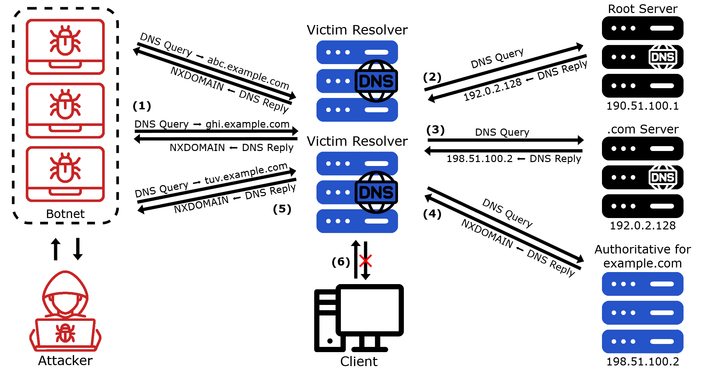
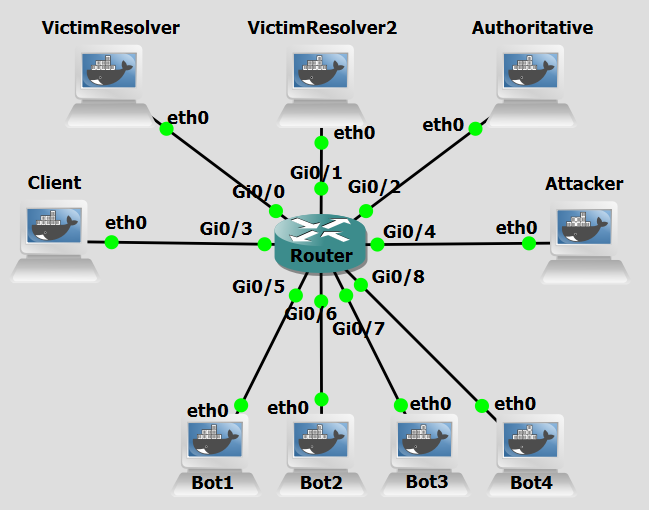

# Background
An NXDOMAIN DDoS attack, also known as a DNS Water Torture attack, is a targeted form of Distributed Denial
of Service (DDoS) that exploits vulnerabilities in the Domain Name System (DNS) infrastructure. This type of
attack is specifically designed to overwhelm DNS servers by flooding them with a high volume of queries for non-existent or invalid domain names, leading to significant disruptions in service availability and performance. "NXDOMAIN" stands for Non-Existent Domain, which is a response code returned by a DNS server indicating that the queried domain name does not exist. Attackers leverage this mechanism by systematically generating a massive volume of DNS requests for fake domains, forcing resolvers to repeatedly search for and return NXDOMAIN responses. In an NXDOMAIN DDoS attack, the attacker generates a large number of DNS queries for such non-existent domains and sends them to one or more recursive DNS resolvers. 

What makes this attack particularly effective is its ability to amplify traffic. DNS responses, especially for non-existent domains, can be much larger than the original queries, allowing attackers to generate a disproportionate amount of traffic with minimal effort. Additionally, recursive resolvers must process each query, often performing multiple lookups before confirming the domain doesn’t exist, which consumes CPU, memory, and bandwidth. This leads to resource exhaustion, causing slowdowns or even complete outages for legitimate users. The attack is also difficult to mitigate because the queries appear legitimate, and attackers can randomize the fake domains, making traditional filtering methods like rate limiting or blacklisting less effective.

In practice, attackers use botnets or compromised devices to send a flood of DNS queries for randomly generated subdomains (e.g., random12345.example.com). Since these domains don’t exist, recursive resolvers would not cache the responses and must repeatedly query authoritative DNS servers, further amplifying the attack’s impact. The result is a cascade of traffic that can overwhelm both recursive and authoritative DNS servers, disrupting access to websites and online services for legitimate users. Beyond immediate service disruptions, these attacks can damage an organization’s reputation and even cause collateral damage to upstream providers and other networks.


<figure markdown id="figure-1">
  
  <figcaption>Figure 1: NXDOMAIN DDoS attack</figcaption>
</figure>


 [Figure 1](#figure-1) shows an NXDOMAIN DDoS case example. All the bots are using the same two DNS resolvers which, of course, in a real-world scenario would not occur. These are the steps:

- **Step 1:** The attacker commands a botnet to send a high volume of DNS queries for random subdomains of example.com.
- **Step 2:** Each receiving DNS resolver, receives each query and begins a recursive lookup. The first time it queries a root DNS server to obtain a referral to the appropriate Top-Level Domain (TLD) server, in this case, the .com TLD server.
- **Step 3:** Each resolver then queries the .com TLD server, receiving the IP address of the authoritative nameserver responsible for example.com.
- **Step 4:** For the rest of the packets each resolver now only sends the queries to the authoritative nameserver for example.com, which responds with NXDOMAIN messages indicating the requested subdomains do not exist.
- **Step 5:** Each NXDOMAIN response is sent back to the querying bots.
- **Step 6:** Due to the flood of DNS queries, the victim resolvers' and authoritative server's resources can be overwhelmed with the increased load, and legitimate query resolutions from clients are halted.

<br>
<br>

# Objectives
This lab demonstrates how attackers can leverage the distributed nature of botnets to overwhelm recursive DNS resolvers and Authoritative servers by flooding them with a massive volume of queries for non-existent or invalid domain names.

<br>
<br>

# Lab Prerequisites & Network Configuration
<figure markdown id="figure-2">
  
  <figcaption>Figure 2: NXDOMAIN DDoS GNS3 Lab Topology</figcaption>
</figure>

In the GNS3 project showed in [Figure 2](#figure-2), you will need to add in the following topology that uses nine key nodes (be sure to previously check the [Lab Setup Guide](../../setup.md){:target="_blank"}):

| Node Name  | Role                          | IP Address     | Subnet           |
|------------|-------------------------------|----------------|------------------|
| **Victim Resolver1**     | Recursive DNS Server              |  **10.0.0.1**   | 10.0.0.0/24  | 
| **Victim Resolver2**     | Recursive DNS Server              |  **10.0.1.1**   | 10.0.1.0/24    |
| **Authoritative Server**   | Authoritative nameserver for example.com  | **10.0.2.1**   | 10.0.2.0/24  |
| **Client**     | DNS Client | **10.0.3.1**   | 10.0.3.0/24  |
| **Attacker**  | Coordinates attack            | **10.0.4.1**   | 10.0.4.0/24  |
| **Bot1**     | Receives orders from Attacker. Acts as proxy  | **10.0.5.1**   | 10.0.5.0/24  |
| **Bot2**   | Receives orders from Attacker. Acts as proxy  | **10.0.6.1**   | 10.0.6.0/24  |
| **Bot3**  | Receives orders from Attacker. Acts as proxy          | **10.0.7.1**   | 10.0.7.0/24  |
| **Bot4**     | Receives orders from Attacker. Acts as proxy             | **10.0.8.1**   | 10.0.8.0/24  |

Since there is no TLD server in this lab, the Resolver machine should be configured to host `.com` zone to be able to access the Authoritative Server. You can check the [Lab Setup Guide](../../setup.md){:target="_blank"} to know how.

<br>
<br>


# Phase 1: Configure the Authoritative Server

The Authoritative Server is responsible for holding the DNS zone records for example.com. In this phase, we configure it with a set of known valid subdomains (e.g., testa, testb, testc) so that we can later verify that legitimate DNS queries resolve correctly both before and after the attack.

### Step 1.1: Add test subdomains

On the **Authoritative Server**,

 1 - Create or modify the `db.example` zone file:

```python
nano /etc/bind/db.example
```
```python
example.com. IN SOA ns1.example.com. admin.example.com. (
    1 7200 3600 1209600 86400
)
    NS ns1.example.com.
ns1.example.com. A 10.0.2.1

@                IN      A       10.0.10.1
www              IN      A       10.0.10.1
testa            IN      A       10.0.10.1
testb            IN      A       10.0.10.1
testc            IN      A       10.0.10.1
```

 2 - Restart the BIND service (named):

```bash
pkill named && named -c /etc/bind/named.conf
```
<br>

On the **Resolver**,

 3 - Test DNS resolution: ```dig testa.attacker.com```


<br>

Make sure the Root Server, Resolver are correctly configured with the IP addresses for this lab, check [Lab Setup Guide](../../setup.md){:target="_blank"}.

<br>
<br>
<br>

# Phase 2: Setting up the Attacker's Infrastructure

The attacker's infrastructure consists of a central controller machine and four bot machines. The attacker does not send DNS queries directly; instead, it orchestrates the bots remotely via SSH to distribute the flood traffic across multiple source IPs, making the attack harder to block with simple IP-based filtering and increasing the total query throughput.

### Step 2.1: Prepare the Scripts

On the **Attacker** machine, add the script `activate.py`:

```bash
nano /home/activate.py
```

The script `activate.py` uses the paramiko python library to run, via ssh, the `nxdomainddos.py` on each of the bots.

<br>

On the **Bot** machines, add the script `nxdomainddos.py`:

```bash
nano /home/nxdomainddos.py
```

The script `nxdomainddos.py` generates 1,000 unique, random 3-letter subdomains (e.g., abc.example.com, xyz.example.com), crafts raw network packets using the Scapy library with a given source IP address and targets DNS Resolvers by sending these 1,000 queries to specific DNS resolvers (10.0.0.1 and 10.0.1.1).


!!! question Question
      Why does the attack script generate random subdomains rather than reusing the same fake domain name repeatedly?

??? success "Answer"
     Because DNS resolvers cache responses. If the same non-existent domain were queried repeatedly, the resolver would return the cached NXDOMAIN response without performing a new recursive lookup, drastically reducing the load on both the resolver and the authoritative server. By generating a different random subdomain for each query, the attacker ensures that no cached response exists, forcing the resolver to perform a full recursive lookup for every single query. This is precisely what makes the NXDOMAIN DDoS attack so resource-intensive for the victim infrastructure.

<br>
<br>

# Phase 3: Validation and Analysis

You can now execute the full attack and observe the results. Do a Wireshark capture right next to Authoritative Server and another next to a Victim Resolver interfaces (as a tip, use a `dns` filter to better analyze the relevant DNS packets).

### Step 3.1: Test DNS Resolution

On the **Client** machine, run:

```bash
dig testa.example.com
```

Make sure it receives a correct response. If not, restart BIND on the designated **Resolver** machine.

### Step 3.2: Run the attack

On the **Attacker** machine, run:

```bash
python3 /home/activate.py
```


!!! question Question
      Looking at the Wireshark capture taken next to the Authoritative Server, what do you notice about the volume and content of the DNS queries arriving there compared to what you would expect under normal conditions? What does this tell you about the effectiveness of the attack in propagating flood traffic beyond the resolver?

??? success "Answer"
     Under normal conditions, the authoritative server would only receive queries for domains it is responsible for, and only after the resolver has confirmed there is no cached answer. During the attack, the authoritative server is flooded with queries for random, non-existent subdomains of example.com (e.g., xqr.example.com, kbz.example.com). Because none of these domains exist and the resolver has no cached NXDOMAIN for any of them, every single bot query triggers a full recursive lookup that reaches the authoritative server. The capture shows a flood of queries arriving from the resolvers' IP addresses (since the resolvers forward on behalf of the bots), each receiving an NXDOMAIN response. This demonstrates that the attack successfully propagates through the resolver layer and overwhelms the authoritative server as well, not just the recursive resolvers themselves.


<br>
<br>
<br>
<br>
<br>


# Countermeasure
After performing the attack, we now pass on to the countermeasure phase. NXDOMAIN DDoS exploits the DNS protocol by flooding a target with queries for non-existent domains, forcing authoritative DNS servers to generate and return "NXDOMAIN" (non-existent domain) responses. This attack leverages the fact that resolving non-existent domains consumes more server resources than answering legitimate queries, as the server must perform recursive lookups and return negative responses. The attacker’s goal is to exhaust the DNS infrastructure’s CPU, memory, and bandwidth, disrupting service for legitimate users.
A defining characteristic of this attack is that it does not rely on amplification or spoofing but instead abuses the inherent inefficiency of processing NXDOMAIN responses. Since the attacker sends a high volume of queries for random or non-existent subdomains, the targeted DNS server can be overwhelmed by the sheer number of recursive lookups and negative responses it must generate. This can lead to degraded performance or complete unavailability of DNS services.

To defend against NXDOMAIN-based DDoS attacks, network administrators can enforce firewall rate-limiting rules. By restricting the number of DNS queries allowed from a single source IP, these rules prevent attackers from flooding the server with invalid requests, ensuring service availability and protecting against resource exhaustion.


<br>
<br>

### Step 1: Configure Firewall Rule

On each of the **Victim Resolvers**, run:

```bash
iptables -A INPUT -p udp --dport 53 \
  -m hashlimit \
  --hashlimit-above 5/sec \
  --hashlimit-burst 10 \
  --hashlimit-mode srcip \
  --hashlimit-name dns_flood \
  -j DROP
```

This iptbales rule adds a rate-limiting filter on incoming UDP traffic destined for port 53 (DNS). It uses the hashlimit module to track query rates on a per source IP basis. Any source IP that sends more than 5 DNS queries per second (with an allowed burst of up to 10 packets) will have its excess packets silently dropped. This effectively caps the query rate from any single client, preventing a bot from overwhelming the resolver regardless of how many random subdomains it queries. Legitimate clients, which typically send only a handful of DNS queries per second, are unaffected by this threshold.


To see the list of all the rules in the iptables firewall, run:
```bash
iptables -L --line-numbers -n
```


### Step 2:  Re-run the attack
Repeat Step 3.2 to re-run the attack. Do two Wireshark captures like before, one right next to one of the Victim Resolvers and another next to the Authoritative Server to be able to see the influence of the countermeasures restrictions on network traffic.


<br>


!!! question Question
      Comparing the Wireshark capture at the Authoritative Server before and after applying the iptables rule on the resolvers, what difference do you observe in the volume of traffic reaching the authoritative server? Why does a firewall rule applied at the resolver have this effect on a different machine downstream? 


??? success "Answer"
    After applying the rate-limiting rule on the resolvers, the traffic volume arriving at the Authoritative Server drops dramatically. The vast majority of the bot queries are now dropped at the resolver's INPUT chain before they are ever processed by BIND. Because the resolver never processes these dropped packets, it never initiates recursive lookups on their behalf — meaning the authoritative server simply never receives the corresponding forwarded queries. This illustrates an important principle: a well-placed firewall rule at an intermediate node (the resolver) can shield downstream infrastructure (the authoritative server) from the flood, even though the rule is not applied on the authoritative server itself.


!!! question Question
      Why don't we also implement the same iptables rule on the Authoritative Server? What would change in terms of availability of the DNS service for the clients of the Victim Resolvers?
 

??? success "Answer"
    Compared to the previously explored scenario of only using firewall rules on the Victim Resolvers, applying the same rule on the Authoritative Server would introduce a critical problem: the rule would filter based on source IP address, and from the Authoritative Server's perspective, all queries (both legitimate and malicious) arrive with the Victim Resolvers' IP addresses as the source (since resolvers forward queries on behalf of their clients). There is no way for the Authoritative Server to distinguish a query forwarded on behalf of a bot from a query forwarded on behalf of a real user. As a result, once the resolver's query rate exceeds the threshold (which it easily would during an attack), the iptables rule would begin dropping all traffic from that resolver, including legitimate recursive lookups for real clients. In short, applying the rate-limiting rule at the Authoritative Server would protect it from exhaustion but at the cost of blocking all DNS resolution for the legitimate users behind the victim resolvers which is an unacceptable trade-off that the resolver-level rule avoids by filtering at the actual source of the flood traffic.


<br>
<br>

# Conclusion
As we saw, after enforcing the firewall rules on the Resolvers the vast majority of query packets arriving at the resolvers were dropped. This also means they were never processed by the recursive resolvers and no extra resolution steps to the Authoritative Server were carried out for those dropped queries. The countermeasure therefore protected both the resolvers and the authoritative server simultaneously, without degrading service for legitimate clients — demonstrating that correct placement of rate-limiting controls within the DNS resolution chain is key to an effective defence against NXDOMAIN DDoS attacks.
    
<br>