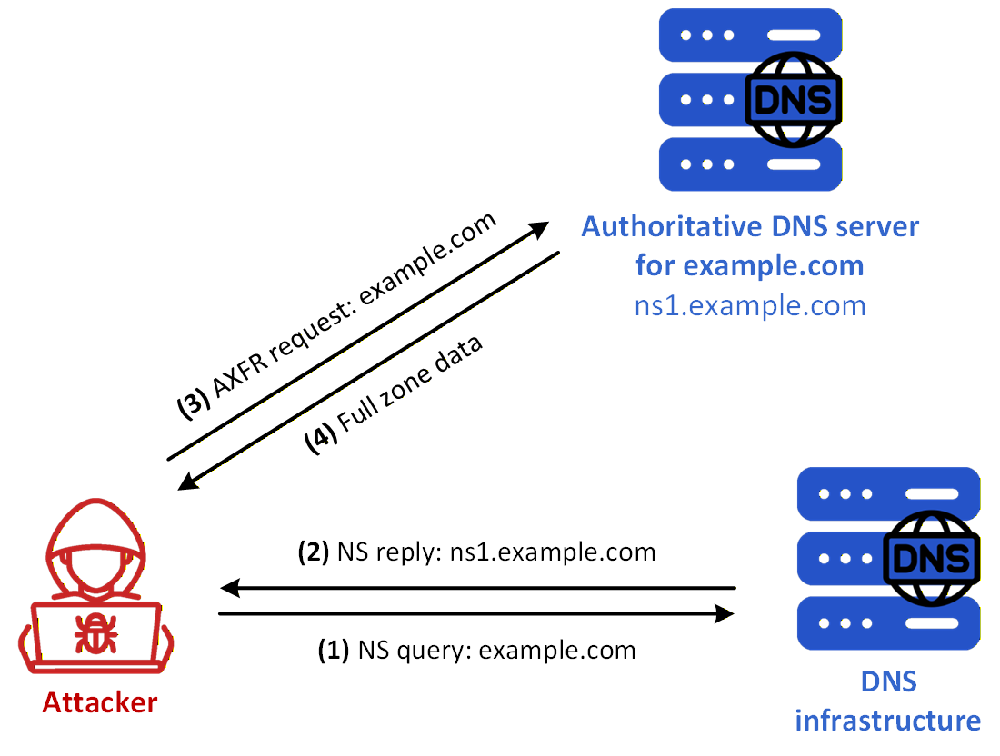
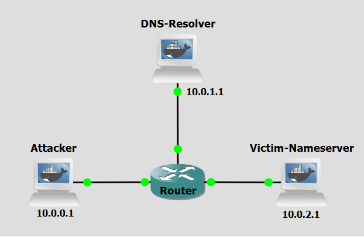

# Background
Unauthorized zone transfer is a cyberattack technique that leverages the DNS zone transfer mechanism to obtain a complete copy of a domain's DNS records. This method allows attackers to bypass reconnaissance limitations by exploiting misconfigured DNS servers, effectively extracting an entire map of an organization's internal network infrastructure. The primary goal of an unauthorized zone transfer is to gather sensitive DNS data — including hostnames, IP addresses, mail servers, and subdomains — that can be used to plan further attacks.

This technique exploits the legitimate zone transfer protocol (AXFR, Authoritative Full Transfer, a full zone transfer), which was originally designed to replicate DNS records between primary and secondary name servers. The attack takes advantage of servers that fail to restrict which hosts are permitted to request this replication, effectively handing the attacker a full inventory of the target's DNS namespace.
Unauthorized zone transfer technique can be divided into four main concepts: Target Identification, Transfer Request Initiation, Data Extraction, and Reconnaissance Exploitation.

Initially, the attacker identifies the authoritative name servers for the target domain by querying publicly available DNS records, such as NS records. This reveals which servers are responsible for hosting the zone data. The attacker then sends a crafted AXFR (or IXFR, Incremental Zone Transfer, intended for  partial updates to zone information) request directly to one of these name servers, impersonating the behavior of a legitimate secondary DNS server attempting to synchronize records. If the name server is misconfigured and lacks proper access controls, it responds by transmitting the complete zone file without authentication. The attacker receives and parses this zone file, extracting a comprehensive list of DNS records — including A, MX, CNAME, TXT, and PTR records — that reveal the full topology of the target's network. This intelligence is then used to identify high-value targets, exposed services, and potential attack vectors for subsequent intrusion attempts.


<figure markdown id="figure-1">
  { width="600" }
  <figcaption>Figure 1: Unauthorized Zone Transfer attack</figcaption>
</figure>

 [Figure 1](#figure-1) shows a unauthorized zone transfer scenario using a misconfigured victim nameserver. These are the steps:


- **Step 1:** The attacker sends an NS query for example.com to the DNS infrastructure in order to discover the authoritative server for the target domain.
- **Step 2:** The DNS infrastructure replies with the authoritative server name, here **ns1.example.com**.
- **Step 3:** The attacker sends an AXFR request directly to that authoritative server.
- **Step 4:** If the server is misconfigured and does not enforce access control on zone transfers, it replies with the full zone data, which the attacker can then inspect to obtain a detailed view of the target’s DNS namespace, including hosts, services, and addressing information that may be useful for subsequent intrusion attempts.


<br>
<br>

# Objectives
Our goal with the following configurations is to simulate a Unauthorized zone transfer attack. This lab demonstrates how attackers can exploit a misconfiguration on a DNS server to extract all DNS records for a domain which can include sensitive information. You will act first as the attacker to extract the relevant data and then as victim nameserver administrator, to apply the correctly configurations.

<br>
<br>

# Lab Prerequisites & Network Configuration
<figure markdown id="figure-2">
  
  <figcaption>Figure 2: Unauthorized Zone Transfer attack GNS3 Lab Topology</figcaption>
</figure>

In the GNS3 project showed in [Figure 2](#figure-2), you will need to add in the following topology that uses three key nodes (be sure to previously check the [Lab Setup Guide](../../setup.md){:target="_blank"}):

| Node Name  | Role                          | IP Address     | Subnet           |
|------------|-------------------------------|----------------|------------------|
| **Attacker**  | Attacker console         | **10.0.0.1**   | 10.0.0.0/24  |
| **DNS-Resolver**     | Recursive DNS Server              | **10.0.1.1**   | 10.0.1.0/24  |
| **Victim-Nameserver**     | Authoritative nameserver for example.com  | **10.0.2.1**   | 10.0.2.0/24  |

<br>
<br>


# Phase 1: Setting up the Victim Nameserver

The Victim Nameserver (10.0.2.1) hosts the example.com zone and will be the target of the exploitation.

### Step 1.1: Basic Zone Setup

On the **Victim-Nameserver**,

 1 - Create the `db.example` zone file:

```python
nano /etc/bind/db.example
```
```python
example.com. IN SOA ns1.example.com. admin.example.com. (
    1 7200 3600 1209600 86400
)
    NS ns1.example.com.
ns1.example.com. A 10.0.2.1

@                IN      A       10.0.2.10
www              IN      A       10.0.2.20
secret-host IN A 10.0.10.1
mail IN A 10.0.2.100
mail IN MX 10 mail.example.com
*                IN     TXT      "If there are any problems reboot the system using admin credentials. User: admin Password: admin1234"
```

 2 - Modify the `named.conf.local` file, add the `example.com` zone:

```python
nano /etc/bind/named.conf.local
```
```python
zone "example.com" {
    type master;
    file "/etc/bind/db.example";
};
```

 3 - Restart the BIND service (named):

```bash
pkill named && named -c /etc/bind/named.conf
```
<br>

<br>
<br>


# Phase 2: Attacker's Request

The attacker will have to firstly obtain the `example.com` authoritative nameserver's IP address to only then do a zone transfer request.

### Step 2.1: Identify the Authoritative Nameserver

On the **Attacker** machine, run:

```bash
dig NS example.com
```

By querying for "NS" records the attacker can now know which nameservers are responsible for hosting the zone.

<br>

### Step 2.2: Make a Full Zone Transfer Request

Using the information obtained in the previous step we can now query the authoritative nameserver of `example.com` directly. You can use a Wireshark capture on the Attacker machine to see the exact packets and Resource Records being received.

On the **Attacker** machine, run:

```bash
dig axfr @10.0.2.1 example.com
```

You might need to run the the `dig` a couple  of times until it starts working properly.

<br>


!!! question Question
     What sensitive information was exposed by the zone transfer? How could an attacker leverage this data to plan further attacks against the target infrastructure?

??? success "Answer"
     The zone transfer reveals the full contents of the example.com DNS zone. Several pieces of information are directly exploitable: - **Credentials in a TXT record**: The wildcard TXT record exposes plaintext administrator credentials (`admin` / `admin1234`). An attacker could use these to attempt logins on any discovered hosts. - **Hidden internal host**: The `secret-host.example.com` A record points to `10.0.10.1`, an address in a separate subnet not otherwise advertised. Without the zone transfer, this host would be invisible to external reconnaissance. - **Mail server**: The MX and A records for `mail.example.com` identify the mail infrastructure at `10.0.2.100`, which could be targeted for phishing, relay abuse, or direct exploitation. - **Full network map**: Combined, the A records reveal the internal IP layout (`10.0.2.0/24` and `10.0.10.0/24`), giving the attacker a clear picture of the target's network topology without ever sending a packet inside it. An attacker would use this information to prioritise targets (e.g. the mail server, the secret host), attempt credential reuse across all discovered addresses, and tailor further exploits to the specific services mapped.

<br>
<br>
<br>
<br>


# Countermeasure
We now pass on to the countermeasure phase. Unauthorized zone transfer abuses the misconfiguration of zone-authoritative DNS servers to obtain otherwise non-accessible information. The correction for this problem is as simple as defining which machines are able to request a full zone transfer.

<br>

## Configure Zone Transfer in the Victim Nameserver

### Step 1:  Reconfigure the Zone

On the **Victim-Nameserver**,

 1 - Modify  the `example.com` zone in the `named.conf.local` file:

```python
nano /etc/bind/named.conf.local
```
```python
zone "example.com" {
    type master;
    file "/etc/bind/db.example";
    allow-transfer { };
};
```
Notice the `allow-transfer { };` line.

<br>

 2 - Restart the BIND service (named):

```bash
pkill named && named -c /etc/bind/named.conf
```

### Step 2:  Re-run the attack
Repeat Step 2.2 to re-run the attack. 

Do a Wireshark capture right next to the Victim-Nameserver to see the changes to network traffic. 

<br>


!!! question Question
     After applying the allow-transfer { }; directive and restarting BIND, what do you observe when repeating the zone transfer request? What does Wireshark show compared to before?


??? success "Answer"
     The dig axfr request now returns an error:**`; Transfer failed.`** BIND refuses the AXFR request and replies with a **Refused** response code. In Wireshark, you can observe the DNS response packet containing the REFUSED status immediately after the client's AXFR query — no zone data is transmitted whatsoever.


!!! question Question
    Why does the allow-transfer { }; directive with an empty list effectively block all zone transfer requests?
 

??? success "Answer"
    The allow-transfer directive in BIND defines an Access Control List (ACL) of hosts permitted to request a full zone transfer (AXFR/IXFR). When the list is left empty ({ }), no IP address matches the ACL, so BIND denies every incoming zone transfer request regardless of its origin. This is the principle of default-deny: rather than explicitly listing which hosts to block, you define an empty whitelist, meaning no host is ever authorised. This is the recommended configuration for any authoritative nameserver that does not need to replicate its zone to a secondary server, as it eliminates the attack surface entirely with a single configuration line.


<br>
<br>

# Conclusion

As we saw, after reconfiguring BIND the zone transfer is stopped. Although simple, since zone transfer blocking is not available as default in BIND, many misconfigured nameservers can become victims to a straight-forward exploit such as the one explored in this lab. With the information obtained, a malicious actor can plan more robust attacks to the network insfrastructre related to the targeted domain, like  [DNS Rebinding](../protocol/rebinding.md){:target="_blank"} for example.