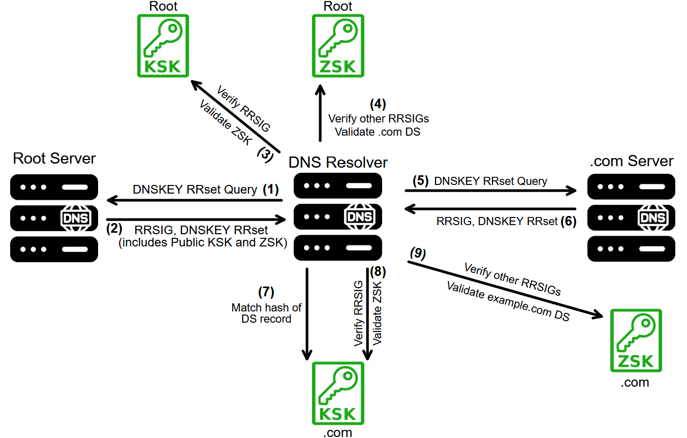
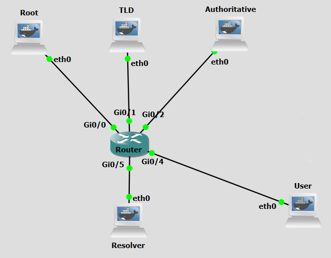

# Background
The Domain Name System Security Extensions (DNSSEC) were developed to tackle persistent security issues within DNS, especially its deficiencies in authentication and integrity. DNSSEC introduces a set of extensions to DNS, focused on ensuring data integrity and authenticating the origin of data.

DNSSEC uses asymmetric (public-key) cryptography, such that each DNS zone has a Zone Signing Key (ZSK) and a Key Signing Key (KSK). The ZSK is used to sign the zone's resource record sets (RRsets). The KSK is used to sign the ZSK itself. The public part of each key is published in the zone via DNSKEY records. There are five DNS record types added by DNSSEC:

- RRSIG: A digital signature for a set of DNS records (an RRset), generated using the private ZSK. Resolvers can verify these signatures to confirm authenticity.
- DNSKEY: Holds a public key used to sign RRSIGs. Each zone usually publishes two: a KSK and a ZSK.
- DS Records: Delegation Signer (DS) records connect a child zone to a parent zone, establishing a chain of trust from the root.
- NSEC/NSEC3: These are used to provide authenticated denial of existence, preventing attackers from falsifying non-existent domains.


The widespread adoption of DNSSEC is contingent upon support from both DNS resolvers and authoritative servers. Importantly, the client does not need to possess any certificate. Instead, trust is established through a hierarchical chain of trust, as described below. A significant breakthrough occurred in July 2010 with the signing of the root zone, facilitating the complete establishment of the DNSSEC chain of trust. This chain of trust operates hierarchically. Each DNS zone's authenticity is validated by the zone above it, ensuring a secure and authenticated path from the root to individual domains. This process guarantees that DNS information remains untampered during transit. The root zone's public KSK is pre-configured in most validating DNS resolvers and serves as the trust anchor. 

<figure markdown>
  
  <figcaption>Figure 1: DNSSEC Validation Process</figcaption>
</figure>

The validation process, as shown in Figure 1, proceeds as follows:

- **Step 1:** The resolver queries the root zone for the DNSKEY RRset.
- **Step 2:** The Root server returns the DNSKEY RRSET that includes the RRSIG, the public KSK and the public ZSK.
- **Step 3:** The resolver uses the root public KSK to verify the RRSIG. If the signature is valid, the resolver now trusts the root public ZSK.
- **Step 4:** The ZSK is used to verify RRSIGs (validating) on other records in the root zone, such as the DS record for a TLD (e.g., .com).
- **Step 5:** The resolver then queries the .com zone for its DNSKEY RRset.
- **Step 6:** .com Server returns its DNSKEY RRset
- **Step 7:** The DNS Resolver then checks that the KSK in the .com DNSKEY RRset matches the hash in the DS record.
- **Step 8:** If it matches, the resolver uses the .com public KSK to verify the RRSIG over the .com DNSKEY RRset.
- **Step 9:** The .com public ZSK is then trusted and used to validate records like the DS for example.com. This process continues down the DNS hierarchy until the final domain is validated.

The resolver validates each link in the chain by fetching the appropriate DNSKEYs and DS records, validating RRSIGs with the correct public keys, and confirming that the hashes match the DS record in the parent zone. If any of these validation steps fail, the DNS response is considered fraudulent and is not returned to the client. 


<br>
<br>

# Objectives
Our goal with the following configurations is to establish a chain of trust that enables the use of DNSSEC. To achieve this, we will begin at the authoritative server for the domain example.com and then ascend the DNS hierarchy. Finally, we will configure a trust anchor in the resolver.
In a real-world environment, machines can be updated at any time. Tasks such as signing zone files and generating and submitting DS records (from child zones to parent zones) must be repeated whenever changes are made to the zone file data. Due to its repetitive nature, many registries and registrars use the Extensible Provisioning Protocol (EPP) to automate DS record submission, thereby streamlining the process.

<br>
<br>

# Lab Prerequisites & Network Configuration
<figure markdown>
  
  <figcaption>Figure 2: DNSSEC GNS3 Lab Topology</figcaption>
</figure>

In the GNS3 project showed in Figure 2, you will need to add in the following topology that uses six key nodes (be sure to previously check the [Lab Setup Guide](../setup.md){:target="_blank"}):

| Node Name  | Role                             | IP Address     | Subnet           | 
|------------|----------------------------------|----------------|------------------|
| **Root Server**     | Root Zone ( . ) nameserver (BIND)         | **10.0.0.1**   | 10.0.0.0/24  |
| **TLD Server** | Top-Level Domain (.com) nameserver (BIND)      | **10.0.1.1**   | 10.0.1.0/24  |
| **Authoritative Server**   | Authoritative nameserver for example.com (BIND)| **10.0.2.1**   | 10.0.2.0/24  |
| **User** | Client of the Resolver         | **10.0.4.1**   | 10.0.4.0/24  |
| **Resolver**   | Recursive DNS Server (BIND)  | **10.0.5.1**   | 10.0.5.0/24  |

<br>
<br>
<br>

# Phase 1: Configuring the Authoritative Server for example.com 

The Authoritative Server (10.0.2.1) hosts the example.com zone and is the lowest-level server in the chain-of-trust. This is where we initiate the DNSSEC signing process.

### Step 1.1: Basic Zone Setup

On the **Authoritative Server**,

 1 - Define the Zone in `named.conf.local`:

```python
nano /etc/bind/named.conf.local
```
```python
zone "example.com" {
    type master;
    file "/etc/bind/db.example.com";
    allow-update { none; };
    check-names ignore;
};
```
<br>
<br>

### Step 1.2: Create the Unsigned Zone File

On the **Authoritative Server**,

 1 - Create the `db.example.com` zone file:

```python
nano /etc/bind/db.example.com
```
```python
$TTL 1h
@       IN      SOA     auth.example.com. hostmaster.example.com. (
                2026090801 ; serial
                3H         ; refresh
                15M        ; retry
                1W         ; expire
                1H )       ; minimum

        IN      NS      auth.example.com.
auth    IN      A       10.0.2.1
www     IN      A       10.0.3.1
```

<br>

!!! question Question
    What is the purpose of the auth A record (10.0.2.1)?

??? success "Answer"
     It ensures the nameserver auth.example.com can be resolved within the zone itself (glue record).


<br>
<br>
<br>

# Phase 2: Signing the Authoritative Zone

DNSSEC requires two types of keys: the **KSK** (Key Signing Key, used for signing DNSKEY records) and the **ZSK** (Zone Signing Key, used for signing all other records).

### Step 2.1: Generate DNSSEC Keys

Generate the KSK and ZSK for example.com. We use the ECDSAP256SHA256 algorithm (Algorithm 13).

On the **Authoritative Server**,

```python
cd /etc/bind
```

<br>

 1 - Generate the ZSK (Zone Signing Key):

```python
dnssec-keygen -a ECDSAP256SHA256 -b 256 -n ZONE example.com
```

This creates two files, one ending in **.key (public)** and one in **.private (private)**. Note the filename, e.g., `Kexample.com.+013+12345.key`.


<br>

2 - Generate the KSK (Key Signing Key):

```python
dnssec-keygen -a ECDSAP256SHA256 -b 256 -n ZONE -f KSK example.com
```
Note this filename too, e.g., `Kexample.com.+013+54321.key`. This KSK key ID will be used to create the DS record later.

<br>
<br>

### Step 2.2: Include Keys in the Zone File

Include the public parts of the KSK and ZSK into the `db.example.com` file.

On the **Authoritative Server**,


 1 - Edit `db.example.com`:

```python
nano /etc/bind/db.example.com
```

<br>

2 - Below the $TTL line, add:

```python
$INCLUDE Kexample.com.+013+<ZSK_ID>.key ; ZSK 
$INCLUDE Kexample.com.+013+<KSK_ID>.key ; KSK 
```

Where `<ZSK_ID>` is the ID from the first key generated, `<KSK_ID>` is the ID from the second key generated.

This creates two files, one ending in **.key (public)** and one in **.private (private)**. Note the filename, e.g., `Kexample.com.+013+12345.key`.

<br>
<br>


### Step 2.3: Sign the Zone

Use the KSK and ZSK to sign the zone, creating **RRSIG** records for every other record.

On the **Authoritative Server**,


 1 - Sign the Zone:

```python
dnssec-signzone -o example.com -k Kexample.com.+013+<KSK_ID>.key -N increment /etc/bind/db.example.com Kexample.com.+013+<ZSK_ID>.key
```
This command creates a new file, `db.example.com.signed`.

<br>

2 - Update `named.conf.local`:

```python
# Change:
file "/etc/bind/db.example.com";
# TO:
file "/etc/bind/db.example.com.signed";
```

Changes the file entry to point to the signed file.

<br>

 3 - Restart BIND:

```python
pkill named && named -c /etc/bind/named.conf
```

<br>
<br>

##### Step 2.4: Generate the Delegation Signer (DS) Record

The **DS record** is the critical security link between the child and parent zone. It must be provided to the parent zone (TLD) for delegation. Generate the DS record using the KSK public key.


On the **Authoritative Server**,


 1 - Generate DS record (using KSK public key):

```python
dnssec-dsfromkey Kexample.com.+013+<KSK_ID>.key
```
Example Output: 
`example.com. IN DS 12345 13 2 9AAF96127BFE1C5BE61DC60E5776561556145B`

Copy the line and save it.

<br>
<br>
<br>

# Phase 3: Configuring the TLD Server (.com)

The TLD Server (10.0.1.1) hosts the com zone and needs the DS record from the Authoritative server.


### Step 3.1: Basic Zone Setup

On the **TLD Server**,

 1 - Define the Zone in `named.conf.local`:


```python
zone "com" {
    type master;
    file "/etc/bind/db.com";
    allow-update { none; };
    check-names ignore;
}
```

<br>

2 - Create `db.com`:

```python
$TTL 1h
@       IN      SOA     tld.com. admin.com. (
                2026090803 ; serial
                3H         ; refresh
                15M        ; retry
                1W         ; expire
                1H )       ; minimum

        IN      NS      tld.com.
tld     IN      A       10.0.1.1

example.com. IN NS      auth.example.com.
auth.example.com. IN A  10.0.2.1
```


<br>
<br>

### Step 3.2: Signing the TLD Zone
This process is identical to Phase 2, but for the com TLD zone.


On the **TLD Server**,

 1 - Generate Keys (KSK and ZSK):

```python
cd /etc/bind
```

```python
dnssec-keygen -a ECDSAP256SHA256 -b 256 -n ZONE com
```           

```python       
dnssec-keygen -a ECDSAP256SHA256 -b 256 -n ZONE -f KSK com       
```
Note their IDs: `<com_ZSK_ID>` and `<com_KSK_ID>`, respectively.

<br>

2 - Include Keys in `db.com`:

```python
$INCLUDE Kcom.+013<com_ZSK_ID>.key ; ZSK
```

```python
$INCLUDE Kcom.+013+<com_KSK_ID>.key ; KSK 
```           
Add includes below `$TTL`, using the new key IDs.

<br>

3 - Sign the Zone and Update `named.conf.local`:

```python
dnssec-signzone -o com -k Kcom.+013+<com_KSK_ID>.key -N increment /etc/bind/db.com Kcom.+013+<com_ZSK_ID>.key
```

```python
nano /etc/bind/named.conf.local
```        

```python
# Change:
file "/etc/bind/db.com";
# TO:
file "/etc/bind/db.com.signed";
```

Changes the file entry to point to the signed file.  

<br>
<br>


### Step 3.3: Publish the Child's DS Record
Paste the DS record generated in Step 2.4 into the `db.com` file.


On the **TLD Server**,

 1 - Edit `db.com`:

Go to the end and paste the DS record from the Authoritative server (Step 2.4)

Example: `example.com. IN DS 12345 13 2 9AAF96127BFE1C5BE61DC60E5776561556145B`

**IMPORTANT:** Increment the SOA serial number (e.g., from 2026090803 to 2026090804).

<br> 

!!! question Question
      Why must we increment the SOA serial number after making changes to the zone file?


??? success "Answer"
     It is a good practice, that signals to other DNS servers that the zone data has been updated and needs to be reloaded/transferred.

<br> 


2 - Re-sign and Restart BIND:

The `db.com` file has changed, so the signed file must be regenerated.	


```python
dnssec-signzone -o com -k Kcom.+013+<com_KSK_ID>.key -N increment /etc/bind/db.com Kcom.+013+<com_ZSK_ID>.key
```

```python
pkill named && named -c /etc/bind/named.conf
```        


<br>

### Step 3.4: Generate the TLD DS Record
Generate the DS record for the com zone using its KSK public key. This will be provided to the Root server.

On the **TLD Server**,

 1 - Generate DS record (using TLD KSK public key):

```python
dnssec-dsfromkey Kcom.+013+<com_KSK_ID>.key
```
Copy this resulting line.

<br>
<br>

# Phase 4: Configuring the Root Server (.)
The Root Server (10.0.0.1) hosts the Root zone (.) and needs the DS record from the TLD.


### Step 4.1: Basic Zone Setup

On the **Root Server**,

 1 - Define the Zone in `named.conf.local`:

```python
zone "." {
    type master;
    file "/etc/bind/db.root";
    allow-update { none; };
    check-names ignore;
};
```

<br>

 2 - Create `db.root`:

```python
$TTL 1h
@       IN      SOA     root. root. (
                2026090801 ; serial
                3H         ; refresh
                15M        ; retry
                1W         ; expire
                1H )       ; minimum

        IN      NS      root.

root.   IN      A       10.0.0.1

com.    IN      NS      tld.com.
tld.com. IN     A       10.0.1.1
```
 This defines the delegation for the TLD (com). You can change the serial number to the current date plus two digits like the example below.

<br>
<br>

### Step 4.2: Signing the Root Zone
Generate the Root keys, sign the zone, and publish the TLD DS record.

On the **Root Server**,


 1 - Generate Keys (KSK and ZSK):

```python
cd /etc/bind
```

```python
dnssec-keygen -a ECDSAP256SHA256 -b 256 -n ZONE .
```

```python
dnssec-keygen -a ECDSAP256SHA256 -b 256 -n ZONE -f KSK .
```
Note their IDs: `<root_ZSK_ID>` and `<root_KSK_ID>`, respectively


<br>

 2 - Include Keys in `db.root`:

```python
$INCLUDE Kcom.+013<root_ZSK_ID>.key ; ZSK
```

```python
$INCLUDE Kcom.+013+<root_KSK_ID>.key ; KSK 
```           
Add includes below `$TTL`, using the new key IDs.


<br>

 3 - Publish the TLD's DS Record (from Step 3.4) in `db.root`:

Example: `com. IN DS 64646 13 2 CC761F2D5768B440B5E827AF3EF3D1A77D91EE6C0DC62FDB422C39BE20E77628`


**IMPORTANT**: Increment the SOA serial number.

<br>

 4 - Sign the Zone and Update `named.conf.local`:

```python
dnssec-signzone -o . -k K.+013+<root_KSK_ID>.key -N increment /etc/bind/db.root K.+013+<root_ZSK_ID>.key
```


```python
nano /etc/bind/named.conf.local
```

```python
# Change:
file "/etc/bind/db.root";
# TO:
file "/etc/bind/db.root.signed";
```

<br>

5 - Restart BIND:

```python
pkill named && named -c /etc/bind/named.conf
```

<br>
<br>


### Step 4.3: Extract the Root Trust Anchor
The Root KSK is the **Trust Anchor** for the entire DNSSEC hierarchy. The Resolver must be configured to trust it.

On the **Root Server**,


 1 - Display the KSK public key data:

```python
cat K.+013+<root_KSK_ID>.key
```
Expected Output: `. IN DNSKEY 257 3 13 <LONG_STRING_OF_RANDOM_CHARACTERS_KEY_DATA>`

Copy the last line of the output (the one containing the random characters key string).

<br>
<br>
<br>

# Phase 5: Configuring the Resolver and DNSSEC Validation
The Resolver (10.0.5.1) is the recursive server that will perform DNSSEC validation. This machine needs to know what Root machine to trust in order to then trust the subsequent chain-of-trust.

### Step 5.1:  Configure Root Hints and BIND Options


On the **Resolver**,

 1 - Configure Root Hint File `db.root`:

By default, BIND uses standard hints. We must structure it to use our simulated Root.

```python
.       3600000 IN      NS      .
.       3600000 IN      A       10.0.0.1
```

The `named.conf.default-zones` should already contain the `zone "." { type hint; file "/etc/bind/db.root"; };` entry.

<br>

 2 - Configure BIND options file, `named.conf.options`:

Insert these lines inside the `options` block.

```python
recursion yes;
allow-recursion { any; };
allow-query { any; };
listen-on { any; };
dnssec-validation auto;
```

<br>

!!! question Question
    What does the directive `dnssec-validation auto;` do?

??? success "Answer"
    It instructs BIND to automatically attempt to validate all DNS responses using DNSSEC and reject (return SERVFAIL) unvalidated or broken responses, relying on trust anchors loaded via managed-keys or bind.keys.

<br>
<br>

### Step 5.2: Install the Root Trust Anchor


On the **Resolver**,

 1 - Create a `bind.keys` file and paste the Root KSK (Trust Anchor) copied in Step 4.3 :

```python
nano /etc/bind/bind.keys
```

Example format:  `. initial-key  257 3 13 “<LONG_STRING_OF_RANDOM_CHARACTERS_KEY_DATA>”;` 

<br>

2 - Restart BIND:

```python
pkill named && named -c /etc/bind/named.conf
```

<br>
<br>

# Phase 6: Final Validation Test
The User machine or the Resolver itself should now be able to query the system and verify the authenticity of DNS Messages using the DNSSEC chain of trust.


### Step 6.1: Run the DNSSEC Query

Query for a record in the signed zone, forcing DNSSEC details to be shown. Be sure to use a Wireshark capture between the Resolver and the central Router to see the various messages traded between the Resolver and the DNS hierarchy.

On the **Resolver** or **User**,

 1 - Run a query
```python
dig www.example.com @10.0.5.1 +dnssec +multi
```

Look at the DNS header flags in the response. If the DNSSEC chain is valid, the response should include the `ad` (Authenticated Data) flag.


```python
;; ->>HEADER<<- opcode: QUERY, status: NOERROR, id: XXXX
;; flags: qr rd ra ad; QUERY: 1, ANSWER: 2, AUTHORITY: 4, ADDITIONAL: 5
```

Notice the difference in quantity between a normal DNS lookup and a DNSSEC lookup.

<br>

!!! question Question
    If the query fails or returns a SERVFAIL status, where in the hierarchy is the most likely location of the DNSSEC error?

??? success "Answer"
    The most likely error is a mismatch between a DS record in the parent zone and the KSK key in the child zone, or the Trust Anchor on the Resolver is incorrect.


!!! question Question
    Do you think the quantity of DNS Message necessary for DNSSEC to work influenced its adoption in the real world? Why or why not?

??? success "Answer"
    Yes, the increased quantity of DNS messages required by DNSSEC—due to larger responses and additional validation steps—has likely slowed its adoption. The overhead can strain networks, increase latency, and complicate deployment, especially for resource-constrained systems. Many organizations weigh these costs against the security benefits, often opting for simpler alternatives. Complexity and performance trade-offs remain key barriers.

<br>
<br>

### Step 6.2: SERVFAIL troubleshooting

If the query returns a SERVFAIL, first verify if every machine on the DNS hierarchy is working properly. 

On each nameserver,

 1 - Check if BIND is active
```python
netstat -tulnp | grep 53
```

It should show some ports with the tag “LISTEN”

<br>

 2 - Check BIND debugging info:

If nothing was returned then check why the service isn't working:

```python
named -c /etc/bind/named.conf -g -d 9
```

<br>

 3 - Fix issues:

Most probably there was so problem in generating the keys, signing the zone files or with the DS records passed on to other DNS Hierarchy servers, fix those issues by repeating the steps respective to the configuration of the faulty machine.

<br>

 4 - Restart BIND:

After the issue is fixed, kill the previous BIND service running (if any) and restart a new one, run:


```python
pkill named && named -c /etc/bind/named.conf
```
