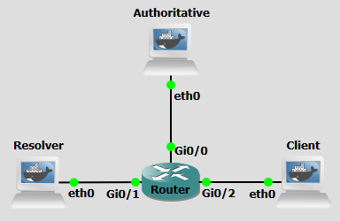

# Background
DNS over HTTPS (DoH) is a protocol designed to improve user privacy and security by encrypting DNS queries through the HTTPS protocol. This encryption prevents eavesdropping and tampering with DNS data by man-in-the-middle attacks, as the communication between the DoH client and the DoH-based DNS resolver is secured.

DoH encrypts DNS queries using HTTPS, typically over port 443, making DNS traffic indistinguishable from regular HTTPS traffic. This encryption enhances user privacy by preventing intermediaries like ISPs from monitoring or altering DNS requests. Additionally, since DoH uses standard HTTPS protocols, it benefits from existing web infrastructure, facilitating easier adoption and deployment.

Traditionally, an Operating System handles DNS for all applications. However, with DoH, browsers can bypass the OS's native resolver and send encrypted queries directly to a trusted provider. This "Last Mile" encryption ensures that the local network administrator or ISP cannot see which websites a user is visiting based on their DNS requests.

While DoH enhances privacy, it can complicate network management tasks, such as content filtering and malware detection, as it obscures DNS traffic from traditional monitoring tools. It also permits the establishment of DNS tunnels   and does not inherently prevent cache poisoning unless it's combined with DNSSEC and a trustworthy DoH resolver.


<br>
<br>

# Objectives
Our goal with the following configurations is to establish a secure, end-to-end DNS resolution path. You will deploy a recursive resolver (Unbound) to handle DNS lookups and caching, and implement an encryption gateway (dnsdist) to terminate TLS connections and translate DoH queries into standard DNS packets to be processed by the resolver.

<br>
<br>

# Lab Prerequisites & Network Configuration
<figure markdown>
  
  <figcaption>Figure 2: DNS-over-HTTPS GNS3 Lab Topology</figcaption>
</figure>

In the GNS3 project showed in Figure 2, you will need to add in the following topology that uses three key nodes (be sure to previously check the [Lab Setup Guide](../setup.md){:target="_blank"}):

| Node Name  | Role                             | IP Address     | Subnet           | 
|------------|----------------------------------|----------------|------------------|
| **Authoritative Server**   | Authoritative nameserver for example.com (BIND)| **10.0.0.1**   | 10.0.0.0/24  |
| **Resolver**   | Recursive DNS Server (Unbound) that supports DNS-over-HTTPS | **10.0.1.1**   | 10.0.1.0/24  |
| **Client** | Client of the Resolver         | **10.0.2.1**   | 10.0.2.0/24  |

<br>

The following script was used in this lab:

- <a href="../../../scripts/doh_query.py" download>doh_query.py</a>


<br>
<br>

# Phase 1: Configuring the Resolver

The Resolver machine uses Unbound for recursive resolution and caching and Dnsdist to provide the DoH frontend. It also needs to have a TLD role and will be configured to forward queries of the `example.com` domain to the Authoritative Server.


### Step 1.1: Unbound Setup

On the **Resolver**:

```console
nano /etc/unbound/unbound.conf
```

```console
server:
    interface: 10.0.1.1
    interface: 127.0.0.1
    port: 53
    access-control: 127.0.0.0/8 allow
    access-control: 10.0.1.0/32 allow
    verbosity: 1
    do-daemonize: yes

    val-permissive-mode: yes
    auto-trust-anchor-file: ""

forward-zone:
    name: "example.com"
    forward-addr: 10.0.0.1
```

Both 10.0.1.1 and 127.0.0.1 were used to allow Unbound to accept local queries from the dnsdist service. Notice the forward zone configuration specifies that Unbound should not attempt to resolve via the global root hints, but should instead query the specific authoritative IP at 10.0.0.1.

<br>

### Step 1.2: Generate Certificates

On the **Resolver**:

```console
openssl req -x509 -nodes -newkey rsa:2048 -keyout /etc/dnsdist/dnsdist.key   -out /etc/dnsdist/dnsdist.crt -days 365 -subj "/CN=10.0.1.1"
```

This command generates a self-signed SSL/TLS certificate and a private key for 10.0.1.1. It is used for setting up a secure DoH (DNS over HTTPS) interface for dnsdist.

<br>

### Step 1.3: Dnsdist Setup

On the **Resolver**:

```console
nano /etc/dnsdist/dnsdist.conf
```


```console
-- Frontend: Listening for DoH on 10.0.1.1
addDOHLocal("10.0.1.1:443", "/etc/dnsdist/dnsdist.crt", "/etc/dnsdist/dnsdist.key", {"/dns-query"})

-- Backend: Points to Unbound
newServer({address="127.0.0.1:53", name="unbound", checkName="example.com."})
```

Dnsdist uses the `addDOHLocal` function to define the encrypted entry point for clients, binding the generated certificate and key to `port 443`. The `newServer` line establishes the downstream backend, instructing dnsdist to pass decrypted traffic to Unbound’s listener at 127.0.0.1:53.


!!! question Question
     Why does dnsdist point to 127.0.0.1 instead of 10.0.1.1 for the backend?

??? success "Answer"
    By pointing to 127.0.0.1, dnsdist communicates with Unbound over the local loopback interface. This keeps the unencrypted "standard" DNS traffic off the physical network, ensuring that only the encrypted DoH traffic on port 443 is visible to external observers.

<br>
<br>

# Phase 2: Deployment and Verification


### Step 2.1: Start Unbound and Dnsdist services

On the **Resolver**:

```console
unbound -c /etc/unbound/unbound.conf
```

```console
dnsdist -C /etc/dnsdist/dnsdist.conf --supervised
```


You should see `Marking downstream unbound (127.0.0.1:53) as 'up'` message indicating unbound is listening to dnsdist requests.


<br>


### Step 2.2: Query the Resolver

Do a Wireshark capture right next to the Resolver's interface.

On the **Client**, run:

```console
curl -k 'https://10.0.1.1:443/dns-query?dns=AAABAAABAAAAAAAAA3d3dwdleGFtcGxlA2NvbQAAAQAB' -H 'accept: application/dns-message' --output - | hexdump -C
```

This command is a "manual" way to perform a DNS lookup over an encrypted HTTPS connection and view the raw data coming back from the server. `dns=AAABAAABAAAAAAAAA3d3dwdleGFtcGxlA2NvbQAAAQAB` is the DNS Question. Instead of typing `www.example.com`, you are sending a Base64-encoded binary string that represents the DNS "wire format" packet for an `A record` query of www.example.com. DNS does not use plain text. It uses a packed binary structure.

<br>


### Step 2.3: Use the query script

For a more streamlined and automated testing approach, replace the manual curl method with the `doh-query.py` script, it abstracts the complexity of the DoH protocol into a single, standard command.


```console
python3 /home/doh_query.py testa.example.com 10.0.1.1
```


This script functions as a lightweight DNS-over-HTTPS (DoH) client that bridges the gap between human-readable domain names and the binary requirements of secure DNS communication. It handles the `HTTPS encapsulation` using urllib library. It bypasses the standard TLS certificate chain to allow for the use of self-signed certificates and executes an `HTTP POST` request. By setting the Content-Type to `application/dns-message`, it ensures the upstream dnsdist instance recognizes the payload as raw DNS data rather than standard web traffic. Upon receiving the encrypted response, the script performs a tail-end extraction of the last four bytes of the `RDATA` section, converting those bits into a human-readable IPv4 address.

While this lab uses a Python script to simulate a DoH client, the protocol's most common implementation is within modern web browsers.

<br>

!!! question Question
    During the Wireshark capture, why can't you see the domain name `testa.example.com` in the packets coming from the Client?

??? success "Answer"
    Because the DNS query is encapsulated within a TLS-encrypted tunnel (HTTPS). On the wire, the traffic appears as standard encrypted TCP data on port 443. The domain name is only visible after dnsdist decrypts the packet and forwards it to Unbound over the local loopback interface (127.0.0.1).


!!! question Question
     Where in a standard DNS resolution process is the use of DoH most applicable?

??? success "Answer"
     DoH is most applicable in the "Last Mile" of the DNS lookup, the communication between the Stub Resolver (the user's device) and the Recursive Resolver (the ISP or a public provider). While the rest of the DNS chain (Recursive to Authoritative) often relies on standard `UDP/TCP` or `DNSSEC`, DoH is specifically designed to protect the user's privacy at the most vulnerable point, where local network eavesdropping and ISP tracking are most likely to occur.

<br>
<br>

# Conclusion

In this lab, we successfully implemented a split-service DNS architecture by separating the DoH Gateway (dnsdist) from the Recursive Resolver (Unbound). We verified that DoH functions by observing raw binary data and then utilized a Python-based client to demonstrate how modern applications programmatically interface with these secure resolvers. This configuration ensures that all client-to-resolver traffic is shielded from local network inspection, effectively mitigating common DNS-based MITM, DNS hijacking, and DNS spoofing attacks.

<br>
