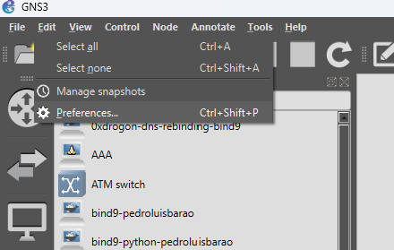
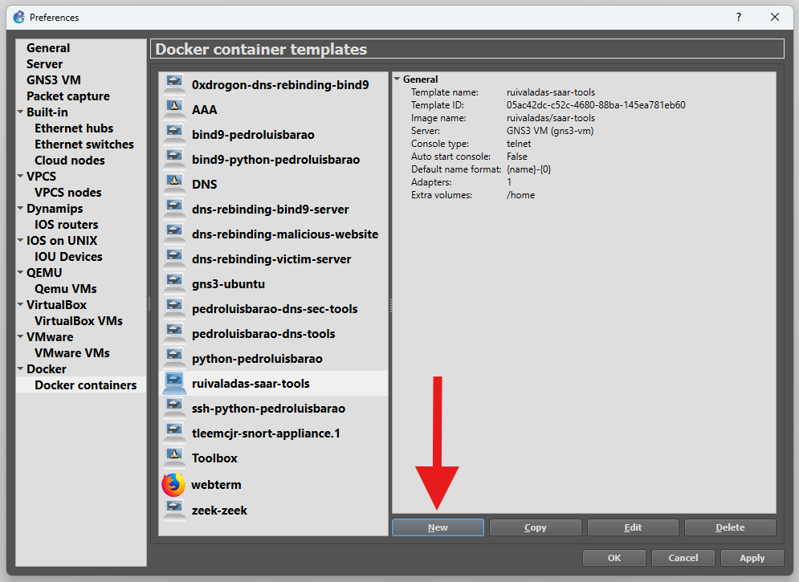
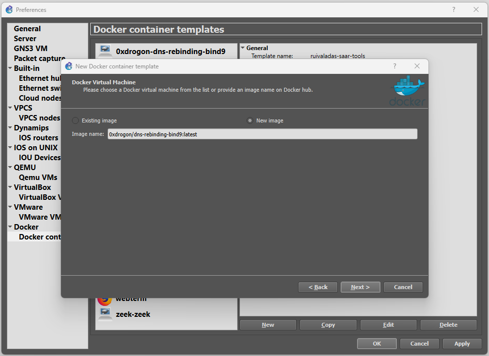
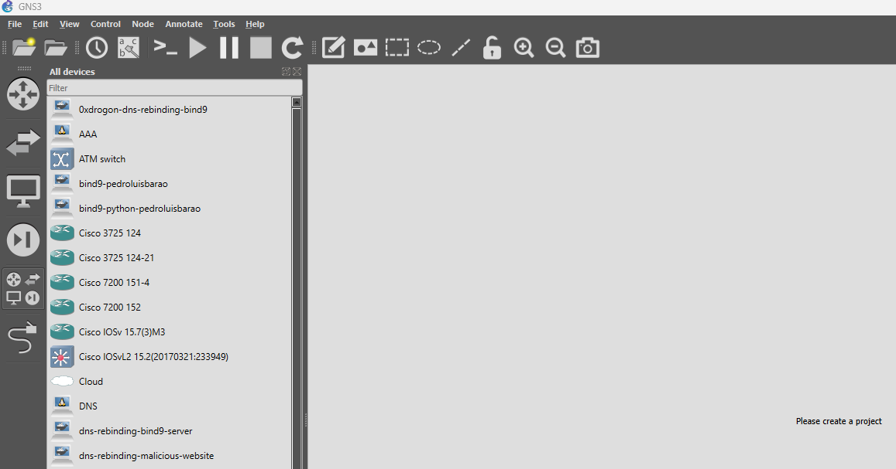

## Add Docker based machines
Start by importing the docker images for the relevant machines provided here (preciso ainda de adicionar). To add them to GNS3, go to `Edit>Preferences>Docker containers`.


<figure markdown id="figure-1">
  
</figure>


<figure markdown id="figure-2">
  
</figure>


Then click `New` and select `New image`, add the name of the container like in the image below.
 
<figure markdown id="figure-3">
  
</figure>

<figure markdown id="figure-4">
  
</figure>


Now you should be able to just grab the desirable device from the devices panel on the left and drop it on the project area to start configuring.
If you want to make changes to the machines persistent consider going to the `Configure` option of the machine options menu, then select `Advanced`, and on `Additional directories to make persistent that are not included in the image VOLUMES config. One directory per line.` add the directories you want to make persistent. We recommend `/home`, `/usr`, `/var` and `/etc`.


<br>
<br>

## Machines’ Configuration

You should replicate the GNS3 lab topology found in the specific lab guide, be sure to use the same network interfaces. For some routers and specific machines, sometimes there is the need to increase the number of interfaces. In each lab guide a list of IP addresses for the machines used in that lab will be provided, as well as other necessary configurations, which can include BIND configurations.

On GNS3, each Docker container-based machine has an editable configuration which can make the initial setup more practical. Right-Click on the machine and select `Edit config`, and paste in a configuration like the one below.

Example configuration of a Docker container-based DNS Server (the `up` line activates Bind when the machine is in start up):

```console
auto eth0
iface eth0 inet static
    address 10.0.1.1
    netmask 255.255.255.0
    gateway 10.0.1.254
    up named -c /etc/bind/named.conf
```


Example configuration of a Docker container-based Bot-like machine (the `up` line activates when the machine is in start up):
```console
auto eth0
iface eth0 inet static
    address 10.0.8.1
    netmask 255.255.255.0
    gateway 10.0.8.254
    up echo nameserver 10.0.0.1 > /etc/resolv.conf
    up /etc/init.d/ssh start
    up chown root:root /usr/bin/sudo
    up chmod 4755 /usr/bin/sudo
```

Some routers can only be configured using the console. You should the commands one by one. Below is an example of a router with 3 interfaces.


```console
conf t
ip routing
interface f0/0
  ip address 10.0.2.254 255.255.255.0
  no shutdown
interface f0/1
  ip address 10.0.1.254 255.255.255.0
  no shutdown
interface f1/0
  ip address 10.0.3.254 255.255.255.0
  no shutdown
exit
exit
wr
```


Don't forget to type `wr` at the end to ensure the configurations are persistent through reboots.


<br>
<br>


## DNSMasq

In the “Edit config” option of the DNS Server machine be sure to add the following configurations (specially relevant if running DGAs Lab):

```console
auto eth0
iface eth0 inet static
    address 192.168.20.2
    netmask 255.255.255.0
    gateway 192.168.20.1
    up /etc/init.d/ssh start
    up chown root:root /usr/bin/sudo
    up chmod 4755 /usr/bin/sudo
    up chown root:root /usr/lib/sudo/sudoers.so
```


Before using the dnsmasq service a few configurations are needed.  Go to the configuration file.


```python
nano /etc/dnsmasq.conf
```


Add the lines in the appropriate place:

```console
listen-address=192.168.20.2
addn-hosts=/etc/dnsmasq.d/hosts/dynamic_hosts.txt
```

Add a new user with some special permissions (if you are not running as root user you need `sudo` before each command):

```console
chown dnsadmin:dnsadmin /etc/dnsmasq.d/hosts
```
```console
chmod 755 /etc/dnsmasq.d/hosts
```
```console
chown dnsadmin:dnsadmin /etc/dnsmasq.d/hosts/dynamic_hosts.txt
```

The `/etc/dnsmasq.d/hosts/dynamic_hosts.txt` file is where the new “host, IP address” pairs will be configured.

To see the changes and use the dnsmasq service, reset using these commands:

```console
pkill dnsmasq && dnsmasq
```

<br>
<br>


## BIND

Since BIND is used in the majority of the labs, there are many configuration variations.
 
Sometimes there will be bind files like named.conf.root-hints or named.conf.default- zones that will have conflictive information about the zones like root zone. It's better to edit named.conf file to make sure it isn't including these file sources or even removing these files outright.

Every time you want to reset a BIND DNS servers cache is easier to just reset BIND named service using:

```console
pkill named && named -c /etc/bind/named.conf
```

If you are configuring DNS Resolvers be sure to check if `/etc/bind/db.root` has the correct address of Root Server (if you are using a Root Server in that particular simulation), and also if in `/etc/resolv.conf` the address listed as nameserver is `127.0.0.1` (loopback).


### Root Server

Example of Root Server configuration:

```console
nano /etc/bind/named.conf.options
```
```console
options {
    directory "/var/cache/bind";
    recursion no;
    allow-query { any; };
    listen-on port 53 { any; };
};
```

```console
nano /etc/bind/named.conf.local
```

```console
zone "." {
    type master;
    file "/etc/bind/db.root";
};
```

```console
nano /etc/bind/db.root
```

```console
$TTL 86400
@   IN  SOA root.example.com. admin.example.com. (
        1 7200 3600 1209600 86400 )

    IN  NS  ns.root.

ns.root.    IN  A   10.0.0.1
com.        IN  NS  ns.com.
ns.com.     IN  A   10.0.1.1
```

### TLD Server (.com)

Example of TLD Server configuration for `.com`:

```console
nano /etc/bind/named.conf.options
```
```console
options {
    directory "/var/cache/bind";
    recursion no;
    allow-query { any; };
    listen-on port 53 { any; };
};
```

```console
nano /etc/bind/named.conf.local
```

```console
zone "com." {
    type master;
    file "/etc/bind/db.com";
};
```

```console
nano /etc/bind/db.com
```

```console
$TTL 86400
@   IN  SOA ns1.example.com. admin.example.com. (
        1       ; Serial
        7200    ; Refresh
        3600    ; Retry
        1209600 ; Expire
        86400 ) ; Minimum TTL

    IN  NS  ns.com.
ns.com. IN  A   10.0.1.1

; Delegate example.com to authoritative server
example.com.    IN  NS  ns1.example.com.
ns1.example.com. IN  A   10.0.2.1
```


### Authoritative Server (example.com)

Example of Authoritative Server configuration for `example.com`:

```console
nano /etc/bind/named.conf.options
```
```console
options {
    directory "/var/cache/bind";
    recursion no;
    allow-query { any; };
    listen-on port 53 { any; };
};
```

```console
nano /etc/bind/named.conf.local
```

```console
zone "example.com" {
    type master;
    file "/etc/bind/db.example";
};
```

```console
nano /etc/bind/db.example
```

```console
example.com. IN SOA ns1.example.com. admin.example.com. (
    1 7200 3600 1209600 86400
)
    NS ns1.example.com.
ns1.example.com. A 10.0.2.1

@                IN      A       10.0.3.1
www              IN      A       10.0.3.1
secret-host IN A 10.0.10.1
mail IN A 10.0.3.100
mail IN MX 10 mail.example.com
testa            IN      A       10.0.10.1
testb            IN      A       10.0.10.1
testc            IN      A       10.0.10.1
```


### Resolver (no zone hosting)

Example of Resolver configuration acting only as recursive resolver without zone hosting:

```console
nano /etc/resolv.conf
```

```console
nameserver 127.0.0.1
```

```console
nano /etc/bind/named.conf.options
```
```console
options {
    directory "/var/cache/bind";
    recursion yes;
    allow-recursion {any; };
    allow-query { any; };
    listen-on { any; };
};
```
```console
nano /etc/bind/named.conf.default-zones
```

```console
zone "." {
	type hint;
	file "/etc/bind/db.root";
};
```

```console
nano /etc/bind/db.root
```

```console
.       3600000  IN  NS  .
.       3600000  IN  A   10.0.0.1
```


### Resolver (with zone hosting, example.com)

Example of Resolver configuration also hosting zone `example.com`:

```console
nano /etc/resolv.conf
```

```console
nameserver 127.0.0.1
```

```console
nano /etc/bind/named.conf.options
```
```console
options {
    directory "/var/cache/bind";
    recursion yes;
    allow-recursion {any; };
    allow-query { any; };
    listen-on { any; };
};
```
```console
nano /etc/bind/named.conf.local
```

```console
zone "example.com" {
    type master;
    file "/etc/bind/db.example";
};
```

```console
nano /etc/bind/db.example
```

```console
example.com. IN SOA ns1.example.com. admin.example.com. (
    1 7200 3600 1209600 86400
)
    NS ns1.example.com.
ns1.example.com. A ##RESOLVER_IP##

@                IN      A       10.0.3.1
www              IN      A       10.0.3.1
secret-host IN A 10.0.10.1
mail IN A 10.0.3.100
mail IN MX 10 mail.example.com
testa            IN      A       10.0.10.1
testb            IN      A       10.0.10.1
testc            IN      A       10.0.10.1
```

The resolver could also host a TLD zone and then have another machine acting as Authoritative server.

<br>
<br>

### See BIND's cache
In order to see the content in BIND's cache you might need to perform a few configurations.

First, check if you can already access it:

```bash
rndc dumpdb -cache
nano /var/cache/bind/named_dump.db
```

If not, change file `named.conf`:

```bash
include "/etc/bind/named.conf.options";
include "/etc/bind/named.conf.local";
include "/etc/bind/named.conf.default-zones";
include "/etc/bind/rndc.key";

controls {
    inet 127.0.0.1 port 953
    allow { 127.0.0.1; } keys { "rndc-key"; };
};
```

Generate the `rndc-key`:
```bash
rndc-confgen -a -c /etc/bind/rndc.key
```

## Using SSH
For the C&C Server to be able to run commands on the a machine remotely via SHH it will need new user credentials.

```bash
adduser test
```
```bash
usermod -aG sudo test
```
To confirm the user was added:
```bash
groups test
```

To simplify running commands, we will a no-password needed clause to certain commands used by the C&C Server. 

```bash
visudo
```

At the end of the file you can add:
```bash
test ALL=(ALL) NOPASSWD: /usr/sbin/named, /usr/bin/pkill named, /usr/bin/python3, /usr/bin/tee
```

<br>
<br>

## Snort

If you are using Snort Inline mode, you should check if the following are as follows and if not modify them. Replace `#SUBNET_IP` with the correct subnet IP address of where the Snort machine is use, should look like `192.168.10.0/24`


```console
nano /etc/snort/snort.conf
```

```console
ipvar HOME_NET #SUBNET_IP
…
config daq: afpacket
config daq_mode: inline
```


<br>
<br>


